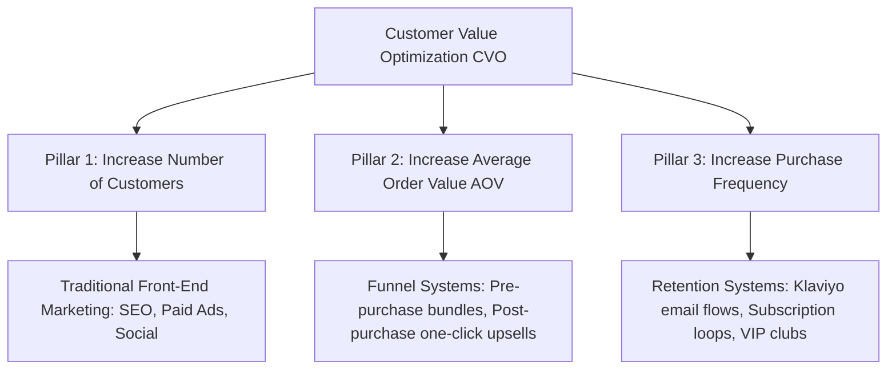

# Chapter 1: The CVO Framework & Core Mindset

## 🎯 Core Thesis
Most online store owners fail because they believe the goal of e-commerce is simply to sell a product and pocket the profit from that single transaction. **This is a fatal strategic mistake**. Tanner Larsson argues that in competitive markets, the **Customer Value Optimization (CVO)** loop is the only way to scale. CVO states that you should structure your business to use the first sale purely to offset your Customer Acquisition Cost (CAC), and generate massive, high-margin net profits on the back-end by programmatically increasing Average Order Value (AOV) and repeat purchase frequency.

---

## 🔑 Key Terminology & Academic Definitions (Demystifying Jargon)

*   **CVO (Customer Value Optimization)**: A systematic e-commerce framework designed to maximize the value of each customer by optimizing three leverage points: acquiring customers, increasing average order value (AOV), and increasing purchase frequency.
*   **Average Order Value (AOV)**: The average dollar amount spent by a customer during a single transaction on your store:
    $$\text{AOV} = \frac{\text{Total Revenue}}{\text{Total Orders}}$$
*   **Purchase Frequency (F)**: The average number of times a unique customer purchases from your store over a specific timeframe (typically 12 months).
*   **Customer Lifetime Value (LTV)**: The total net profit generated by a single customer over the entire duration of their relationship with your brand:
    $$\text{LTV} = \text{AOV} \times \text{Purchase Frequency} \times \text{Profit Margin (\%)}$$
*   **Customer Acquisition Cost (CAC)**: The total advertising and sales budget spent to acquire a single paying customer:
    $$\text{CAC} = \frac{\text{Total Marketing Spend}}{\text{Total New Customers Acquired}}$$
*   **Cohort Retention Rate**: The percentage of customers in a specific sign-up/purchase month who continue to make purchases in subsequent months.

---

## 📐 The 3 Pillars of E-Commerce Growth (Jay Abraham's Law)

Tanner Larsson structures the CVO loop around the three fundamental ways to scale any business:



### The CVO Funnel Workflow:
1.  **Determine Product-Market Fit**: Locate high-quality products with clear problem-solving intent (e.g. specialized premium hardware).
2.  **Choose Lead Magnet/Tripwire**: Offer a high-value, low-friction entry product to acquire the customer at break-even ($CAC = \text{Front-end Margin}$).
3.  **Core Offer**: Immediately upsell the primary product.
4.  **Maximize AOV**: Present immediate one-click upsells and add-on bundles during checkout.
5.  **Return Path (Retention)**: Utilize automated Klaviyo email flows and loyalty programs to bring the customer back for repeat purchases, driving back-end profit.

---

## 📈 Financial Modeling: Cohort Decay & LTV Growth Curves

To prove CVO's leverage, let's analyze how a single 1,000-customer acquisition cohort decays over a 12-month period. 

If we have a traditional store (no upsells, no retention flows) vs. a CVO-optimized store, the differences in cohort capital preservation are dramatic:

| Month | Cohort Size (Traditional) | Purchases (Traditional) | Monthly Gross Margin | Cohort Size (CVO Store) | Purchases (CVO Store) | Monthly Gross Margin |
| :--- | :--- | :--- | :--- | :--- | :--- | :--- |
| **Month 0 (Acquisition)**| 1,000 | 1,000 (AOV: \$50) | \$10,000 (20% Net) | 1,000 | 1,000 (AOV: \$85) | \$25,500 (30% Net) |
| **Month 3** | 1,000 | 20 (AOV: \$50) | \$200 | 1,000 | 180 (AOV: \$85) | \$4,590 |
| **Month 6** | 1,000 | 5 (AOV: \$50) | \$50 | 1,000 | 110 (AOV: \$85) | \$2,805 |
| **Month 9** | 1,000 | 1 (AOV: \$50) | \$10 | 1,000 | 85 (AOV: \$85) | \$2,167 |
| **Month 12** | 1,000 | 0 | \$0 | 1,000 | 60 (AOV: \$85) | \$1,530 |
| **Cohort Profit (Total)**| - | **1,026 orders** | **\$10,260 Net** | - | **1,435 orders** | **\$36,592 Net** |

*   **Critical Comparison**: At a CAC of \$30 per user, acquiring this 1,000-customer cohort costs **\$30,000**. The Traditional Store loses **-\$19,740** on the cohort, driving the brand into bankruptcy. The CVO Store clears **+\$6,592 net profit** on the exact same ad spend, achieving self-funding growth and infinite scalability.

---

## 💻 Production Reference: Robust Cohort LTV & CVO Simulator (Python)

To evaluate how improvements in AOV, purchase frequency, and margins impact your long-term Customer Lifetime Value (LTV) and cash reserves compared to static ad spend, you can model the CVO loop programmatically.

The following Python script calculates and simulates the difference between a traditional, transactional store and an optimized CVO store over a 12-month cohort of 1,000 customers, incorporating customer churn and organic CAC adjustments with robust error logging:

```python
import logging
import json

# Setup developer log config
logging.basicConfig(level=logging.INFO, format="%(asctime)s - %(levelname)s - %(message)s")

class CVOSimulator:
    def __init__(self, cohort_size: int, cac: float):
        self.cohort_size = cohort_size
        self.cac = cac  # Customer Acquisition Cost in USD

        if cohort_size <= 0 or cac <= 0:
            raise ValueError("Cohort size and CAC parameters must be positive numbers.")

    def simulate_store(self, aov: float, frequency: float, margin: float, churn_rate: float) -> str:
        """
        Calculates total cohort revenue, net profit, LTV, and CAC-to-LTV ratio 
        incorporating cohort churn rates.
        """
        logging.info(f"Simulating cohort performance: AOV=${aov}, F={frequency}, Margin={margin*100}%")
        
        try:
            # Adjust effective frequency based on cohort customer churn
            effective_frequency = frequency * (1.0 - (churn_rate / 2.0))
            
            total_revenue = self.cohort_size * aov * effective_frequency
            total_profit = total_revenue * margin
            ltv = aov * effective_frequency * margin
            cac_ltv_ratio = ltv / self.cac
            
            # Net ROI after deducting the upfront acquisition cost
            total_acquisition_cost = self.cohort_size * self.cac
            net_roi = total_profit - total_acquisition_cost
            
            payload = {
                "cohort_size": self.cohort_size,
                "customer_acquisition_cost": self.cac,
                "ltv": round(ltv, 2),
                "total_revenue": round(total_revenue, 2),
                "total_profit": round(total_profit, 2),
                "cac_ltv_ratio": round(cac_ltv_ratio, 2),
                "net_roi": round(net_roi, 2)
            }
            
            return json.dumps(payload, indent=2)
        except Exception as err:
            logging.error(f"Simulator encountered an execution exception: {str(err)}")
            return json.dumps({"status": "ERROR", "message": str(err)})

# --- Example Run ---
simulator = CVOSimulator(cohort_size=1000, cac=40.0)

# Traditional Model (AOV: $50, F: 1.1, Margin: 20%, Churn: 80%)
traditional_json = simulator.simulate_store(aov=50.0, frequency=1.1, margin=0.20, churn_rate=0.80)

# CVO Model (AOV: $75, F: 2.8, Margin: 25%, Churn: 20%)
cvo_json = simulator.simulate_store(aov=75.0, frequency=2.8, margin=0.25, churn_rate=0.20)

print(" सीवीओ कोहोर्ट सिम्युलेटर परिणाम (CVO Cohort LTV Simulator Result):")
print("-" * 80)
print("Traditional Store Cohort Statistics:")
print(traditional_json)
print("-" * 80)
print("Optimized CVO Store Cohort Statistics:")
print(cvo_json)
print("-" * 80)
```

---

## 🏆 Operator Playbook: CVO Funnel Deployment

When designing a new e-commerce product funnel and justifying your front-end break-even acquisition structure, use this playbook:

```text
CVO Deployment Playbook:
─────────────────────────────────────────────────────────────────────────────
How do you scale customer acquisition if competitors are outbidding you on Google/Facebook?
  └── Justification: CVO Front-End Break-Even Strategy.
      1. Stop expecting immediate profit on the first sale.
      2. Increase AOV programmatically: Add post-purchase one-click upsells and 
         complementary accessory bundles directly in the checkout DOM.
      3. Break-Even Bid Power: By raising AOV, you increase your margin-per-transaction, 
         allowing you to afford a higher CAC. You can outbid competitors on paid search 
         because you monetize the back-end via Klaviyo retention flows, winning the market.
─────────────────────────────────────────────────────────────────────────────
```

---

## 💬 Cross-Functional Interview Q&As (PMM Audits)

### Q1: "If our customer acquisition cost (CAC) on Facebook/Google rises by 40% year-over-year, how do we adjust our product positioning and CVO loop to remain highly profitable?" (Paid Acquisition Lead / Growth PM)

> **PMM Candidate Answer:**
> "A 40% increase in ad platform CAC is a existential threat if we remain transactional. To absorb this cost and stay profitable, we must adjust our product positioning and optimize the three CVO leverage points:
> 
> 1.  **Product Repositioning (Front-End Tripwire)**: Instead of advertising our core high-ticket device (which has high friction and requires a high CAC to convert cold audiences), we reposition our entry-point product. We package a high-utility accessory or specialized software toolkit as a 'Tripwire offer' priced under \$30. This reduces customer friction, boosting ad CTR and dropping front-end CAC back down.
> 2.  **Order Bumps (AOV Boost)**: The moment they initiate purchase on the Tripwire, we add checkout-embedded order bumps offering lifetime replacement protection or complementary supplies for \$10, instantly increasing AOV by 20% at a 90% margin.
> 3.  **Core Product Upsell (Post-Purchase)**: Immediately after checkout, we present a vaulted post-purchase one-click upsell for our primary hardware device at an exclusive 20% discount. Because the buyer has already committed their card details and bypassed psychological friction, up to 15% will accept the core offer. This scales our AOV and allows us to outbid competitors because our margin-per-customer has grown to absorb the 40% ad inflation."

### Q2: "Paid Media wants a high-friction Welcome discount (e.g. '15% off') to lower ad CAC. Finance is complaining that this discount is destroying our gross profit margins and product value. How do you resolve this brand-value vs. customer-acquisition conflict?" (CMO to Paid Media & Finance leads)

> **PMM Candidate Answer:**
> "This is a classic e-commerce dispute. Finance is correct that site-wide discounting degrades our perceived brand value, commoditizes our premium hardware, and permanently shrinks our gross margins. Paid Media is also correct that we need a strong incentive to capture cold ad traffic and offset high CAC.
> 
> **To resolve this, we pivot from blanket monetary discounting to value-add bundling and conditional post-purchase rewards.**
> 
> 1.  **Eliminate Broad Front-End Discounts**: We remove site-wide '15% off everything' coupon codes. This immediately restores our raw gross margins and maintains premium product positioning.
> 2.  **Implement 'Gift with Purchase' (Value Add)**: Instead of discounting our \$100 primary product by \$15, we package a high-utility accessory (that costs us \$3 COGS but has a perceived retail value of \$20) as a 'Free Launch Gift'. This maintains the \$100 price point for Finance, preserves brand value, but provides Paid Media with a powerful, high-conversion acquisition hook.
> 3.  **Conditional Return-Path Value**: We issue a \$15 store credit voucher *only after* the transaction is completed, valid only for purchases made on our backend catalog within 30 days. This drives them into our Klaviyo retention loops, ensuring that the 'discount' is actually utilized to buy a repeat purchase rather than cutting our initial transaction margins."
