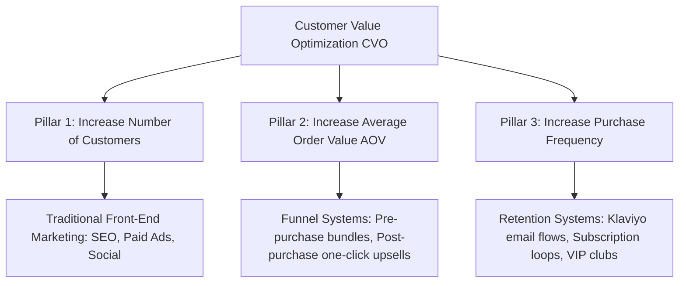

# Chapter 1: The CVO Framework & Core Mindset

## 🎯 Core Thesis
Most online store owners fail because they believe the goal of e-commerce is simply to sell a product and pocket the profit from that single transaction. **This is a fatal strategic mistake**. Tanner Larsson argues that in competitive markets, the **Customer Value Optimization (CVO)** loop is the only way to scale. CVO states that you should structure your business to use the first sale purely to offset your Customer Acquisition Cost (CAC), and generate massive, high-margin net profits on the back-end by programmatically increasing Average Order Value (AOV) and repeat purchase frequency.

---

## 🔑 Key Terminology & Academic Definitions (Demystifying Jargon)

*   **CVO (Customer Value Optimization)**: A systematic e-commerce framework designed to maximize the value of each customer by optimizing three leverage points: acquiring customers, increasing average order value (AOV), and increasing purchase frequency.
*   **Average Order Value (AOV)**: The average dollar amount spent by a customer during a single transaction on your store:
    $$\text{AOV} = \frac{\text{Total Revenue}}{\text{Total Orders}}$$
*   **Purchase Frequency (F)**: The average number of times a unique customer purchases from your store over a specific timeframe (typically 12 months).
*   **Customer Lifetime Value (LTV)**: The total net profit generated by a single customer over the entire duration of their relationship with your brand:
    $$\text{LTV} = \text{AOV} \times \text{Purchase Frequency} \times \text{Profit Margin (\%)}$$
*   **Customer Acquisition Cost (CAC)**: The total advertising and sales budget spent to acquire a single paying customer:
    $$\text{CAC} = \frac{\text{Total Marketing Spend}}{\text{Total New Customers Acquired}}$$

---

## 📐 The 3 Pillars of E-Commerce Growth (Jay Abraham's Law)

Tanner Larsson structures the CVO loop around the three fundamental ways to scale any business:



### The CVO Funnel Workflow:
1.  **Determine Product-Market Fit**: Locate high-quality products with clear problem-solving intent (e.g. specialized premium hardware).
2.  **Choose Lead Magnet/Tripwire**: Offer a high-value, low-friction entry product to acquire the customer at break-even ($CAC = \text{Front-end Margin}$).
3.  **Core Offer**: Immediately upsell the primary product.
4.  **Maximize AOV**: Present immediate one-click upsells and add-on bundles during checkout.
5.  **Return Path (Retention)**: Utilize automated Klaviyo email flows and loyalty programs to bring the customer back for repeat purchases, driving back-end profit.

---

## 💻 Production Reference: Cohort LTV & CVO Simulator in Python

To evaluate how improvements in AOV, purchase frequency, and margins impact your long-term Customer Lifetime Value (LTV) and cash reserves compared to static ad spend, you can model the CVO loop programmatically.

The following Python script calculates and simulates the difference between a traditional, transactional store and an optimized CVO store over a 12-month cohort of 1,000 customers:

```python
class CVOSimulator:
    def __init__(self, cohort_size: int, cac: float):
        self.cohort_size = cohort_size
        self.cac = cac  # Customer Acquisition Cost in USD

    def simulate_store(self, aov: float, frequency: float, margin: float) -> dict:
        """
        Calculates total cohort revenue, net profit, LTV, and CAC-to-LTV ratio 
        based on CVO input variables.
        """
        total_revenue = self.cohort_size * aov * frequency
        total_profit = total_revenue * margin
        ltv = aov * frequency * margin
        cac_ltv_ratio = ltv / self.cac
        
        # Net ROI after deducting the upfront acquisition cost
        total_acquisition_cost = self.cohort_size * self.cac
        net_roi = total_profit - total_acquisition_cost
        
        return {
            "ltv": round(ltv, 2),
            "total_revenue": round(total_revenue, 2),
            "total_profit": round(total_profit, 2),
            "cac_ltv_ratio": round(cac_ltv_ratio, 2),
            "net_roi": round(net_roi, 2)
        }

# --- Example System Execution ---
# We acquire a cohort of 1,000 customers with a CAC of $40 per user.
simulator = CVOSimulator(cohort_size=1000, cac=40.0)

# Store A: Traditional Transactional Store (Low AOV, Single Purchase, 20% Margin)
store_traditional = simulator.simulate_store(aov=50.0, frequency=1.1, margin=0.20)

# Store B: Optimized CVO Store (Dynamic Upsells increase AOV, Klaviyo flows increase frequency, 25% Margin)
store_cvo = simulator.simulate_store(aov=75.0, frequency=2.8, margin=0.25)

print(" सीवीओ कोहोर्ट सिम्युलेटर (CVO Cohort LTV Simulator):")
print("-" * 80)
print("Store A: Traditional Transactional Model")
print(f"  -> LTV:                   ${store_traditional['ltv']}")
print(f"  -> Total Cohort Revenue:  ${store_traditional['total_revenue']}")
print(f"  -> Net Cohort Profit:     ${store_traditional['total_profit']}")
print(f"  -> Net ROI (after CAC):   ${store_traditional['net_roi']} USD")
print(f"  -> LTV:CAC Ratio:         {store_traditional['cac_ltv_ratio']}x (Danger: Unsustainable)")
print("-" * 80)
print("Store B: Optimized CVO Relationship Model")
print(f"  -> LTV:                   ${store_cvo['ltv']}")
print(f"  -> Total Cohort Revenue:  ${store_cvo['total_revenue']}")
print(f"  -> Net Cohort Profit:     ${store_cvo['total_profit']}")
print(f"  -> Net ROI (after CAC):   ${store_cvo['net_roi']} USD (Highly Profitable!)")
print(f"  -> LTV:CAC Ratio:         {store_cvo['cac_ltv_ratio']}x (Healthy & Scalable)")
print("-" * 80)
```

---

## 🏆 Operator Playbook: CVO Funnel Deployment

When designing a new e-commerce product funnel and justifying your front-end break-even acquisition structure, use this playbook:

```text
CVO Deployment Playbook:
─────────────────────────────────────────────────────────────────────────────
How do you scale customer acquisition if competitors are outbidding you on Google/Facebook?
 └── Justification: CVO Front-End Break-Even Strategy.
     1. Stop expecting immediate profit on the first sale.
     2. Increase AOV programmatically: Add post-purchase one-click upsells and 
        complementary accessory bundles directly in the checkout DOM.
     3. Break-Even Bid Power: By raising AOV, you increase your margin-per-transaction, 
        allowing you to afford a higher CAC. You can outbid competitors on paid search 
        because you monetize the back-end via Klaviyo retention flows, winning the market.
─────────────────────────────────────────────────────────────────────────────
```
