# Chapter 2: Funnel Architecture & Upsell Systems

## 🎯 Core Thesis
Standard e-commerce websites operate on a wide-catalog architecture: they send cold traffic to a generic home page or a grid-based category page, presenting the user with hundreds of options. **This architecture is highly inefficient**. Presenting too many choices triggers **Analysis Paralysis**, causing users to bounce without purchasing. Modern e-commerce relies on **Linear Funnel Architecture**. Funnels guide the consumer through a highly structured, sequential path (Landing Page $\to$ Checkout $\to$ One-Click Upsells), maximizing Average Order Value (AOV) by offering complementary items at the peak moment of purchase intent.

---

## 🔑 Key Terminology & Academic Definitions

*   **Analysis Paralysis (Choice Paradox)**: The cognitive overload experienced by a user when presented with too many options, leading to a complete failure to make a decision.
*   **Linear Purchase Funnel**: A highly structured, sequential path of web pages designed to guide a user from a single landing page to checkout, excluding all unrelated navigation links.
*   **Order Bump (Pre-purchase)**: A small, high-margin complementary add-on offered directly on the checkout form as a checkbox (e.g., adding warranty insurance or a custom charging cable for \$5).
*   **One-Click Upsell (Post-purchase)**: A premium offer presented *after* the initial checkout is successful but *before* the thank-you page, allowing the user to purchase an additional product with a single click without re-entering their credit card details.
*   **Downsell**: A lower-priced alternative offer presented only if the user declines the primary one-click upsell offer, designed to salvage the transaction.
*   **Stripe Tokenization / Payment Vaulting**: The secure process of saving a customer's encrypted payment method token on a gateway (like Stripe) to allow subsequent charges without re-entering credentials.

---

## 🏗️ Linear Funnel vs. Wide Catalog Grid

To scale a high-quality product DTC, you must transition your traffic from broad browse pages to targeted linear funnels:

```mermaid
graph TD
    subgraph "Standard Catalog Grid (Low Conversion)"
    A[Ad Traffic] --> B[Home Page / Catalog]
    B --> C[User browses 50 products]
    C -->|Bounces due to choice overload| D[Lost Conversion]
    end
    
    subgraph "Linear CVO Funnel (High AOV & Conversion)"
    E[Ad Traffic] --> F[High-Utility Landing Page]
    F -->|Click CTA| G[Optimized Checkout + Pre-purchase Order Bump]
    G -->|Initial Charge Success| H[Post-Purchase One-Click Upsell]
    H -->|Add to Order with 1 Click| I[Thank You Page]
    end
```



### The Post-Purchase Upsell Advantage:
*   **Peak Buying State**: The user has already committed to the purchase, entered their payment details, and clicked "Submit." The psychological barrier to purchase has been completely bypassed.
*   **Zero-Friction Re-authorization**: By utilizing Stripe tokenization or Shopify's post-purchase API, you can charge the user's card a second time without prompting them to re-enter their 16-digit card number or complete extra validation checks, increasing upsell take-rates by $20-40\%$.

---

## 🏗️ Structural Analysis: One-Click Post-Purchase Checkout Logic

To implement a frictionless post-purchase upsell system, you must construct a highly secure backend transaction pipeline. This pipeline intercepts a successful transaction, vaults the user's payment credentials, serves the upsell offer page, and programmatically updates the order payload without forcing the user to re-enter their 16-digit credit card number.

### The 5-Step Vaulted Payment Pipeline:

```text
Vaulted Payment Transaction Pipeline:
┌────────────────────────────────────────────────────────────────────────────┐
│ 1. Customer initiates transaction on primary checkout form.                │
│    - Input: Credit Card details (Visa, Mastercard, Amex).                  │
│    - System Action: Stripe SDK encrypts card details, returning a secure   │
│      token (e.g. "tok_12345"). Raw card details never touch our server.    │
├────────────────────────────────────────────────────────────────────────────┤
│ 2. Backend processes primary order charge successfully.                    │
│    - System Action: Authorize & capture initial purchase. Simultaneously,  │
│      vault the tokenized payment method in the Stripe Customer Object,     │
│      securing a reusable payment token (e.g. "pm_vault_abc").              │
├────────────────────────────────────────────────────────────────────────────┤
│ 3. Intercept order confirmation page; serve post-purchase upsell.          │
│    - UI Layout: Offer a highly complementary product at a 30% discount.     │
│    - Call-to-Action: A prominent, single button: "Add to My Order".        │
├────────────────────────────────────────────────────────────────────────────┤
│ 4. User clicks the single-click upsell CTA.                                │
│    - System Action: Intercept CTA click; dispatch a secure backend API     │
│      charge to Stripe. Query is executed using the vaulted payment token   │
│      ("pm_vault_abc") for the new upsell amount.                           │
├────────────────────────────────────────────────────────────────────────────┤
│ 5. Primary order payload update & confirmation.                            │
│    - Database Action: Retrieve the original order record from the database.│
│      Append the new SKU, recalculate total taxation and shipping parameters,│
│      and update status to "Completed". Present thank-you page.             │
└────────────────────────────────────────────────────────────────────────────┘
```

By decoupling the second charge from raw user input, you reduce transaction abandonment and maximize average order value (AOV) at the peak moment of customer buy-in.

---

## 🏆 Operator Playbook: Funnel Deployment

When migrating your standard storefront grid to a highly optimized linear funnel in your systems design review, use this playbook:

```text
Funnel Deployment Playbook:
─────────────────────────────────────────────────────────────────────────────
How do you increase Average Order Value (AOV) for a premium hardware device without 
increasing your paid search advertising budget?
  └── Justification: Checkout-Embedded Order Bumps & Upsells.
      1. Pre-purchase Order Bump: Add a high-margin $5-10 warranty checkbox directly 
         into the credit card checkout form.
      2. Post-purchase One-Click Upsell: Immediately after purchase, present a clean, 
         one-click offer for a highly compatible accessory (e.g. specialized mounting 
         hardware) priced 30% below retail.
      3. Margin Capture: Because this upsell incurs no extra traffic cost, it flows 
         directly into net margins, scaling your AOV by 20% programmatically.
─────────────────────────────────────────────────────────────────────────────
```

---

## 💬 Cross-Functional Interview Q&As (PMM Audits)

### Q1: "UX designers want a beautiful, wide product catalog. Growth marketers want a linear purchase funnel. How do you resolve this architectural conflict?" (Creative Director to PMM)

> **PMM Candidate Answer:**
> "This is a very common conflict between brand aesthetics and conversion efficiency. The solution is not to choose one over the other; it is to **match our storefront architecture to the user's acquisition channel and traffic intent**.
> 
> 1.  **For Direct, Organic Search, and Returning Traffic (Brand Browse)**: These users are searching for our brand directly or arriving via our home page. They are in 'discovery' mode. For this traffic, we serve our beautiful, wide product catalog and multi-category navigation. This builds brand equity, allows exploration, and supports complex shopping cart additions.
> 2.  **For Paid Social & Paid Search Traffic (Linear Funnels)**: These users clicked a highly specific ad targeting a specific pain point. They did not click to 'browse'; they clicked because they were promised a solution. Routing this cold, high-cost ad traffic to a generic wide catalog causes 'Analysis Paralysis' and catastrophic bounce rates. For this traffic, we bypass the main home page and route them directly to dedicated, linear purchase funnels.
> 
> By segmenting our storefront pathways—using linear funnels for high-cost paid acquisition to maximize conversion and AOV, and using the wide product catalog for organic brand-building—we satisfy both brand design and conversion performance."

### Q2: "If our post-purchase upsell take-rate drops below 5%, how do you troubleshoot and optimize the funnel to lift average order value (AOV)?" (VP of Operations / Growth PM)

> **PMM Candidate Answer:**
> "A post-purchase upsell take-rate below 5% indicates a mismatch in either product relevance, pricing structure, or page layout friction. I will audit and optimize this using a three-stage funnel diagnostic:
> 
> **Step 1: Audit Relevance & Complementary Value**
> The number one reason upsells fail is low relevance. If a customer just bought a \$150 technical keyboard, offering them a second keyboard is highly irrelevant. Instead, we must offer a highly complementary accessory—such as custom keycap pullers, wrist rests, or premium coiled cables priced under \$30. The upsell must naturally enhance the primary purchase.
> 
> **Step 2: Optimize the Pricing Friction Window**
> The upsell price point must represent a 'frictionless impulse buy.' As a rule of thumb, the post-purchase upsell price must be **between 20% and 40% of the primary order value**. If they bought a \$100 item, an upsell priced at \$25 requires low mental friction. If the upsell is priced at \$90, they will reject it because it requires a secondary, high-friction purchase decision.
> 
> **Step 3: Simplify the Visual Layout**
> We must audit the upsell landing page layout. It should feature:
> *   A prominent header confirming their primary purchase was successful: *'Wait! Your order is not quite complete...'*
> *   A single, bold, high-contrast CTA button: *'Yes, Add to My Order with 1 Click'*.
> *   A clear, risk-free guarantee: *'Ships free in the same box'*.
> *   Zero distraction navigation links, headers, or footers. By isolating the choice, matching the price ratio, and ensuring 100% accessory relevance, we can double our take-rates back to a healthy 10-15% range."
