# Chapter 2: Funnel Architecture & Upsell Systems

## 🎯 Core Thesis
Standard e-commerce websites operate on a wide-catalog architecture: they send cold traffic to a generic home page or a grid-based category page, presenting the user with hundreds of options. **This architecture is highly inefficient**. Presenting too many choices triggers **Analysis Paralysis**, causing users to bounce without purchasing. Modern e-commerce relies on **Linear Funnel Architecture**. Funnels guide the consumer through a highly structured, sequential path (Landing Page $\to$ Checkout $\to$ One-Click Upsells), maximizing Average Order Value (AOV) by offering complementary items at the peak moment of purchase intent.

---

## 🔑 Key Terminology & Academic Definitions

*   **Analysis Paralysis (Choice Paradox)**: The cognitive overload experienced by a user when presented with too many options, leading to a complete failure to make a decision.
*   **Linear Purchase Funnel**: A highly structured, sequential path of web pages designed to guide a user from a single landing page to checkout, excluding all unrelated navigation links.
*   **Order Bump (Pre-purchase)**: A small, high-margin complementary add-on offered directly on the checkout form as a checkbox (e.g., adding warranty insurance or a custom charging cable for \$5).
*   **One-Click Upsell (Post-purchase)**: A premium offer presented *after* the initial checkout is successful but *before* the thank-you page, allowing the user to purchase an additional product with a single click without re-entering their credit card details.
*   **Downsell**: A lower-priced alternative offer presented only if the user declines the primary one-click upsell offer, designed to salvage the transaction.
*   **Stripe Tokenization / Payment Vaulting**: The secure process of saving a customer's encrypted payment method token on a gateway (like Stripe) to allow subsequent charges without re-entering credentials.

---

## 🏗️ Linear Funnel vs. Wide Catalog Grid

To scale a high-quality product DTC, you must transition your traffic from broad browse pages to targeted linear funnels:

```mermaid
graph TD
    subgraph "Standard Catalog Grid (Low Conversion)"
    A[Ad Traffic] --> B[Home Page / Catalog]
    B --> C[User browses 50 products]
    C -->|Bounces due to choice overload| D[Lost Conversion]
    end
    
    subgraph "Linear CVO Funnel (High AOV & Conversion)"
    E[Ad Traffic] --> F[High-Utility Landing Page]
    F -->|Click CTA| G[Optimized Checkout + Pre-purchase Order Bump]
    G -->|Initial Charge Success| H[Post-Purchase One-Click Upsell]
    H -->|Add to Order with 1 Click| I[Thank You Page]
    end
```



### The Post-Purchase Upsell Advantage:
*   **Peak Buying State**: The user has already committed to the purchase, entered their payment details, and clicked "Submit." The psychological barrier to purchase has been completely bypassed.
*   **Zero-Friction Re-authorization**: By utilizing Stripe tokenization or Shopify's post-purchase API, you can charge the user's card a second time without prompting them to re-enter their 16-digit card number or complete extra validation checks, increasing upsell take-rates by $20-40\%$.

---

## 💻 Production Reference: Robust Post-Purchase Upsell Engine (Node.js)

To implement a frictionless post-purchase upsell system, you must design a backend controller that intercepts a successful transaction, verifies that the user's payment token can be re-charged, presents the offer, and updates the order payload programmatically.

The following Node.js script demonstrates how to securely process a post-purchase upsell charge using tokenized Stripe API methods, incorporating comprehensive input checks, currency formatting, and robust error logging:

```javascript
/**
 * Post-Purchase One-Click Upsell Transaction Engine
 * Programmatically re-charges a tokenized credit card for add-on offers.
 */

const logging = {
    info: (msg) => console.log(`[Upsell INFO] ${new Date().toISOString()} - ${msg}`),
    error: (msg) => console.error(`[Upsell ERROR] ${new Date().toISOString()} - ${msg}`),
    warn: (msg) => console.warn(`[Upsell WARN] ${new Date().toISOString()} - ${msg}`)
};

class UpsellPaymentEngine {
    constructor(stripeGatewayClient) {
        this.gateway = stripeGatewayClient; // Secure Mock Stripe SDK Client
    }

    /**
     * Executes a secure post-purchase charge without requiring re-entry of card details.
     * Triggers at the peak moment of purchase intent.
     */
    async executeOneClickUpsell(originalOrderId, upsellItem, customerPaymentToken) {
        logging.info(`Processing post-purchase upsell queue for Original Order: ${originalOrderId}...`);

        // 1. Mandatory Parameters Validation
        if (!originalOrderId || !upsellItem || !customerPaymentToken) {
            logging.error("Failed upsell pipeline: Missing mandatory parameters.");
            return { success: false, reason: "MISSING_PARAMETERS" };
        }

        if (upsellItem.price <= 0) {
            logging.error(`Abort upsell pipeline: Invalid price value of $${upsellItem.price}`);
            return { success: false, reason: "INVALID_PRICE" };
        }

        try {
            // 2. Map Payload details matching Stripe Charge/PaymentIntent API
            const chargePayload = {
                amount: Math.round(upsellItem.price * 100), // Stripe requires amounts in cents
                currency: "usd",
                customer_payment_token: customerPaymentToken,
                description: `Post-purchase Upsell: ${upsellItem.name} added to Order #${originalOrderId}`,
                metadata: {
                    parent_order_id: originalOrderId,
                    upsell_sku: upsellItem.sku,
                    one_click_trigger: "true"
                }
            };

            // 3. Dispatch secure transaction API roundtrip to Stripe
            const chargeResponse = await this.gateway.createCharge(chargePayload);

            if (chargeResponse && chargeResponse.status === "succeeded") {
                logging.info(`Successfully charged vaulted card token: ${customerPaymentToken} amount: $${upsellItem.price}`);
                
                // 4. Construct updated order response payload to save in relational DB
                const updatedOrder = {
                    orderId: originalOrderId,
                    upsellTransactionId: chargeResponse.transaction_id,
                    additionalAmountCharged: chargeResponse.amount_billed,
                    addedItems: [upsellItem],
                    upsellStatus: "SUCCESS_COMPLETED"
                };
                
                return { success: true, order: updatedOrder };
            } else {
                logging.warn(`Charge declined by payment processor for card token: ${customerPaymentToken}`);
                return { success: false, reason: "CHARGE_DECLINED_BY_PROCESSOR" };
            }

        } catch (error) {
            logging.error(`Exception occurred in payment gateway connection: ${error.message}`);
            return { success: false, error: "GATEWAY_CONNECTION_FAILED", message: error.message };
        }
    }
}

# --- Gateway Simulation & Execution ---
const mockStripeGateway = {
    async createCharge(payload) {
        // Simulates secure API round-trip call to Stripe Gateway
        return {
            status: "succeeded",
            transaction_id: "ch_98df8123a_stripe_vault",
            amount_billed: payload.amount / 100
        };
    }
};

const upsellItem = {
    sku: "ANK-CABLE-3FT",
    name: "Heavy-Duty 3ft Type-C Fast Charging Cable",
    price: 9.99
};

const engine = new UpsellPaymentEngine(mockStripeGateway);
engine.executeOneClickUpsell("TX-998012-SZ", upsellItem, "tok_visa_vaulted")
    .then(result => {
        console.log("\n वन-क्लिक अपसेल परिणाम (One-Click Upsell Result):");
        console.log(JSON.stringify(result, null, 2));
    });
