# Chapter 2: Funnel Architecture & Upsell Systems

## 🎯 Core Thesis
Standard e-commerce websites operate on a wide-catalog architecture: they send traffic to a generic home page or a grid-based category page, presenting the user with hundreds of options. **This architecture is highly inefficient**. presenting too many choices triggers **Analysis Paralysis**, causing users to bounce without purchasing. Modern e-commerce relies on **Linear Funnel Architecture**. Funnels guide the consumer through a highly structured, step-by-step path (Landing Page $\to$ Checkout $\to$ One-Click Upsells), maximizing Average Order Value (AOV) by offering complementary items at the peak moment of purchase intent.

---

## 🔑 Key Terminology & Academic Definitions (Demystifying Jargon)

*   **Analysis Paralysis (Choice Paradox)**: The cognitive overload experienced by a user when presented with too many options, leading to a complete failure to make a decision.
*   **Linear Purchase Funnel**: A highly structured, sequential path of web pages designed to guide a user from a single landing page to checkout, excluding all unrelated navigation links.
*   **Order Bump (Pre-purchase)**: A small, high-margin complementary add-on offered directly on the checkout form as a checkbox (e.g., adding warranty insurance or a custom charging cable for \$5).
*   **One-Click Upsell (Post-purchase)**: A premium offer presented *after* the initial checkout is successful but *before* the thank-you page, allowing the user to purchase an additional product with a single click without re-entering their credit card details.
*   **Downsell**: A lower-priced alternative offer presented only if the user declines the primary one-click upsell offer, designed to salvage the transaction.

---

## 🏗️ Linear Funnel vs. Wide Catalog Grid

To scale a high-quality product DTC, you must transition your traffic from broad browse pages to targeted linear funnels:

```mermaid
graph TD
    subgraph "Standard Catalog Grid (Low Conversion)"
    A[Ad Traffic] --> B[Home Page / Catalog]
    B --> C[User browses 50 products]
    C -->|Bounces due to choice overload| D[Lost Conversion]
    end
    
    subgraph "Linear CVO Funnel (High AOV & Conversion)"
    E[Ad Traffic] --> F[High-Utility Landing Page]
    F -->|Click CTA| G[Optimized Checkout + Pre-purchase Order Bump]
    G -->|Initial Charge Success| H[Post-Purchase One-Click Upsell]
    H -->|Add to Order with 1 Click| I[Thank You Page]
    end
```



### The Post-Purchase Upsell Advantage:
*   **Peak Buying State**: The user has already committed to the purchase, entered their payment details, and clicked "Submit." The psychological barrier to purchase has been completely bypassed.
*   **Zero-Friction Re-authorization**: By utilizing Stripe tokenization or Shopify's post-purchase API, you can charge the user's card a second time without prompting them to re-enter their 16-digit card number or complete extra validation checks, increasing upsell take-rates by $20-40\%$.

---

## 💻 Production Reference: One-Click Post-Purchase Upsell Logic (Node.js)

To implement a frictionless post-purchase upsell system, you must design a backend controller that intercepts a successful transaction, verifies that the user's payment token can be re-charged, presents the offer, and updates the order payload programmatically.

The following Node.js script demonstrates how a payment gateway API is utilized to execute a secure one-click upsell charge:

```javascript
/**
 * Post-Purchase One-Click Upsell Transaction Engine
 * Programmatically re-charges a tokenized credit card for add-on offers.
 */

class UpsellPaymentEngine {
    constructor(gatewayClient) {
        this.gateway = gatewayClient; // Mock Stripe/Adyen SDK Client
    }

    /**
     * Executes a secure post-purchase charge without requiring re-entry of card details.
     * Triggers at the peak moment of purchase intent.
     */
    async executeOneClickUpsell(originalOrderId, upsellItem, paymentToken) {
        console.log(`[Upsell Pipeline] Processing upsell for Original Order: ${originalOrderId}...`);

        // 1. Verify that the original payment token is valid for vaulting/re-charge
        if (!paymentToken || paymentToken === "expired_token") {
            console.error("[Upsell Error] Invalid payment token. Re-charge aborted.");
            return { success: false, reason: "TOKEN_EXPIRED" };
        }

        try {
            // 2. Execute the secondary charge via the secure payment gateway (Stripe/Adyen API)
            const chargePayload = {
                amount_in_cents: Math.round(upsellItem.price * 100),
                currency: "usd",
                payment_method_token: paymentToken,
                description: `Post-purchase Upsell: ${upsellItem.name} added to Order #${originalOrderId}`,
                metadata: {
                    original_order_id: originalOrderId,
                    upsell_sku: upsellItem.sku
                }
            };

            const response = await this.gateway.createCharge(chargePayload);

            if (response.status === "succeeded") {
                console.log(`[Upsell Success] Successfully charged $${upsellItem.price} to card token: ${paymentToken}`);
                
                // 3. Programmatically append the new item to the original database order record
                const updatedOrder = {
                    orderId: originalOrderId,
                    newTotal: response.total_amount_billed,
                    items: [upsellItem],
                    upsellStatus: "COMPLETED"
                };
                
                return { success: true, order: updatedOrder };
            } else {
                return { success: false, reason: "CHARGE_DECLINED" };
            }

        } catch (error) {
            return { success: false, error: error.message };
        }
    }
}

// --- Mock Gateway & Example Run ---
const mockGateway = {
    async createCharge(payload) {
        // Simulates API round-trip call to Stripe Gateway
        return {
            status: "succeeded",
            transaction_id: "ch_98df8123a",
            total_amount_billed: payload.amount_in_cents / 100
        };
    }
};

const upsellItem = {
    sku: "ANK-CABLE-3FT",
    name: "Heavy-Duty 3ft Type-C Fast Charging Cable",
    price: 9.99
};

const engine = new UpsellPaymentEngine(mockGateway);
engine.executeOneClickUpsell("TX-998012-SZ", upsellItem, "tok_visa_vaulted")
    .then(result => {
        console.log("\n वन-क्लिक अपसेल परिणाम (One-Click Upsell Result):");
        console.log(JSON.stringify(result, null, 2));
    });
```

---

## 🏆 Operator Playbook: Funnel Deployment

When migrating your standard storefront grid to a highly optimized linear funnel in your systems design review, use this playbook:

```text
Funnel Deployment Playbook:
─────────────────────────────────────────────────────────────────────────────
How do you increase Average Order Value (AOV) for a premium hardware device without 
increasing your paid search advertising budget?
 └── Justification: Checkout-Embedded Order Bumps & Upsells.
     1. Pre-purchase Order Bump: Add a high-margin $5-10 warranty checkbox directly 
        into the credit card checkout form.
     2. Post-purchase One-Click Upsell: Immediately after purchase, present a clean, 
        one-click offer for a highly compatible accessory (e.g. specialized mounting 
        hardware) priced 30% below retail.
     3. Margin Capture: Because this upsell incurs no extra traffic cost, it flows 
        directly into net margins, scaling your AOV by 20% programmatically.
─────────────────────────────────────────────────────────────────────────────
```
