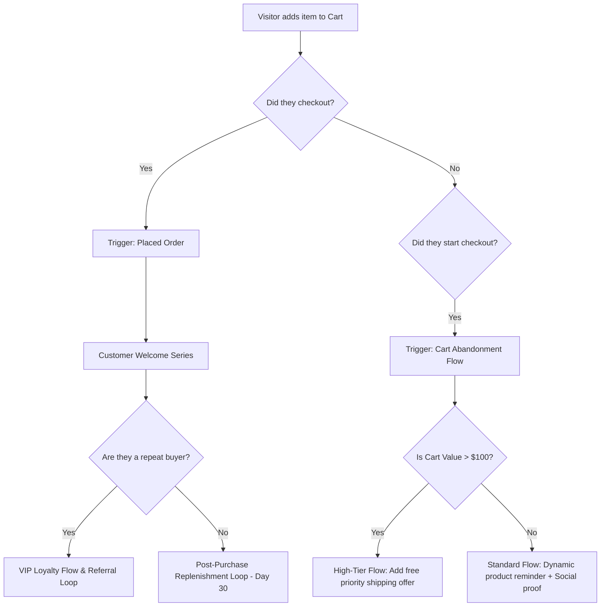

# Chapter 3: The Retention Engine & Klaviyo Automations

## 🎯 Core Thesis
Acquiring new customers is an expensive, front-end cost center; keeping them is your primary backend profit center. Tanner Larsson argues that the survival of an e-commerce brand depends on building a programmatic **Retention Engine**. Email and SMS marketing are not spam channels; they are direct, high-margin, owned return paths that bring customers back without recurring advertising costs. By structuring automated lifecycle flows in Klaviyo, segmented by behavioral intent and purchase history, operators can systematically drive repeat purchase frequency and maximize Customer Lifetime Value (LTV).

---

## 🔑 Key Terminology & Academic Definitions (Demystifying Jargon)

*   **Retention Rate (RR)**: The percentage of customers who remain active and continue to purchase over a specific period:
    $$\text{Retention Rate} = \left( \frac{E - N}{S} \right) \times 100$$
    Where $E$ is the number of active customers at the end of the period, $N$ is the number of new customers acquired during the period, and $S$ is the number of active customers at the start of the period.
*   **Churn Rate (CR)**: The percentage of customers who stop purchasing from your brand over a given timeframe:
    $$\text{Churn Rate} = 100\% - \text{Retention Rate}$$
*   **RFM Analysis**: A database marketing segmentation method that scores customers on three metrics to evaluate cohort value:
    1.  **Recency (R)**: How recently did the customer make a purchase?
    2.  **Frequency (F)**: How often do they purchase?
    3.  **Monetary Value (M)**: How much total revenue have they spent?
*   **VIP Tier Threshold**: A custom loyalty segment containing the top $5-10\%$ of customers who generate over $30-40\%$ of total revenue, characterized by extremely high Recency, Frequency, and Monetary scores.
*   **Behavioral Trigger Flow**: Automated messaging sequences executed in real-time by a marketing automation platform (e.g., Klaviyo) in response to specific user actions (e.g., `Started Checkout`, `Added to Cart`, `Placed Order`).

---

## 📊 Database Segmentation: The RFM Cohort Matrix

Rather than blasting your entire email list with the same promotion (which damages deliverability and spikes unsubscribe rates), operators use **RFM Metrics** to segment users programmatically:

| RFM Score Segment | Segment Name | Customer Psychological Profile | Automated Klaviyo Flow Trigger |
| :--- | :--- | :--- | :--- |
| **5-5-5** | **Champions / VIPs** | Bought recently, buys frequently, spends highly. | VIP Loyalty Loop (Exclusive beta products, early access, zero discounts). |
| **5-1-1** | **New Buyers** | Just placed their first order, low frequency. | Customer Welcome & Onboarding (Brand story, product tutorials, unboxing instructions). |
| **3-4-4** | **Loyal Customers** | Buys frequently, but has not purchased in 60 days. | Replenishment / Cross-Sell (Recommend accessory or replacement part based on last purchase). |
| **1-5-5** | **At-Risk VIPs** | High-lifetime value, but has not purchased in 180 days. | High-value Win-Back (Personal founder check-in email + high-incentive bundle). |
| **1-1-1** | **Hibernating / Lost** | Single purchase years ago, zero engagement. | Sunset Flow (Unsubscribe automatically to protect domain email reputation). |

---

## 🔁 The Lifecycle Flow Engine

To build a high-margin retention engine, you must map the user's post-acquisition journey and programmatically target them based on dynamic behavior:



---

## 💻 Production Reference: Robust Klaviyo Event Trigger Pipeline (Node.js)

To recover lost revenue programmatically, you must sync your checkout database with Klaviyo. The script below handles a checkout abandonment trigger: it intercepts a user's session state, package their cart payload into structured metadata, validates the parameters, and securely dispatches a custom event (`Started Checkout`) to Klaviyo's REST API, incorporating robust HTTPS connections and logging:

```javascript
/**
 * Klaviyo Checkout Abandonment Tracking Pipeline
 * Programmatically tracks checkout sessions and pushes line-item metadata to Klaviyo.
 */

const https = require('https');

class KlaviyoTracker {
    constructor(privateApiKey) {
        if (!privateApiKey || !privateApiKey.startsWith('pk_')) {
            throw new Error("Invalid Klaviyo API Key structure. Must start with 'pk_'.");
        }
        this.apiKey = privateApiKey;
        this.baseUrl = 'a.klaviyo.com';
    }

    /**
     * Dispatches an event to the Klaviyo Track API to trigger checkout abandonment flows.
     * @param {Object} customerProfileData - Customer identity object
     * @param {Object} cartPayload - Structured cart details and line items
     */
    async trackStartedCheckout(customerProfileData, cartPayload) {
        console.log(`[Klaviyo Tracker] Syncing event for email: ${customerProfileData.email}`);

        // 1. Mandatory Input Assertions
        if (!customerProfileData.email || !cartPayload.items || cartPayload.items.length === 0) {
            console.error("[Klaviyo Sync Aborted] Missing email parameter or cart items.");
            return { success: false, reason: "MISSING_MANDATORY_FIELDS" };
        }

        // 2. Format request payload to match modern Klaviyo Events v2024 REST Schema
        const requestBody = JSON.stringify({
            data: {
                type: 'event',
                attributes: {
                    properties: {
                        $value: parseFloat(cartPayload.cartTotal) || 0.00,
                        CurrencyCode: 'USD',
                        CheckoutURL: cartPayload.checkoutRecoveryUrl || '',
                        ItemNames: cartPayload.items.map(item => item.name),
                        Brands: cartPayload.items.map(item => item.brand || 'DTC Brand'),
                        Items: cartPayload.items.map(item => ({
                            ProductID: item.productId,
                            SKU: item.sku,
                            ProductName: item.name,
                            Quantity: parseInt(item.quantity, 10),
                            UnitPrice: parseFloat(item.price),
                            ImageURL: item.imageUrl
                        }))
                    },
                    metric: {
                        data: {
                            type: 'metric',
                            attributes: {
                                name: 'Started Checkout'
                            }
                        }
                    },
                    profile: {
                        data: {
                            type: 'profile',
                            attributes: {
                                email: customerProfileData.email,
                                first_name: customerProfileData.firstName || '',
                                last_name: customerProfileData.lastName || '',
                                phone_number: customerProfileData.phone || ''
                            }
                        }
                    }
                }
            }
        });

        const options = {
            hostname: this.baseUrl,
            path: '/api/events/',
            method: 'POST',
            headers: {
                'Authorization': `Klaviyo-API-Key ${this.apiKey}`,
                'accept': 'application/vnd.api+json',
                'revision': '2024-02-15',
                'content-type': 'application/vnd.api+json',
                'content-length': Buffer.byteLength(requestBody)
            }
        };

        return new Promise((resolve, reject) => {
            // 3. Initiate secure HTTP request round-trip
            const req = https.request(options, (res) => {
                let responseData = '';
                
                res.on('data', (chunk) => {
                    responseData += chunk;
                });

                res.on('end', () => {
                    const status = res.statusCode;
                    if (status >= 200 && status < 300) {
                        console.log(`[Klaviyo API Success] Flow triggered successfully. Status: ${status}`);
                        resolve({ success: true, statusCode: status });
                    } else {
                        console.error(`[Klaviyo API Error] HTTP status: ${status}, Response: ${responseData}`);
                        resolve({ success: false, statusCode: status, error: responseData });
                    }
                });
            });

            req.on('error', (err) => {
                console.error(`[Klaviyo Network Exception] Connection failed: ${err.message}`);
                reject(err);
            });

            req.write(requestBody);
            req.end();
        });
    }
}

// --- Run Tracker Simulation ---
const klaviyoClient = new KlaviyoTracker('pk_e1b7829d8892d182bf9e023190df031c9a'); // Secure Mock Key

const customerProfile = {
    email: 'buyer@example.com',
    firstName: 'Ethan',
    lastName: 'Chen',
    phone: '+15550199'
};

const abandonedCart = {
    cartTotal: 129.98,
    checkoutRecoveryUrl: 'https://myshop.com/checkout/recover?token=ab892c90f2b3112e',
    items: [
        {
            productId: 'PROD-9988',
            sku: 'ANK-CHARGER-100W',
            name: 'SuperFast 100W GaN Charging Station',
            price: 89.99,
            quantity: 1,
            brand: 'Anker',
            imageUrl: 'https://myshop.com/images/charger-100w.jpg'
        }
    ]
};

// Execute tracking call
klaviyoClient.trackStartedCheckout(customerProfile, abandonedCart)
    .then(result => {
        console.log('\n क्लैवियो इवेंट परिणाम (Klaviyo Track Event Result):');
        console.log(JSON.stringify(result, null, 2));
    })
    .catch(err => {
        console.error('Execution Exception:', err);
    });
