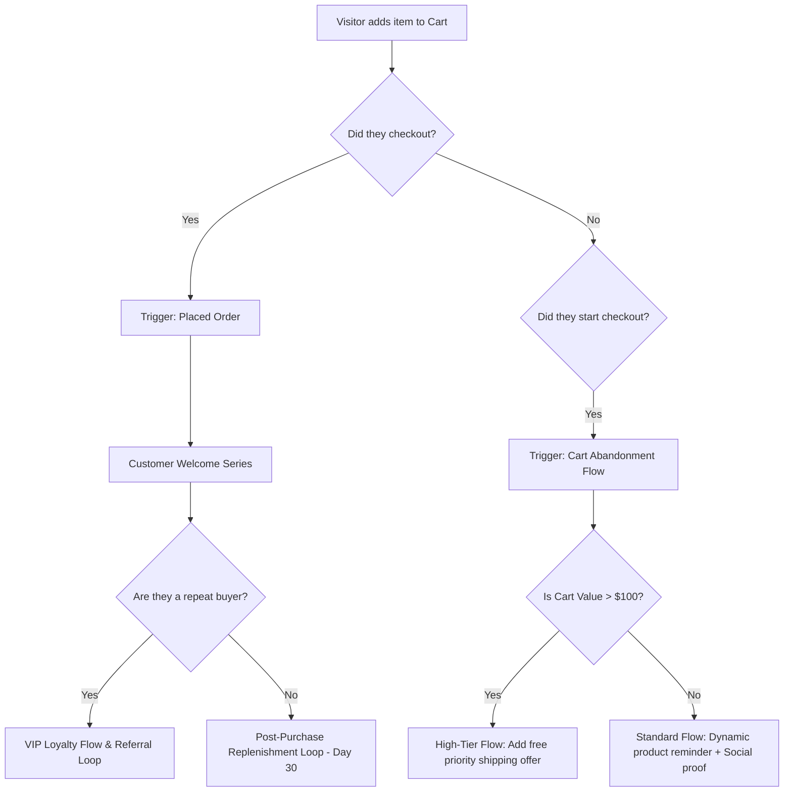

# Chapter 3: The Retention Engine & Klaviyo Automations

## 🎯 Core Thesis
Acquiring new customers is an expensive, front-end cost center; keeping them is your primary backend profit center. Tanner Larsson argues that the survival of an e-commerce brand depends on building a programmatic **Retention Engine**. Email and SMS marketing are not spam channels; they are direct, high-margin, owned return paths that bring customers back without recurring advertising costs. By structuring automated lifecycle flows in Klaviyo, segmented by behavioral intent and purchase history, operators can systematically drive repeat purchase frequency and maximize Customer Lifetime Value (LTV).

---

## 🔑 Key Terminology & Academic Definitions (Demystifying Jargon)

*   **Retention Rate (RR)**: The percentage of customers who remain active and continue to purchase over a specific period:
    $$\text{Retention Rate} = \left( \frac{E - N}{S} \right) \times 100$$
    Where $E$ is the number of active customers at the end of the period, $N$ is the number of new customers acquired during the period, and $S$ is the number of active customers at the start of the period.
*   **Churn Rate (CR)**: The percentage of customers who stop purchasing from your brand over a given timeframe:
    $$\text{Churn Rate} = 100\% - \text{Retention Rate}$$
*   **RFM Analysis**: A database marketing segmentation method that scores customers on three metrics to evaluate cohort value:
    1.  **Recency (R)**: How recently did the customer make a purchase?
    2.  **Frequency (F)**: How often do they purchase?
    3.  **Monetary Value (M)**: How much total revenue have they spent?
*   **VIP Tier Threshold**: A custom loyalty segment containing the top $5-10\%$ of customers who generate over $30-40\%$ of total revenue, characterized by extremely high Recency, Frequency, and Monetary scores.
*   **Behavioral Trigger Flow**: Automated messaging sequences executed in real-time by a marketing automation platform (e.g., Klaviyo) in response to specific user actions (e.g., `Started Checkout`, `Added to Cart`, `Placed Order`).
*   **Email Deliverability (IP Warming)**: The process of establishing a positive sender reputation with Internet Service Providers (ISPs like Gmail, Outlook) by slowly increasing email sending volumes over time.

---

## 📊 Database Segmentation: The RFM Cohort Matrix

Rather than blasting your entire email list with the same promotion (which damages deliverability and spikes unsubscribe rates), operators use **RFM Metrics** to segment users programmatically:

| RFM Score Segment | Segment Name | Customer Psychological Profile | Automated Klaviyo Flow Trigger |
| :--- | :--- | :--- | :--- |
| **5-5-5** | **Champions / VIPs** | Bought recently, buys frequently, spends highly. | VIP Loyalty Loop (Exclusive beta products, early access, zero discounts). |
| **5-1-1** | **New Buyers** | Just placed their first order, low frequency. | Customer Welcome & Onboarding (Brand story, product tutorials, unboxing instructions). |
| **3-4-4** | **Loyal Customers** | Buys frequently, but has not purchased in 60 days. | Replenishment / Cross-Sell (Recommend accessory or replacement part based on last purchase). |
| **1-5-5** | **At-Risk VIPs** | High-lifetime value, but has not purchased in 180 days. | High-value Win-Back (Personal founder check-in email + high-incentive bundle). |
| **1-1-1** | **Hibernating / Lost** | Single purchase years ago, zero engagement. | Sunset Flow (Unsubscribe automatically to protect domain email reputation). |

---

## 🔁 The Lifecycle Flow Engine

To build a high-margin retention engine, you must map the user's post-acquisition journey and programmatically target them based on dynamic behavior:



---

## 🏗️ Structural Analysis: Klaviyo Event Trigger & Abandoned Cart Flow Logic

To programmatically recover lost revenue, you must sync your storefront database with Klaviyo. The event tracking pipeline must securely intercept a user's session state, package their cart payload into structured metadata, and securely dispatch a custom event (`Started Checkout`) to Klaviyo's Track API, triggering the correct sequence.

### The 4-Stage Abandonment Lifecycle Flow:

```text
Klaviyo Abandonment Event & Flow Loop:
┌────────────────────────────────────────────────────────────────────────────┐
│ 1. Event Capture (Storefront DOM / API)                                    │
│    - User enters checkout, types their email, but exits before completing. │
│    - Trigger: Storefront dispatches a secure 'Started Checkout' payload containing│
│      email, cart total ($129.98), checkout URL, and SKU metadata.           │
├────────────────────────────────────────────────────────────────────────────┐
│ 2. Klaviyo Processing & Customer Profiling                                 │
│    - Platform Action: Klaviyo receives the event payload, maps it to the    │
│      customer profile via email, and registers the dynamic cart variables.  │
├────────────────────────────────────────────────────────────────────────────┐
│ 3. Conditional Flow Splitting (Value-Based Segmentation)                   │
│    - Logic Gate: Is Cart Value > $100?                                     │
│      - High-Value Split: Direct user to a high-priority, high-support flow.│
│      - Low-Value Split: Direct user to standard reminder sequence.          │
├────────────────────────────────────────────────────────────────────────────┐
│ 4. Sequence Timing & Messaging Delivery                                    │
│    - Email 1 (4 Hours): Simple reminder + product image + dynamic checkout  │
│      recovery link. (Goal: Recover warm interest).                         │
│    - Email 2 (24 Hours): Social proof (verified 5-star customer reviews).  │
│    - Email 3 (48 Hours): Expiration urgency / Support outreach ("Did your  │
│      payment fail? Let us help!").                                         │
└────────────────────────────────────────────────────────────────────────────┘
```

This structural automation runs passively 24/7, recovering up to $15-25\%$ of abandoned checkout sessions and returning them directly to the bottom-funnel purchase flow.

---

## 🏆 Operator Playbook: Klaviyo Flow Deployment

When designing a new e-commerce product funnel and justifying your front-end break-even acquisition structure, use this playbook:

```text
Klaviyo Deployment Playbook:
─────────────────────────────────────────────────────────────────────────────
How do you build a high-converting cart abandonment sequence that recovers lost 
sales without training users to wait for discounts?
  └── Justification: Value-Add & Support-First Sequencing.
      1. Zero Initial Discounts: Never offer a discount in the first email. This 
         trains users to abandon their carts intentionally to get coupon codes.
      2. Dynamic Recovery Links: Ensure Email 1 contains a direct, vaulted link 
         that rebuilds their exact shopping cart DOM dynamically in a single click.
      3. Risk Reversal: Highlight your money-back guarantees, fast shipping policies, 
         and secure checkout badges in Email 2 to resolve trust objections.
─────────────────────────────────────────────────────────────────────────────
```

---

## 💬 Cross-Functional Interview Q&As (PMM Audits)

### Q1: "How do you construct a high-converting cart abandonment sequence that recovers lost sales without training users to wait for discounts?" (Director of Email Marketing / CMO)

> **PMM Candidate Answer:**
> "Building a high-converting cart recovery sequence without resorting to margin-killing discounts requires shifting our positioning from **transactional discounting** to **customer support and objection resolution**. 
> 
> Here is a 3-step, high-converting recovery sequence:
> 
> *   **Email 1 (Triggered at 4 Hours - The Customer Service Angle)**: 
>     We frame the email as a helpful customer support check-in, not a sales pitch. Subject line: *'Did something go wrong with your order, [First Name]?'* We display their dynamic cart items and provide a direct recovery link. We assume the checkout failed due to a technical glitch, wifi drop, or distraction. This recovers 50% of recoverable carts without offering a single cent in discounts.
> *   **Email 2 (Triggered at 24 Hours - The Social Proof Angle)**: 
>     We tackle trust and quality objections. We display user-generated photos and verified 5-star reviews of the exact SKUs in their cart. Subject line: *'Here is what other buyers are saying about [Product Name]'*. We highlight our risk-free 30-day warranty and free return shipping to eliminate friction.
> *   **Email 3 (Triggered at 48 Hours - The Value-Add Incentive)**: 
>     If they still haven't purchased, we introduce an incentive, but **not a monetary discount**. We offer a high-value, low-cost premium accessory for free (e.g. *'Completed your purchase in the next 12 hours and we will throw in our premium desktop charger cable for free'*) or offer a free shipping upgrade. This preserves our primary product gross margin, avoids teaching users to spam checkout for coupons, and provides a powerful buying trigger."

### Q2: "If our email unsubscribe rates spike above 2% after launching lifecycle retention flows, what is your diagnostic audit and resolution plan?" (Deliverability Specialist / Email Marketer)

> **PMM Candidate Answer:**
> "An unsubscribe rate above 2% is a severe deliverability threat that can cause Gmail and Outlook to route all our marketing emails directly to the spam folder. To audit and resolve this spike, I will execute a three-step diagnostics and list hygiene playbook:
> 
> **Step 1: Audit List Hygiene & Consent**
> I will verify our lead-capture opt-in consent settings. If we are auto-subscribing users who merely entered their email in a pop-up without a clear double opt-in, or buying external lists, we will immediately disable these practices. We must only mail users with clear, active consent.
> 
> **Step 2: Implement Frequency Caps & Smart Sending**
> We must audit our Klaviyo **Smart Sending** constraints. If a customer is active in our welcome series, cart abandonment flow, and post-purchase replenishment loops simultaneously, they may receive 3 to 4 emails in a single 24-hour window, leading to extreme inbox fatigue. We will configure Smart Sending to block users from receiving more than one marketing email every 48 hours, automatically prioritizing high-intent transaction triggers (abandonment) over generic welcome emails.
> 
> **Step 3: Refine Behavioral Segmentation**
> We will transition from mailing our entire database to targeting highly active engagement cohorts. We will build a **30-Day Engaged Segment** (users who have opened or clicked an email in the last 30 days) and route 80% of our campaigns exclusively to this warm segment. For unengaged users, we will launch a 3-step sunset winback flow, and if they fail to open, we programmatically unsubscribe them to protect our domain sender reputation, driving our unsubscribe rate back below the healthy 0.5% industry baseline."
