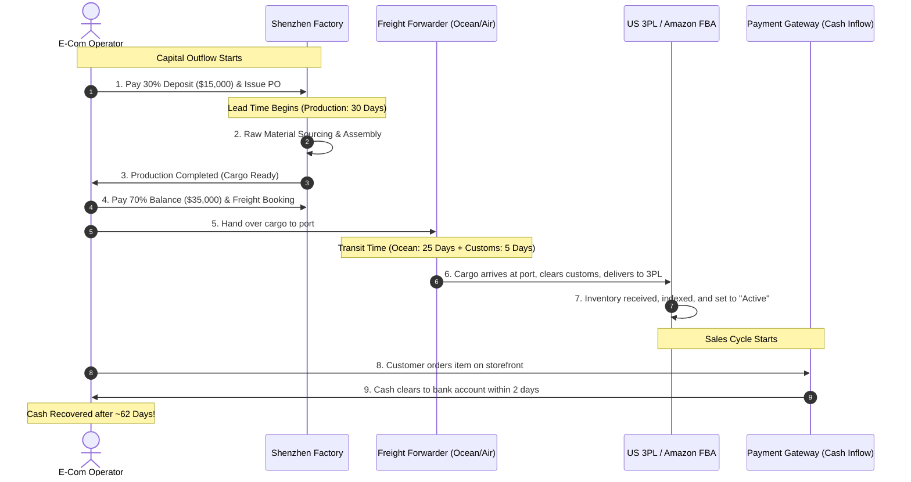

# Chapter 4: Inventory Economics & Cash-Flow Preservation

## 🎯 Core Thesis
In physical product e-commerce, **inventory is frozen cash**. Tanner Larsson stresses that cash flow is the lifeblood of an online business, and mismanaged inventory is the number one reason high-growth DTC brands go bankrupt. This reality is particularly acute for cross-border brands (such as those exporting from Shenzhen to the US/Europe markets), who face massive manufacturing lead times, customs barriers, and ocean shipping disruptions. Under-ordering results in stockouts and lost rankings, while over-ordering traps vital operating capital in depreciating warehouse assets. To survive and scale, operators must utilize strict mathematical models to calculate safety stocks, optimize lead times, and compress their cash-to-cash conversion cycles.

---

## 🔑 Key Terminology & Academic Definitions (Demystifying Jargon)

*   **Cost of Goods Sold (COGS)**: The total direct costs incurred to manufacture and import a product, including raw materials, assembly labor, packaging, factory inspection, and shipping freight to the fulfillment center.
*   **Safety Stock (SS)**: The buffer inventory maintained in a warehouse to protect against stockouts caused by supply-chain volatility (e.g., factory delays, customs inspections) or sudden spikes in consumer demand.
*   **Reorder Point (ROP)**: The exact inventory threshold (in units) at which a new production order must be placed with the manufacturer to ensure the new batch arrives before the current stock is completely depleted.
*   **Lead Time (LT)**: The total duration (in days) from the moment a purchase order (PO) is submitted to the factory and the deposit is paid, to the moment the finished goods are received and checked in at your 3PL or Amazon FBA warehouse.
*   **Cash Conversion Cycle (CCC)**: A key working-capital metric that measures the time (in days) it takes for a business to convert cash outlays for inventory back into cash inflows from sales:
    $$\text{CCC} = \text{Days Inventory Outstanding (DIO)} + \text{Days Sales Outstanding (DSO)} - \text{Days Payable Outstanding (DPO)}$$
*   **Service Level Factor (Z-Score)**: A statistical multiplier corresponding to the probability that a stockout will not occur during the lead time period (e.g., $Z = 1.65$ represents a $95\%$ probability).

---

## ⛓️ The Cross-Border Cash Flow Timeline

For cross-border physical product brands, the flow of cash is highly disjointed. Capital is locked up months before any customer revenue is captured. This gap represents the primary risk to DTC cash flow:



---

## 📈 Financial Mathematics: The Terms Leverage (30/70 vs. 100% Upfront)

Managing *how* you pay your factory is just as important as managing *how much* you pay. Let's look at the cash requirements for a brand scaling to 5,000 units of a premium electronic device (COGS: \$20/unit, Total Order: \$100,000) under two manufacturing payment structures:

### 1. 100% Upfront Terms (High Capital Friction)
*   **Day 0 (PO Placement)**: Pay \$100,000 immediately to start production.
*   **Cash Locked in Transit (Production + Ocean Shipping = 60 Days)**: \$100,000 remains completely frozen.
*   **Working Capital Buffer Required**: Massive. You must keep another \$100,000 in reserves to fund the *next* order before the first container arrives and starts generating revenue.

### 2. 30/70 Net-Terms (High Cash Velocity)
*   **Day 0 (PO Placement)**: Pay 30% Deposit (\$30,000) to start factory line.
*   **Cash Locked (Production phase = 30 Days)**: Only \$30,000 is frozen.
*   **Day 30 (Container Release)**: Pay 70% Balance (\$70,000) after third-party quality inspection passes at the Shenzhen port.
*   **Landed Cash Lock-up**: You preserved \$70,000 in your bank account for 30 extra days. You can allocate this cash to paid ads or local R&D, doubling your inventory turnaround speed.

---

## 📐 Conceptual Deep-Dive: Safety Stock & Reorder Point Calculations

Rather than relying on guessing or static spreadsheets, e-commerce supply chains are managed using **statistical inventory optimization**. To calculate your **Reorder Point (ROP)** programmatically on paper, we apply the standard formula:

$$\text{ROP} = (\text{Average Daily Demand} \times \text{Lead Time (Days)}) + \text{Safety Stock}$$

### 1. The Mathematical Safety Stock Equation:
Under variable customer demand and variable supplier lead times (the standard state of cross-border DTC), the **Safety Stock (SS)** is calculated using the following statistical formula:

$$\text{Safety Stock} = Z \times \sqrt{(L \times \sigma_D^2) + (D^2 \times \sigma_L^2)}$$

Where:
*   $Z$ is the standard **Service Level Factor** Z-Score (e.g., $1.65$ for $95\%$ stock security; $2.33$ for $99\%$ stock security).
*   $L$ is the **Average Supplier Lead Time** in days.
*   $\sigma_D$ is the **Standard Deviation of Daily Sales** (capturing demand volatility).
*   $D$ is the **Average Daily Sales** (unit velocity).
*   $\sigma_L$ is the **Standard Deviation of Lead Time** in days (capturing factory/shipping delay volatility).

### 2. Step-by-Step Mathematical Scenario:
Imagine you export premium mechanical keyboards from Shenzhen to the US market:
*   $D = 45 \text{ units/day}$ (Average sales volume)
*   $\sigma_D = 12 \text{ units/day}$ (Sales volatility due to promotion spikes)
*   $L = 40 \text{ days}$ (Average door-to-door import lead time)
*   $\sigma_L = 8 \text{ days}$ (Lead time volatility due to customs and port congestion)
*   $Z = 1.65$ (Targeting a standard 95% service level to prevent stockouts)

Let's plug these parameters into our Safety Stock equation:
1.  **Calculate Demand Volatility during Lead Time**:
    $$\text{Term 1} = L \times \sigma_D^2 = 40 \times 12^2 = 40 \times 144 = 5,760$$
2.  **Calculate Supplier Volatility under Average Demand**:
    $$\text{Term 2} = D^2 \times \sigma_L^2 = 45^2 \times 8^2 = 2,025 \times 64 = 129,600$$
3.  **Combine and Square Root**:
    $$\text{Sum} = 5,760 + 129,600 = 135,360$$
    $$\sqrt{135,360} \approx 367.91$$
4.  **Multiply by Z-Score**:
    $$\text{Safety Stock} = 1.65 \times 367.91 \approx 607 \text{ units}$$
5.  **Calculate Reorder Point (ROP)**:
    $$\text{Lead Time Demand} = D \times L = 45 \times 40 = 1,800 \text{ units}$$
    $$\text{ROP} = 1,800 + 607 = 2,407 \text{ units}$$
*   **Actionable Strategy**: The moment FBA inventory hits **2,407 units**, the system must automatically issue a production PO to the factory. This guarantees a 95% probability of continuous stock availability, protecting organic SEO rankings and sales velocity.

---

## 🏆 Operator Playbook: Cash Flow Preservation

When managing relationships with overseas factories and budgeting your purchase orders to ensure solvency, use this playbook:

```text
Cash Flow & Margin Preservation Playbook:
─────────────────────────────────────────────────────────────────────────────
How do you scale sales without depleting all cash reserves on inventory purchases?
 └── Justification: Terms Negotiation & Lead Time Reduction.
     1. Negotiate 30/70 Payment Terms: Avoid paying 100% upfront. Pay a 30% deposit 
        to start production, and pay the remaining 70% only upon container inspection 
        and Bill of Lading (BoL) release.
     2. Optimize Lead Times: Consolidate components closer to the assembly factory. 
        Reducing lead time from 60 days to 30 days slashes safety stock requirements 
        by over 40%, freeing up significant working capital.
     3. Margin Safety Guard: Maintain a minimum Gross Margin of 65-70%. If your COGS is 
        $10, your retail price must be at least $30. This margin safety buffer protects 
        against shipping freight spikes and rising acquisition costs.
─────────────────────────────────────────────────────────────────────────────
```

---

## 💬 Cross-Functional Interview Q&As (PMM Audits)

### Q1: "We are running a massive cross-border hardware brand. Our Shenzhen manufacturer encounters a 30-day production bottleneck during Q4, and we are guaranteed to run out of stock in the US FBA warehouse. How do you adjust marketing ad budgets and product positioning to prevent permanent organic rank decay?" (VP of Growth / Head of Supply Chain)

> **PMM Candidate Answer:**
> "A stockout during Q4 is a major operational risk. If our active FBA listing goes completely out of stock for weeks, Amazon's ranking algorithm will drastically penalize our listing, destroying the organic search equity we built. To prevent this rank decay and manage cash flow, I recommend executing a four-step marketing and listing positioning adjustment:
> 
> 1.  **Transition Listings to Merchant Fulfillment (FBM / Back-order)**: We immediately switch our Amazon FBA listing to Merchant Fulfilled (FBM) and update the fulfillment lead time to 30 days. On our Shopify storefront, we replace the 'Add to Cart' button with a **'Pre-Order & Save'** campaign. This prevents our listing from going 'Inactive/Out of Stock' in search indexes, preserving our organic rankings.
> 2.  **Squeeze Paid Traffic & Ad Budgets**: We immediately stop all top-of-funnel paid advertising on Facebook and Google. This halts high-CAC cold acquisition, preserving cash reserves during the bottleneck.
> 3.  **Implement Tiered Pricing & Margin Capture**: We raise our retail price by 10-15%. This intentionally slows down our sales velocity (stretching our remaining stock to cover the manufacturing gap) while capturing higher net margins per transaction, offsetting the Q4 air freight spikes we will inevitably pay to rush the next batch.
> 4.  **Launch VIP Reservation Loops**: We deploy a Klaviyo email sequence to our most loyal cohorts, explaining the manufacturing supply situation transparently. We offer them the exclusive opportunity to 'reserve' a unit from the incoming batch with a complimentary accessory gift, maintaining relationship-driven retention and generating upfront cash to fund the container release."

### Q2: "Supply chain wants to double our Minimum Order Quantity (MOQ) from 2,000 units to 4,000 units to get a 10% unit cost discount from the factory. Finance is opposing this because it freezes too much cash. As a PMM, how do you evaluate this and facilitate a decision?" (CEO to PMM)

> **PMM Candidate Answer:**
> "This MOQ dispute represents a classic struggle between Unit-Cost optimization (Supply Chain) and Cash-Liquidity preservation (Finance). To resolve this, we must calculate the **Return on Capital Employed (ROCE) and Inventory Turn Velocity**, rather than looking at unit cost in isolation.
> 
> Here is how I will evaluate and structure the decision:
> 
> 1.  **Analyze Sales Velocity (Turn Rate)**: We look at our daily sales average. If we sell 10 units/day, an order of 2,000 units represents 200 days of stock (~6 months). Doubling the MOQ to 4,000 units means freezing cash in 400 days of stock (~13 months). 
> 2.  **Calculate the Real Holding Cost**: Finance is correct. Holding inventory for over a year incurs massive carrying costs (3PL warehousing fees, insurance, and risk of product obsolescence) which typically average **15-20% of inventory value annually**. A 10% factory discount will be completely wiped out by 12 months of warehousing storage fees.
> 3.  **Evaluate Cash Opportunity Cost**: Freeing up \$40,000 (the cost of the extra 2,000 units) allows us to allocate that cash to high-intent paid acquisition and CRO. If our LTV:CAC is 3x, that \$40,000 in marketing will generate \$120,000 in high-margin revenue within 90 days. Freeing cash in inventory turns much slower than turning cash in active customer acquisition.
> 
> **My Recommendation:** Unless our sales velocity increases to over 30 units/day (where 4,000 units is turned in under 120 days), we must reject the MOQ increase. We should retain the 2,000 MOQ to preserve cash liquidity, but negotiate with the factory to purchase a larger *annual blanket PO* while releasing inventory in smaller monthly batches, capturing both the unit-cost discount and protecting our cash flow."
