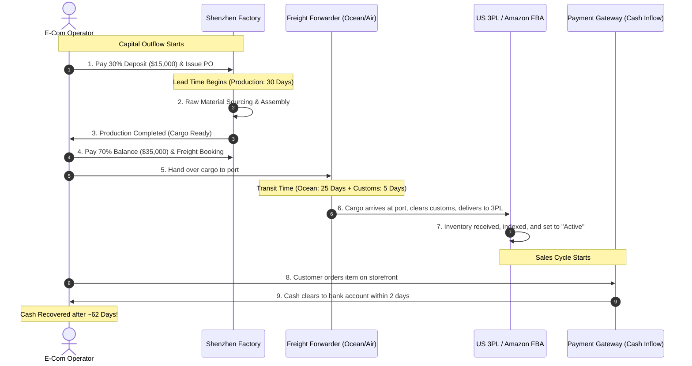

# Chapter 4: Inventory Economics & Cash-Flow Preservation

## 🎯 Core Thesis
In physical product e-commerce, **inventory is frozen cash**. Tanner Larsson stresses that cash flow is the lifeblood of an online business, and mismanaged inventory is the number one reason high-growth DTC brands go bankrupt. This reality is particularly acute for cross-border brands (such as those exporting from Shenzhen to the US/Europe markets), who face massive manufacturing lead times, customs barriers, and ocean shipping disruptions. Under-ordering results in stockouts and lost rankings, while over-ordering traps vital operating capital in depreciating warehouse assets. To survive and scale, operators must utilize strict mathematical models to calculate safety stocks, optimize lead times, and compress their cash-to-cash conversion cycles.

---

## 🔑 Key Terminology & Academic Definitions (Demystifying Jargon)

*   **Cost of Goods Sold (COGS)**: The total direct costs incurred to manufacture and import a product, including raw materials, assembly labor, packaging, factory inspection, and shipping freight to the fulfillment center.
*   **Safety Stock (SS)**: The buffer inventory maintained in a warehouse to protect against stockouts caused by supply-chain volatility (e.g., factory delays, customs inspections) or sudden spikes in consumer demand.
*   **Reorder Point (ROP)**: The exact inventory threshold (in units) at which a new production order must be placed with the manufacturer to ensure the new batch arrives before the current stock is completely depleted.
*   **Lead Time (LT)**: The total duration (in days) from the moment a purchase order (PO) is submitted to the factory and the deposit is paid, to the moment the finished goods are received and checked in at your 3PL or Amazon FBA warehouse.
*   **Cash Conversion Cycle (CCC)**: A key working-capital metric that measures the time (in days) it takes for a business to convert cash outlays for inventory back into cash inflows from sales:
    $$\text{CCC} = \text{Days Inventory Outstanding (DIO)} + \text{Days Sales Outstanding (DSO)} - \text{Days Payable Outstanding (DPO)}$$
    *   *For DTC brands, DSO is typically near 0 (credit card captures are instant), making DIO and DPO the critical levers.*

---

## ⛓️ The Cross-Border Cash Flow Timeline

For cross-border physical product brands, the flow of cash is highly disjointed. Capital is locked up months before any customer revenue is captured. This gap represents the primary risk to DTC cash flow:



---

## 💻 Production Reference: Safety Stock & Reorder Point Calculator (Python)

To run a professional supply chain and protect cash flow, operators cannot rely on guesses. They must calculate safety stock using standard statistical service factors. 

The following Python script implements the mathematical formulas for **Safety Stock (SS)** and **Reorder Point (ROP)** under variable demand and variable lead times, assuming a targeted $95\%$ or $99\%$ service level (probability of not running out of stock):

```python
import math

class SupplyChainEngine:
    # Standard Z-Scores corresponding to desired Service Levels (probability of no stockout)
    SERVICE_LEVEL_Z_SCORES = {
        0.90: 1.28,
        0.95: 1.65,  # Standard industry baseline
        0.98: 2.05,
        0.99: 2.33   # Mission-critical hardware
    }

    def __init__(self, avg_daily_sales: float, std_dev_sales: float, lead_time_days: int, std_dev_lead_time: float):
        """
        :param avg_daily_sales: Average units sold per day
        :param std_dev_sales: Standard deviation of daily unit sales (demand volatility)
        :param lead_time_days: Average factory lead time in days
        :param std_dev_lead_time: Standard deviation of lead time in days (supply chain volatility)
        """
        self.d_avg = avg_daily_sales
        self.d_std = std_dev_sales
        self.lt_avg = lead_time_days
        self.lt_std = std_dev_lead_time

    def calculate_safety_stock(self, service_level: float = 0.95) -> int:
        """
        Calculates safety stock using the standard statistical formula:
        Safety Stock = Z * sqrt( (Avg LT * StdDev Sales^2) + (Avg Sales^2 * StdDev LT^2) )
        """
        z_score = self.SERVICE_LEVEL_Z_SCORES.get(service_level, 1.65)
        
        # Term 1: Demand volatility during average lead time
        term_demand = self.lt_avg * (self.d_std ** 2)
        
        # Term 2: Supply chain/lead time volatility under average demand
        term_supply = (self.d_avg ** 2) * (self.lt_std ** 2)
        
        safety_stock = z_score * math.sqrt(term_demand + term_supply)
        return math.ceil(safety_stock)

    def calculate_reorder_point(self, safety_stock: int) -> int:
        """
        Calculates the Reorder Point (ROP):
        ROP = (Average Daily Sales * Lead Time) + Safety Stock
        """
        lead_time_demand = self.d_avg * self.lt_avg
        rop = lead_time_demand + safety_stock
        return math.ceil(rop)

# --- Example System Execution ---
# Imagine a Shenzhen-to-US exporter selling premium mechanical keyboards:
#   - Average sales: 45 units/day (standard deviation of 12 units/day due to ad-hoc marketing campaigns)
#   - Average lead time: 40 days (standard deviation of 8 days due to custom clearances and port congestion)
engine = SupplyChainEngine(
    avg_daily_sales=45.0,
    std_dev_sales=12.0,
    lead_time_days=40,
    std_dev_lead_time=8.0
)

# Calculate metrics for a standard 95% service level and a high-security 99% service level
ss_95 = engine.calculate_safety_stock(service_level=0.95)
rop_95 = engine.calculate_reorder_point(ss_95)

ss_99 = engine.calculate_safety_stock(service_level=0.99)
rop_99 = engine.calculate_reorder_point(ss_99)

print(" इन्वेंट्री इकोनॉमिक्स इंजन (Inventory Economics Engine):")
print("-" * 80)
print(f"Product Velocity:       {engine.d_avg} units/day (Volatility StdDev: {engine.d_std})")
print(f"Factory Lead Time:      {engine.lt_avg} days (Logistics StdDev: {engine.lt_std})")
print(f"Lead Time Demand:       {engine.d_avg * engine.lt_avg} units (Units sold during transit)")
print("-" * 80)
print("Standard Logistics Model (95% Service Level):")
print(f"  -> Optimal Safety Stock: {ss_95} units")
print(f"  -> Reorder Point (ROP):  {rop_95} units")
print(f"  * ACTION: Trigger production PO when warehouse inventory hits {rop_95} units.")
print("-" * 80)
print("Ultra-Secure Supply Chain Model (99% Service Level):")
print(f"  -> Optimal Safety Stock: {ss_99} units")
print(f"  -> Reorder Point (ROP):  {rop_99} units")
print(f"  * ACTION: Trigger production PO when warehouse inventory hits {rop_99} units.")
print("-" * 80)
print("Working Capital Projection:")
cogs_per_unit = 22.50 # USD
print(f"  -> Cash Frozen in Safety Stock (95% SL): ${ss_95 * cogs_per_unit:,.2f} USD")
print(f"  -> Cash Frozen in Safety Stock (99% SL): ${ss_99 * cogs_per_unit:,.2f} USD")
print("-" * 80)
```

---

## 🏆 Operator Playbook: Cash Flow Preservation

When managing relationships with overseas factories and budgeting your purchase orders to ensure solvency, use this playbook:

```text
Cash Flow & Margin Preservation Playbook:
─────────────────────────────────────────────────────────────────────────────
How do you scale sales without depleting all cash reserves on inventory purchases?
 └── Justification: Terms Negotiation & Lead Time Reduction.
     1. Negotiate 30/70 Payment Terms: Avoid paying 100% upfront. Pay a 30% deposit 
        to start production, and pay the remaining 70% only upon container inspection 
        and Bill of Lading (BoL) release.
     2. Optimize Lead Times: Consolidate components closer to the assembly factory. 
        Reducing lead time from 60 days to 30 days slashes safety stock requirements 
        by over 40%, freeing up significant working capital.
     3. Margin Safety Guard: Maintain a minimum Gross Margin of 65-70%. If your COGS is 
        $10, your retail price must be at least $30. This margin safety buffer protects 
        against shipping freight spikes and rising acquisition costs.
─────────────────────────────────────────────────────────────────────────────
```
