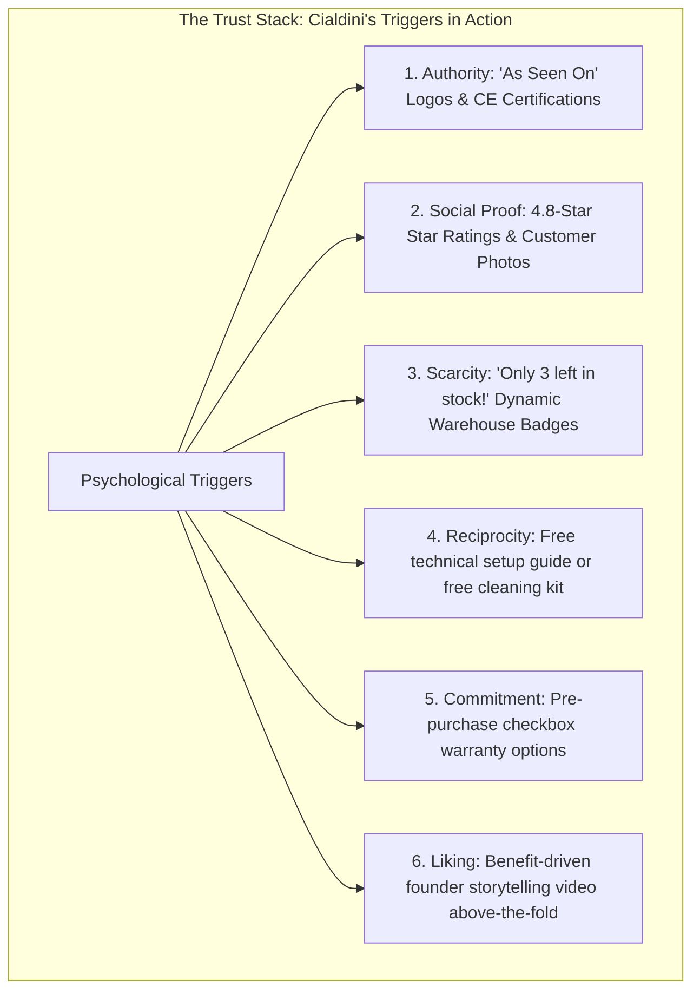

# Chapter 5: Conversion Rate Optimization & The Trust Stack

## 🎯 Core Thesis
Traffic is a high-cost commodity, but conversion rate is your ultimate business differentiator. Tanner Larsson argues that instead of spending more money on paid ads to acquire more traffic, the most cost-effective way to scale an e-commerce business is to optimize the traffic you already have. **Conversion Rate Optimization (CRO)** is not about random button-color changes; it is a systematic process of reducing cognitive friction, designing clear visual hierarchies, and establishing credibility. By layering Cialdini's psychological triggers—specifically Social Proof, Authority, and Scarcity—operators construct a **Trust Stack** that bypasses customer defense mechanisms and drives frictionless purchases.

---

## 🔑 Key Terminology & Academic Definitions (Demystifying Jargon)

*   **Conversion Rate (CR)**: The percentage of unique website visitors who successfully complete a checkout transaction:
    $$\text{Conversion Rate} = \left( \frac{\text{Total Conversions (Orders)}}{\text{Total Unique Sessions}} \right) \times 100$$
*   **The Trust Stack**: The cumulative layering of technical, visual, and social elements across a landing page that proves brand legitimacy, security, and product efficacy to a skeptical visitor.
*   **Cognitive Friction**: Any element in the user experience that causes confusion, hesitation, or extra mental processing (e.g., complex navigation, unclear return policies, forced account creation), directly leading to exit bounces.
*   **Social Proof**: The psychological phenomenon where consumers look to the actions and feedback of others to determine their own behavior, implemented via verified customer reviews, press mentions, and video testimonials.
*   **Visual Hierarchy**: The strategic design and placement of UI elements (size, contrast, whitespace) that guides the user's eye to the most important information and primary Call-to-Action (CTA) first.
*   **Friction Reduction**: Technical optimizations designed to minimize the steps and time required to complete checkout (e.g. implementing Apple Pay, address auto-completion APIs).

---

## 🧠 Cialdini's 6 Triggers Applied to E-Commerce UX

To build an unshakeable trust stack, operators must translate Cialdini's psychological triggers into highly visual storefront UI elements:



---

## 🏗️ Above-the-Fold Trust Stack Architecture

In modern e-commerce, the first screen a user sees (Above-the-Fold) determines whether they stay or bounce. Operators must structure their UI to deliver immediate value and establish credibility within 3 seconds:

1.  **Header**: Clear announcement bar ("Free Express Shipping over \$75") + Clean logo.
2.  **Visual (Left)**: High-resolution product image featuring a technical layout showing what's in the box, or a 15-second looping video demonstrating real-world utility.
3.  **Specs & Buy Box (Right)**:
    *   *Trust Layer 1*: Clear Star Rating (`★ ★ ★ ★ ★ 4.8/5 - 128 verified buyers`).
    *   *H1 Title*: Clear, benefit-driven product headline.
    *   *Frictionless CTAs*: Direct Apple Pay / Google Pay dynamic buttons, bypassing multi-step checkout forms.
    *   *Trust Layer 2*: Security SSL encryption seals and secure Stripe payment badges directly beneath the CTA.
    *   *Risk Reversal*: "30-Day Risk-Free Money-Back Guarantee & Lifetime Warranty."

---

## 📐 Conceptual Deep-Dive: Structured Storefront CRO & A11y Audits

Rather than running client-side test scripts, product marketing managers must perform manual and visual evaluations of storefront DOM parameters to ensure absolute compliance with accessibility, security, and conversion best practices. A comprehensive storefront CRO and accessibility audit evaluates five critical layout vectors:

### The 5-Vector Storefront Audit Framework:

```text
Storefront Layout Audit Framework:
┌────────────────────────────────────────────────────────────────────────────┐
│ 1. Heading Hierarchy & Cognitive Alignment                                 │
│    - Standard: Every landing page must contain exactly one <h1> tag.       │
│    - Audit: Confirm that the <h1> is positioned above-the-fold and maps    │
│      directly to the ad copy intent that referred the visitor.             │
├────────────────────────────────────────────────────────────────────────────┐
│ 2. Visual Contrast & Button Accessibility (A11y)                           │
│    - Standard: Primary CTAs must meet WCAG 2.1 AA contrast requirements    │
│      (minimum contrast ratio of 4.5:1 against page backgrounds).            │
│    - Audit: Confirm that 'Add to Cart' buttons are high-contrast, larger   │
│      than 48x48 pixels for mobile tap targets, and feature ARIA labels.    │
├────────────────────────────────────────────────────────────────────────────┐
│ 3. Image Optimization & Metadata Searchability                             │
│    - Standard: All product images must contain descriptive 'alt' tags.    │
│    - Audit: Check that image alt text does not contain generic keywords,   │
│      but describes the product structure to support Google Image Search.  │
├────────────────────────────────────────────────────────────────────────────┐
│ 4. Trust Badging & Technical Validation                                    │
│    - Standard: Trust badges must be high-resolution SVGs positioned        │
│      directly beneath the primary call-to-action button.                   │
│    - Audit: Ensure security icons do not look generic or low-quality, which│
│      actually degrades trust instead of enhancing it.                      │
├────────────────────────────────────────────────────────────────────────────┐
│ 5. Risk-Reversal & Friction Reduction                                      │
│    - Standard: Display clear satisfaction guarantees within 50px of CTA.   │
│    - Audit: Verify that standard checkout links support 1-click payment    │
│      gateways (Shop Pay, Apple Pay) to bypass forms completely.            │
└────────────────────────────────────────────────────────────────────────────┘
```

By systematically auditing and adjusting these layout vectors, operators can reduce bounce rates and maximize cohort conversion metrics.

---

## 🏆 Operator Playbook: Friction Reduction

When auditing your storefront checkout flow and designing high-converting product templates, use this playbook:

```text
Friction Reduction Playbook:
─────────────────────────────────────────────────────────────────────────────
How do you optimize mobile checkout conversions and reduce transaction abandonment?
 └── Justification: One-Click Gateways & Form Compression.
     1. Form Field Audit: Remove all non-mandatory input fields. Eliminate "Company Name," 
        "Address Line 2," and phone number requirements if not used for shipping.
     2. Address Auto-Complete: Integrate Google Places API in the checkout address 
        input. This allows mobile users to auto-fill their complete street address 
        in a single tap, reducing mobile input friction by 50%.
     3. Vaulted Express Checkout: Position Apple Pay, Google Pay, and Shop Pay 
        buttons above-the-fold. Bypassing standard multi-step forms increases 
        mobile conversions by up to 35% programmatically.
─────────────────────────────────────────────────────────────────────────────
```

---

## 💬 Cross-Functional Interview Q&As (PMM Audits)

### Q1: "UX designers want a beautiful, minimalist landing page with no trust badges, reviews, or guarantees. Paid marketers want a high-converting long-form landing page packed with badges and testimonials. How do you resolve this brand vs conversion conflict?" (Creative Director to PMM)

> **PMM Candidate Answer:**
> "This is a classic e-commerce conflict. Designers are correct that cluttered pages look cheap and degrade brand equity. Marketers are also correct that removing trust elements tank conversion rates, causing our CAC to skyrocket.
> 
> **To resolve this, we implement a 'Sleek Trust Stack' architecture that matches high-density conversions with clean, premium design.**
> 
> 1.  **Eliminate Clunky/Colorful Badge Grids**: We remove colorful, low-quality secure-lock and payment cliparts that look spammy.
> 2.  **Implement Integrated SVGs**: We have design create custom, monochrome, pixel-perfect SVG icons that match our brand's exact color palette (e.g. muted charcoal or sleek slate). We embed these clean, minimalist icons directly under the CTA button, keeping the layout clean while preserving the trust signal.
> 3.  **Tiered Visual Discovery**: Instead of cluttering the main screen with 50 customer reviews, we display a single, high-contrast verified rating summary (`★ ★ ★ ★ ★ 4.8/5 (128 Reviews)`) directly above the product title. When clicked, it smoothly scrolls the user to a dedicated, beautifully formatted reviews section further down the page.
> 
> By utilizing clean monochrome styling and hierarchical disclosure, we satisfy UX design's aesthetic standards while preserving all critical psychological conversion anchors."

### Q2: "If our mobile checkout drop-off rate is 75% higher than our desktop checkout drop-off rate, what is your diagnostic audit and optimization playbook to fix the mobile checkout conversion rate?" (CEO to PMM)

> **PMM Candidate Answer:**
> "A mobile drop-off rate that is 75% higher than desktop indicates severe technical or layout friction in our mobile checkout experience. Mobile users have shorter attention spans, operate on smaller screens, and type with thumbs, making form friction catastrophic.
> 
> I will execute a three-step mobile diagnostic and optimization playbook:
> 
> **Step 1: Audit Form Field Friction**
> I will analyze our checkout forms on a mobile device. If we require users to manually type their first name, last name, email, billing address, and shipping address across three separate screens, we are creating over 30 separate tap targets. Every extra field decreases mobile conversions by 10%. We must compress our forms to a single-screen layout and remove all non-essential fields (e.g., fax, company name, address line 2).
> 
> **Step 2: Integrate Address Auto-Fill**
> We will configure address autocomplete. The moment a user starts typing their street address, the system auto-populates the complete fields using verified shipping databases. This reduces thumb-typing errors by 90% and accelerates checkout by 20 seconds.
> 
> **Step 3: Mandate Vaulted Express Payments**
> Mobile keyboards make entering a 16-digit credit card number and expiration date highly frustrating. We will position **Apple Pay, Google Pay, and Shop Pay** buttons at the top of the mobile buy box. These vaulted express payment options allow a user to complete their entire purchase (including shipping address extraction) via biometric fingerprint or face scan in under 3 seconds. By eliminating manual input, we bypass the mobile conversion barrier and bring our mobile drop-off rates back in line with desktop."
