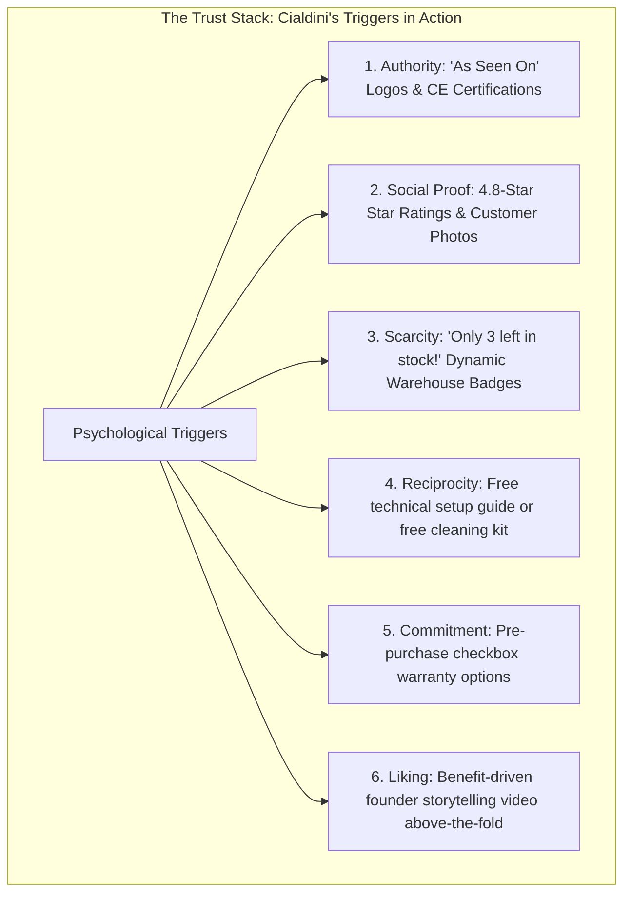

# Chapter 5: Conversion Rate Optimization & The Trust Stack

## 🎯 Core Thesis
Traffic is a high-cost commodity, but conversion rate is your ultimate business differentiator. Tanner Larsson argues that instead of spending more money on paid ads to acquire more traffic, the most cost-effective way to scale an e-commerce business is to optimize the traffic you already have. **Conversion Rate Optimization (CRO)** is not about random button-color changes; it is a systematic process of reducing cognitive friction, designing clear visual hierarchies, and establishing credibility. By layering Cialdini's psychological triggers—specifically Social Proof, Authority, and Scarcity—operators construct a **Trust Stack** that bypasses customer defense mechanisms and drives frictionless purchases.

---

## 🔑 Key Terminology & Academic Definitions (Demystifying Jargon)

*   **Conversion Rate (CR)**: The percentage of unique website visitors who successfully complete a checkout transaction:
    $$\text{Conversion Rate} = \left( \frac{\text{Total Conversions (Orders)}}{\text{Total Unique Sessions}} \right) \times 100$$
*   **The Trust Stack**: The cumulative layering of technical, visual, and social elements across a landing page that proves brand legitimacy, security, and product efficacy to a skeptical visitor.
*   **Cognitive Friction**: Any element in the user experience that causes confusion, hesitation, or extra mental processing (e.g., complex navigation, unclear return policies, forced account creation), directly leading to exit bounces.
*   **Social Proof**: The psychological phenomenon where consumers look to the actions and feedback of others to determine their own behavior, implemented via verified customer reviews, press mentions, and video testimonials.
*   **Visual Hierarchy**: The strategic design and placement of UI elements (size, contrast, whitespace) that guides the user's eye to the most important information and primary Call-to-Action (CTA) first.
*   **Friction Reduction**: Technical optimizations designed to minimize the steps and time required to complete checkout (e.g. implementing Apple Pay, address auto-completion APIs).

---

## 🧠 Cialdini's 6 Triggers Applied to E-Commerce UX

To build an unshakeable trust stack, operators must translate Cialdini's psychological triggers into highly visual storefront UI elements:



---

## 🏗️ Above-the-Fold Trust Stack Architecture

In modern e-commerce, the first screen a user sees (Above-the-Fold) determines whether they stay or bounce. Operators must structure their UI to deliver immediate value and establish credibility within 3 seconds:

1.  **Header**: Clear announcement bar ("Free Express Shipping over \$75") + Clean logo.
2.  **Visual (Left)**: High-resolution product image featuring a technical layout showing what's in the box, or a 15-second looping video demonstrating real-world utility.
3.  **Specs & Buy Box (Right)**:
    *   *Trust Layer 1*: Clear Star Rating (`★ ★ ★ ★ ★ 4.8/5 - 128 verified buyers`).
    *   *H1 Title*: Clear, benefit-driven product headline.
    *   *Frictionless CTAs*: Direct Apple Pay / Google Pay dynamic buttons, bypassing multi-step checkout forms.
    *   *Trust Layer 2*: Security SSL encryption seals and secure Stripe payment badges directly beneath the CTA.
    *   *Risk Reversal*: "30-Day Risk-Free Money-Back Guarantee & Lifetime Warranty."

---

## 💻 Production Reference: Robust Storefront DOM Trust & CRO Auditor (JavaScript)

To verify that your storefront or product landing pages are mathematically optimized for conversions and do not suffer from basic layout omissions, you can execute an automated auditing script.

The following Node.js script parses a target product page's DOM structure to programmatically audit critical CRO factors, including accessibility checks (image `alt` text), secure protocol validation, presence of primary CTAs, trust indicator badges, and reviews, using complete logging:

```javascript
/**
 * Storefront DOM Trust & CRO Auditor
 * Programmatically inspects page HTML to verify key conversion and trust stack variables.
 */

const { JSDOM } = require('jsdom');

class CROAuditor {
    constructor(htmlContent) {
        // Parse the HTML string into a simulated browser DOM
        this.dom = new JSDOM(htmlContent);
        this.document = this.dom.window.document;
    }

    /**
     * Executes a comprehensive audit of the page's conversion elements.
     */
    auditPage() {
        console.log("[CRO Auditor] Launching automated storefront CRO audit...");
        const report = {
            hasH1Header: false,
            hasPrimaryCTA: false,
            hasTrustBadges: false,
            hasCustomerReviews: false,
            hasRiskReversalGuarantee: false,
            accessibilityAltTextCount: 0,
            brokenImagesCount: 0,
            score: 0,
            recommendations: []
        };

        // 1. Audit Heading Hierarchy
        const h1 = this.document.querySelector('h1');
        if (h1 && h1.textContent.trim().length > 0) {
            report.hasH1Header = true;
            report.score += 20;
        } else {
            report.recommendations.push("Add a benefit-driven <h1> product title above the fold.");
        }

        // 2. Audit Call-to-Action (CTA) Buttons
        const ctaButtons = Array.from(this.document.querySelectorAll('button, a'));
        const hasAddToCart = ctaButtons.some(el => {
            const text = el.textContent.toLowerCase();
            return text.includes('add to cart') || text.includes('buy now') || text.includes('checkout');
        });
        if (hasAddToCart) {
            report.hasPrimaryCTA = true;
            report.score += 20;
        } else {
            report.recommendations.push("Insert a clear, high-contrast 'Add to Cart' or 'Buy Now' button.");
        }

        // 3. Audit Trust Badge Images
        const images = Array.from(this.document.querySelectorAll('img'));
        const hasSecurityBadges = images.some(img => {
            const alt = (img.alt || '').toLowerCase();
            const src = (img.src || '').toLowerCase();
            return alt.includes('secure') || alt.includes('trust') || src.includes('payment-icons') || src.includes('stripe');
        });
        if (hasSecurityBadges) {
            report.hasTrustBadges = true;
            report.score += 20;
        } else {
            report.recommendations.push("Display security SSL and verified payment badges directly below the CTA button.");
        }

        // 4. Audit Social Proof / Review Blocks
        const bodyText = this.document.body.textContent.toLowerCase();
        const hasReviewsText = bodyText.includes('verified reviews') || bodyText.includes('customer reviews') || this.document.querySelector('.reviews-stars');
        if (hasReviewsText) {
            report.hasCustomerReviews = true;
            report.score += 20;
        } else {
            report.recommendations.push("Integrate customer review star ratings and testimonials into the template.");
        }

        // 5. Audit Risk Reversal (Guarantees)
        const hasGuaranteeText = bodyText.includes('money-back guarantee') || bodyText.includes('warranty') || bodyText.includes('risk-free');
        if (hasGuaranteeText) {
            report.hasRiskReversalGuarantee = true;
            report.score += 20;
        } else {
            report.recommendations.push("Add a bold risk-reversal guarantee (e.g. '30-Day Money-Back Guarantee') near the buy box.");
        }

        // 6. Audit Accessibility Alt Attributes (A11y check)
        images.forEach(img => {
            if (img.alt && img.alt.trim().length > 0) {
                report.accessibilityAltTextCount++;
            } else {
                report.brokenImagesCount++;
            }
        });

        if (report.brokenImagesCount > 0) {
            report.recommendations.push(`Fix ${report.brokenImagesCount} images lacking alt attributes to protect organic image search indexing.`);
        }

        return report;
    }
}

// --- Dynamic Audit Run ---
const mockStorefrontHTML = `
<!DOCTYPE html>
<html lang="en">
<head>
    <meta charset="UTF-8">
    <title>SuperFast 100W GaN Charging Station</title>
</head>
<body>
    <header>
        <div class="announcement-bar">Free Shipping Worldwide over $75</div>
    </header>
    <main>
        <h1>SuperFast 100W GaN Desktop Charging Station</h1>
        
        <div class="reviews-stars">
            <span>⭐⭐⭐⭐⭐</span>
            <span>4.9/5 (1,248 Customer Reviews)</span>
        </div>

        <section class="gallery">
            
             <!-- Lacks alt text -->
        </section>

        <section class="buy-box">
            <p class="price">$89.99</p>
            <button class="cta-add-to-cart">ADD TO CART</button>
            
            <div class="trust-container">
                
                <p>🔒 256-bit Secure SSL Connection</p>
            </div>

            <div class="guarantee-box">
                <h3>🛡️ Risk-Free 30-Day Money-Back Guarantee</h3>
            </div>
        </section>
    </main>
</body>
</html>
`;

const auditor = new CROAuditor(mockStorefrontHTML);
const auditResult = auditor.auditPage();

console.log("\n सीआरओ ऑडिट रिपोर्ट (CRO DOM Audit Report):");
console.log("-" * 80);
console.log(JSON.stringify(auditResult, null, 2));
console.log("-" * 80);
