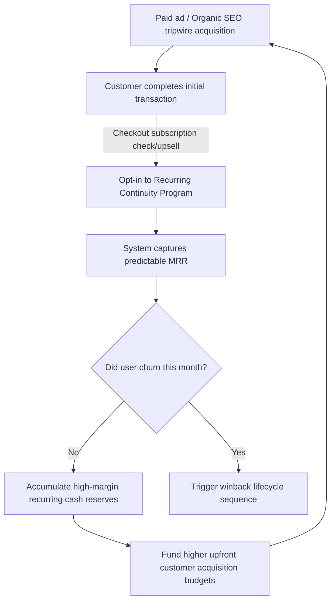

# Chapter 6: The Recurring Income Core

## 🎯 Core Thesis
Purely transactional e-commerce brands operate on a high-risk treadmill: they must pay to acquire every single customer, and the moment they stop running paid ads, their revenue drops to zero. Tanner Larsson argues that the ultimate differentiator of an evolved e-commerce brand is **The Recurring Income Core**. By integrating a **Continuity Model**—such as consumable replenishment, curated subscription boxes, or premium ecosystem memberships—brands build predictable, repeatable Monthly Recurring Revenue (MRR). This recurring engine stabilizes cash flow, cushions against rising ad channel inflation, and drastically amplifies brand valuation, allowing operators to command enterprise multiples up to $3-5\text{x}$ higher than purely transactional competitors during acquisition reviews.

---

## 🔑 Key Terminology & Academic Definitions (Demystifying Jargon)

*   **Continuity Program**: An automated, recurring billing model where customers are programmatically charged at designated intervals (weekly, monthly, quarterly) in exchange for ongoing product shipments, consumables, or exclusive ecosystem access.
*   **Monthly Recurring Revenue (MRR)**: The highly predictable, repeatable revenue generated by a subscription model each month:
    $$\text{MRR} = \text{Total Active Subscribers} \times \text{Average Monthly Subscription Value}$$
*   **Subscriber Churn Rate**: The percentage of active subscribers who cancel or fail to renew their subscription within a given month:
    $$\text{Subscriber Churn (\%)} = \left( \frac{\text{Cancellations during month}}{\text{Total Active Subscribers at start of month}} \right) \times 100$$
    *   *A healthy physical product continuity program must target a monthly subscriber churn under $5-7\%$.*
*   **Replenishment Continuity**: A recurring subscription based on the predictable exhaustion cycle of consumable physical goods (e.g., razor blades, filters, coffee beans, vitamins) shipped automatically to prevent customer stockouts.
*   **Curated Box Continuity**: A subscription model where users receive a curated, surprise bundle of niche-specific products at set intervals, relying on discovery, novelty, and premium packaging utility.
*   **Ecosystem Membership Continuity**: Offering exclusive perks, digital training, community forums, priority support, and automatic free shipping in exchange for a recurring monthly fee (similar to Amazon Prime).

---

## 🔁 The Continuity Growth Loop

Unlike linear transactional scaling, a recurring income core compounds customer value over time, allowing the merchant to accumulate predictable cash reserves that compound with every new cohort acquired:



### The Strategic Value of Predictable Cash Flow:
*   **Compounding Customer Value**: If a customer purchases a single item for \$50, their value is capped at \$50. If they enroll in a \$15/month continuity program and stay for 12 months, their customer value increases to \$230, drastically widening operating margins.
*   **Valuation Multiple Expansion**: In the M&A (Mergers & Acquisitions) market, transactional storefronts are valued at a low $1-2\text{x}$ multiple of trailing twelve months (TTM) net profit because their revenue is volatile. E-commerce brands with a robust recurring revenue core (MRR representing $>35\%$ of total sales) command premium multiples of $4-6\text{x}$ net profit because their future revenue is statistically locked-in.

---

## 🏆 Operator Playbook: Transitioning to Continuity

When restructuring a transactional product catalog to incorporate a recurring continuity core, use this operational checklist:

```text
Continuity Core Deployment Playbook:
─────────────────────────────────────────────────────────────────────────────
How do you integrate recurring revenue into a brand that sells one-time hard goods?
 └── Justification: Ecosystem & Replenishment Bundling.
     1. Consumable Accessories: Identify the parts of your product that wear out 
        or get consumed (e.g., air filters, cleaning solutions, replacement blades). 
        Offer a "Subscribe & Save" discount (10-15%) directly in the checkout buy box.
     2. VIP Premium Memberships: Launch a VIP club offering automatic free shipping, 
        early access to new product drops, and monthly technical guides in exchange 
        for a small recurring fee ($5-9/mo).
     3. Customer Control Portal: Give subscribers easy control to skip, delay, or swap 
        items inside their dashboard. Making cancellation difficult backfires by 
        spiking chargebacks and payment processor disputes.
─────────────────────────────────────────────────────────────────────────────
```

---

## 💬 Cross-Functional PMM Interview Q&As (PMM Audits)

### Q1: "How do you reposition a high-ticket, one-time purchase hardware device (e.g., a premium home espresso machine) to incorporate a high-margin, recurring continuity core?" (Director of Product / PM Lead)

> **PMM Candidate Answer:**
> "Repositioning a premium hard-good device into a recurring continuity core requires shifting our positioning from selling a *standalone physical machine* to selling the *complete premium morning experience*.
> 
> We achieve this by structuring a three-tier customer offering that integrates a **Consumable Replenishment Loop** and an **Ecosystem Membership**:
> 
> 1.  **The Consumable Replenishment (Coffee Bean Continuity)**: During the checkout flow of the espresso machine, we present a pre-checked order bump offering a monthly subscription of curated, freshly roasted coffee beans matching their taste profile. We provide a 15% discount on the machine if they commit to a 6-month bean continuity contract. The discount is fully offset by the high-margin coffee margins over the 6-month cohort duration.
> 2.  **The Maintenance Kit Continuity**: Espresso machines require regular cleaning, descaling, and water filter replacements every 90 days. We programmatically opt buyers into a quarterly 'Clean Machine' shipment program for \$19/quarter, ensuring they protect their machine's warranty while establishing a passive high-margin revenue loop for our brand.
> 3.  **The Premium Ecosystem (VIP Club)**: We bundle a monthly digital membership—featuring exclusive virtual barista training classes, custom drink recipe guides, and community forum access—offered free for the first 30 days and billing at \$4.99/month thereafter. By integrating physical consumables (beans), maintenance parts (filters), and digital experiences, we transform a static one-time purchase into a highly profitable, relationship-driven lifetime customer loop."

### Q2: "Subscriber churn has spiked by 25% over the last two quarters, causing our MRR to decline. As a PMM, how do you audit this churn and design a retention strategy to resolve it without slashing subscription pricing?" (VP of Operations / CFO)

> **PMM Candidate Answer:**
> "A 25% spike in subscriber churn is a critical issue that indicates either transactional friction or customer value fatigue. To audit and resolve this without degrading our margins through price discounts, I will execute a three-stage audit and retention playbook:
> 
> **Stage 1: Isolate Churn Typology (Involuntary vs. Voluntary)**
> *   **Involuntary Churn**: Typically represents 30-40% of overall subscriber losses, caused by failed billing attempts, expired credit cards, or bank declines. I will work with engineering to optimize our automated dunning sequences (retrying cards at optimal times of the month, using card-updater API syncs on Stripe) to recover these users silently.
> *   **Voluntary Churn**: Customers explicitly clicking 'Cancel'.
> 
> **Stage 2: Execute Cancellation Funnel Audits**
> We will implement a brief, high-value cancellation survey inside the user dashboard. Before letting a customer cancel, we ask for their primary reason and programmatically present custom value alternatives:
> *   *If 'Too much product piled up'*: We offer a one-click option to 'Pause for 30 Days' or 'Reduce frequency to every 60 days'. Most churn is caused by product overflow, and letting users skip a month recovers 40% of cancellations.
> *   *If 'Need to save money'*: Instead of discounting the subscription permanently, we offer a temporary 'Free Month Upgrade' or the option to swap their premium tier for a lighter, budget-friendly baseline product tier.
> 
> **Stage 3: Establish Milestone Engagement Value**
> We must constantly re-prove our value. We will schedule automated emails or SMS notifications timed right before their next billing cycle, sharing customer unboxing videos, custom usage tutorials, or offering a surprise loyalty gift (e.g., a free accessory added to their 3rd and 6th consecutive shipments). By focusing on user value metrics and offering billing flexibility, we can compress voluntary churn without touching our baseline continuity margins."
