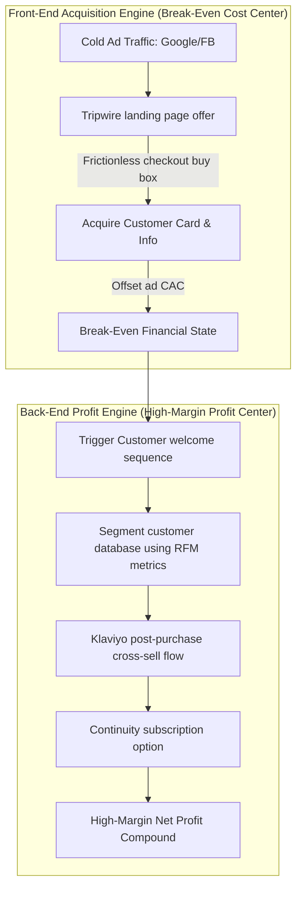

# Chapter 8: Evolved Marketing Systems

## 🎯 Core Thesis
Marketing is not a series of disjointed advertising campaigns; it is an integrated, programmatic machine. Tanner Larsson emphasizes that the primary reason e-commerce brands fail to scale is that they treat customer acquisition (front-end marketing) and customer monetization (back-end marketing) as separate, isolated tasks. **Evolved Marketing Systems** require a strict division of labor: front-end marketing (paid search, paid social, organic SEO sitemaps) is structured as a capital-preservation engine designed to acquire customer relationships at break-even ($CAC = \text{Initial Margin}$). Back-end marketing (automated Klaviyo sequences, loyalty loops, continuity subscriptions) acts as your primary high-margin profit center that scales the enterprise.

---

## 🔑 Key Terminology & Academic Definitions (Demystifying Jargon)

*   **Front-End Marketing**: Acquisition campaigns targeted at cold, unaware audiences designed to convert them into first-time paying buyers. The goal is customer acquisition volume and CAC offset, not immediate net profit.
*   **Back-End Marketing**: Lifecycle marketing campaigns targeted exclusively at existing buyers, utilizing automated retention, replenishment, cross-sell, and VIP loyalty loops to generate high-margin net profits.
*   **Tripwire Funnel**: A highly appealing, low-cost physical product offered at a discount to cold traffic, designed specifically to overcome buyer friction and convert visitors into customers instantly, offsetting upfront ad costs.
*   **Return on Ad Spend (ROAS)**: A basic front-end advertising metric measuring gross revenue generated per dollar spent on ads:
    $$\text{ROAS} = \frac{\text{Total Gross Revenue Generated by Ads}}{\text{Total Ad Spend}}$$
    *   *Tanner Larsson warns that optimizing solely for ROAS is a dangerous mistake because it ignores COGS, shipping fees, and back-end customer value.*
*   **Customer Lifetime Value (LTV)**: The total net profit generated by a single customer over their entire relationship with your brand:
    $$\text{LTV} = \text{AOV} \times \text{Purchase Frequency} \times \text{Net Profit Margin (\%)}$$
*   **Blended CAC**: The average customer acquisition cost calculated across all traffic channels (Paid Search, Social, Organic SEO, Email Referrals) combined:
    $$\text{Blended CAC} = \frac{\text{Total Marketing Spend (All Channels)}}{\text{Total New Customers Acquired}}$$

---

## 🏗️ Front-End Acquisition vs. Back-End Profit Funnel

To build a sustainable e-commerce business, you must decouple your customer acquisition cost from your profit generation. This visual system maps how front-end traffic is converted and programmatically monetized through high-margin back-end channels:



---

## 🏆 Operator Playbook: Evolved Campaign Deployment

When auditing your marketing operations and structuring your product marketing funnel to ensure maximum capital efficiency, use this playbook:

```text
Evolved Marketing Systems Playbook:
─────────────────────────────────────────────────────────────────────────────
How do you structure an integrated marketing funnel that self-funds its own growth?
 └── Justification: Front-End Decoupling & Back-End Customer Value Loops.
     1. Set Front-End CAC Targets: Calculate your manufacturing landed COGS and 
        tripwire pricing. Allow your media buyers to spend up to 100% of the front-end 
        margin to acquire a customer, outbidding competitors on Google and Facebook.
     2. Build Immediate Monetization: Implement checkout-embedded order bumps 
        and post-purchase one-click upsells (Chapter 2) to instantly lift AOV.
     3. Automate Lifecycle Return Paths: Deploy automated email flows in Klaviyo 
        segmented by product purchases. Trigger cross-sell flows on Day 14 and 
        replenishment subscriptions on Day 30, capturing pure backend net profit.
─────────────────────────────────────────────────────────────────────────────
```

---

## 💬 Cross-Functional Interview Q&As (PMM Audits)

### Q1: "The Paid Media Lead is boasting about a 4.0x ROAS on a front-end Facebook ad campaign. The CFO is complaining that our company cash reserves are declining. How do you diagnostic-audit this conflict and align their metrics?" (VP of Growth / CEO)

> **PMM Candidate Answer:**
> "This represents a classic e-commerce metric conflict. The Paid Media Lead is looking at a **Vanity Attribution Metric (ROAS)**, while the CFO is looking at **Cash Flow and Net Margins**. A 4.0x ROAS sounds impressive, but it can easily hide a business that is actively bleeding cash.
> 
> I will audit this disconnect by calculating our **Real Gross Margin Break-Even ROAS** and comparing it to our ad platform reporting:
> 
> 1.  **Calculate Landed Break-Even ROAS**:
>     *   Let's say our retail price is \$100.
>     *   Our landed product COGS is \$30, shipping and fulfillment cost is \$15, and payment processing fees are \$5. Our total variable cost per order is \$50.
>     *   Our real Gross Margin is 50% (\$50 margin per order).
>     *   To break even on a cash basis, our acquisition cost (CAC) must be under \$50.
>     *   This means our real **Break-Even ROAS must be at least 2.0x** ($\frac{\$100}{\$50}$).
> 
> 2.  **Isolate Analytics Attribution Inflation**:
>     *   Ad platforms (like Facebook and Google Ads) utilize inflated, self-serving attribution models. If a user views our ad, makes no purchase, but returns three days later via an organic search listing to buy, Facebook still claims 100% credit for that sale, inflating the reported platform ROAS to 4.0x.
>     *   Meanwhile, on a real cash basis, we paid for the ad, paid our fulfillment costs, and our actual blended acquisition costs are higher than the platform claims.
> 
> **My Strategic Resolution:**
> We must stop using ad-platform reported ROAS as our primary growth metric. I will align both teams by implementing a unified dashboard tracking **MER (Marketing Efficiency Ratio)** and **Blended CAC**:
> $$\text{MER} = \frac{\text{Total Storefront Revenue (All Channels)}}{\text{Total Advertising Spend}}$$
> MER is an audited financial metric that cannot be manipulated by platform attribution errors. If our MER is above our blended break-even threshold (e.g. 2.0x), we are cash-flow positive. We then hold the media buyers accountable to **Blended CAC** (using backend database numbers) and hold the product marketing team accountable to **LTV expansion** through backend CVO loops, ensuring that front-end customer acquisition is backed by real cash reserves."

### Q2: "When executing a multi-channel GTM marketing campaign, how do you prevent ad fatigue on paid channels and coordinate email retention flows to maximize customer value?" (Paid Acquisition Lead / Email Marketer)

> **PMM Candidate Answer:**
> "Ad fatigue and channel friction occur when marketing teams operate in silos, blasting the same generic message across paid social, paid search, and email, leading to consumer blindness and high unsubscribe rates. To prevent this, we must build an **Evolved Multi-Channel Sequence** where channels pass the baton to one another based on customer journey milestones:
> 
> 1.  **Phase 1: Paid Social & Search (The Storyteller & Problem Solver)**: We use paid ads to introduce a technical problem our product solves, driving traffic to a high-utility landing page. We do not try to close a complex, high-ticket sale immediately; we focus on getting them to opt-in to our lead magnet (e.g., a compatibility guide) or purchase a low-friction tripwire accessory.
> 2.  **Phase 2: Transition to Email Retention (The Nurturer)**: Once the user opts-in or purchases, their email is synced with Klaviyo. We immediately exclude them from our top-of-funnel paid social ads using custom audience syncs. This saves ad budget, prevents ad fatigue, and hands the communication over to our free, high-margin email welcome and onboarding loops.
> 3.  **Phase 3: Coordinated Retargeting (The Objection Crusher)**: If the customer abandons their cart, we launch a coordinated sequence. Instead of blasting them with 'buy now' emails, we use email to send a verified customer review video (Social Proof) and simultaneously run paid retargeting ads showing a technical compatibility teardown (Objection Crushing).
> 
> By coordinating our channels so that paid ads focus on *front-end attention and problem validation* and email/SMS focus on *back-end trust building and retention*, we reduce customer ad fatigue, lower our acquisition costs, and maximize long-term lifetime value."
