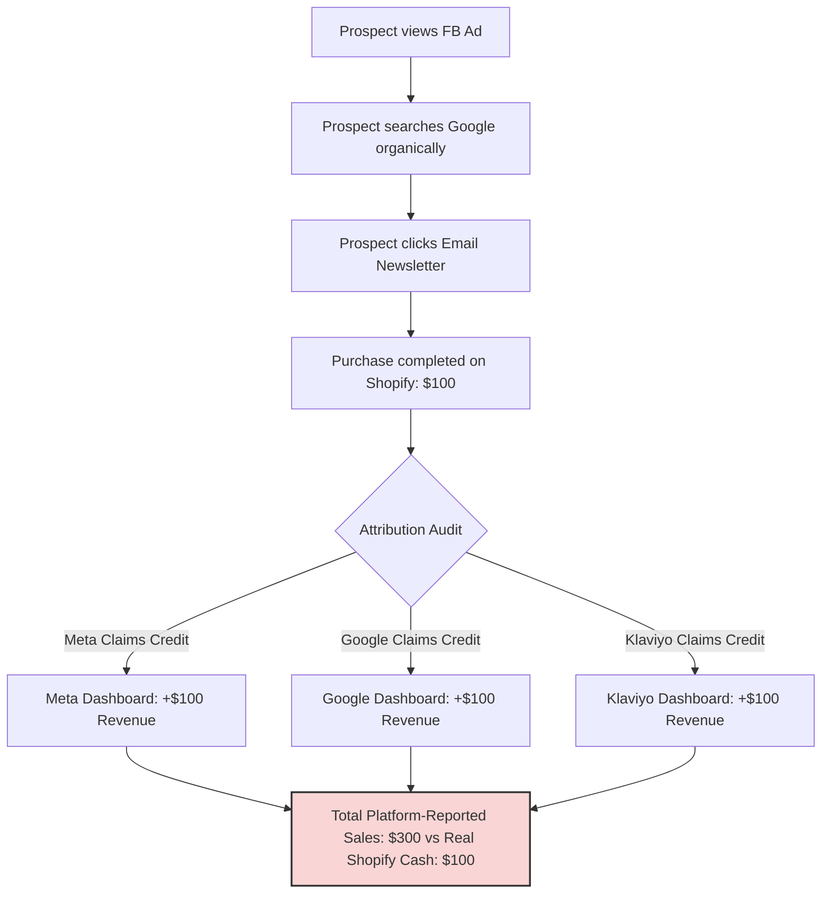

# Case Study: The Shopify DTC Profitability Engine

## 🎯 Strategic Objective
The ultimate failure mode for direct-to-consumer (DTC) brands scaling on the Shopify platform is **net margin dilution** and **attribution blindness**. Operational teams frequently optimize for vanity metrics—such as top-line gross revenue or platform-reported Return on Ad Spend (ROAS)—while ignoring silent cash leaks. To build an enduring e-commerce business, operators must transition from marketing-first management to absolute **financial discipline**. This case study details how to identify and plug cash leaks, construct airtight unit-economic models, bypass ad-network attribution inflation, and establish operational margin safeguards to ensure you **never lose money on Shopify DTC**.

---

## 🛠️ The Leakage Audit: Visualizing the Margin Degradation Cascade

Many founders assume a product with a $\$15$ EXW (Ex Works) factory price sold at $\$60$ carries a robust $75\%$ gross margin. In practice, variable costs, packaging, returns, support, and ad-spend bleed the transaction down to a loss.

Below is a fully loaded transaction cascade showing how a premium $\$100.00$ Shopify retail purchase degrades down to real net profit, illustrating where cash leaks occur:

| Transaction Phase | Operational Line Item | Cash Flow Impact | Cumulative Margin % | Strategic Financial Danger & Leakage Vector |
| :--- | :--- | :--- | :--- | :--- |
| **Gross Capture** | Retail Product Price | **+\$100.00** | **100.0%** | Baseline price captured at checkout. |
| **Product Cost** | Fully Loaded Landed COGS | -\$22.00 | **78.0%** | *Leak:* Underestimating ocean/air freight pro-rata, import tariffs, or 3PL intake fees. |
| **Fulfillment** | 3PL Pick/Pack & Packaging | -\$3.50 | **74.5%** | *Leak:* High custom box weights, excessive bubble wrap, or custom printed card inserts. |
| **Logistics** | Outbound Carrier Postage | -\$11.50 | **63.0%** | *Leak:* Offering un-incentivized free shipping on heavy or low-value items. |
| **Merchant Fee** | Shopify Payments / Gateway Fee | -\$3.20 | **59.8%** | *Leak:* Un-optimized subscription plans, PayPal premiums, or FX conversion fees. |
| **Retention** | Returns & Refunds Reserve | -\$6.00 | **53.8%** | *Leak:* Refunding full cash instantly; absorbing outbound + return shipping and 3PL restock fees. |
| **App Sprawl** | SaaS App Subscriptions | -\$1.80 | **52.0%** | *Leak:* Accumulating 15+ high-priced Shopify App subscriptions with recurring monthly flat fees. |
| **Operations** | Support & Transit Disputes | -\$2.00 | **50.0%** | *Leak:* Processing chargebacks, reshipping lost packages, and support labor overhead. |
| **Acquisition** | Blended CAC (at 2.5x MER) | -\$40.00 | **10.0%** | *Leak:* Relying on inflated ad-network pixel reporting to justify excessive ad bids. |
| **NET CASH** | **Cash Contribution Profit** | **+\$10.00** | **10.0%** | **Real net cash collected—completely isolated from vanity metrics.** |

---

## 💸 The Shopify Fee Stack & SaaS App Squeeze

### Shopify Payments vs. Alternative Gateways
Shopify's subscription tiers charge variable credit card fees and hidden transaction penalties that dilute top-line revenue:

*   **Shopify Basic Plan** ($\$39/\text{mo}$): Standard online credit card processing fees are **$2.9\% + 30¢$** per transaction.
*   **Shopify Advanced Plan** ($\$399/\text{mo}$): Processing fees drop to **$2.4\% + 30¢$**.
*   **The Hidden Gateway Penalty**: If you choose to run transactions through an external merchant gateway (such as Stripe or a high-risk credit processor) instead of *Shopify Payments*, Shopify levies a punitive transaction fee:
    *   **Basic Plan**: **$+2.0\%$** additional fee per transaction.
    *   **Shopify Plan**: **$+1.0\%$** additional fee per transaction.
    *   **Advanced Plan**: **$+0.5\%$** additional fee per transaction.
*   **Cross-Border Surcharges**: International credit card transactions incur an additional **$+1.0\%$** fee, and multi-currency transactions trigger a **$1.5\% \text{ to } 2.0\%$** currency conversion fee.

### The SaaS App Sprawl Leak
Operators frequently install single-feature Shopify apps to enhance storefront functionality (e.g., page builders, product reviews, email popups, automated sitemaps, translation tools, and bundle widgets). 

Accumulating 15 to 20 apps creates a **silent recurring cost center** that eats $\$500 - \$2,000$ per month in flat fees. More dangerously, un-optimized app scripts slow down DOM rendering speeds, leading to **checkout abandonment** and a direct reduction in Conversion Rate.

---

## 📈 Airtight Mathematical Unit Economics Frameworks

Operators must enforce strict mathematical equations to verify every SKU's financial viability before spending capital on advertising.

### 1. Fully Loaded Landed COGS Equation
Do not calculate product cost simply on the factory-floor EXW (Ex Works) price. Use the fully loaded landed cost:

$$\text{Fully Loaded Landed COGS} = \text{EXW Price} + \frac{\text{Freight Cargo Cost (Air/Ocean)}}{\text{Batch Quantity}} + \text{Customs Tariffs} + \text{Broker Fees} + \text{3PL Intake Fee}$$

*   *Tariff Warning:* Import duties, including punitive Section 301 tariffs on Chinese exports (typically an extra $25\%$), must be calculated and factored into the initial margin pro-rata.

### 2. Contribution Margin (CM) & Break-Even ROAS
The Contribution Margin determines the available cash budget to acquire a customer.

$$\text{Contribution Margin \% (Pre-Marketing)} = \frac{\text{Retail Price} - (\text{Landed COGS} + \text{Outbound Shipping} + \text{Fulfillment} + \text{Processor Fees} + \text{Refund Reserve})}{\text{Retail Price}}$$

$$\text{Break-Even ROAS} = \frac{1}{\text{Contribution Margin \% (Pre-Marketing)}}$$

*   *Application:* If a product retails for $\$50$ and total variable costs before marketing are $\$20$, the pre-marketing CM is:
    $$\text{CM} = \frac{\$50 - \$20}{\$50} = 60\%$$
    $$\text{Break-Even ROAS} = \frac{1}{0.60} = 1.67x$$
    Any ad campaign scaling on a platform-reported ROAS of less than $1.67x$ is actively losing the business cash.

### 3. Marketing Efficiency Ratio (MER)
To bypass ad-network attribution inflation, operators must look exclusively at cash collected vs. cash spent:

$$\text{MER} = \frac{\text{Total Net Storefront Revenue (USD)}}{\text{Total Paid Ad Spend across All Channels (USD)}}$$

*   **MER > 3.0x**: Highly profitable acquisition. Budget can be scaled aggressively.
*   **MER 2.0x - 3.0x**: Margin warning zone. Fixed operating expenses must be tightly controlled to ensure profitability.
*   **MER < 1.8x**: Financial danger zone. Paid acquisition is siphoning cash out of the business; ad spend must be optimized or paused immediately.

### 4. The Return Squeeze Model
Merchant gateways do not refund credit card processing fees upon customer refunds. This creates a double-whammy loss on every cash refund transaction:

```
Customer Orders Product ($100) 
  ├── Pay Shopify/Processor Fee: -$3.20
  ├── Pay Outbound Shipping: -$11.50
  └── Pay 3PL Pick/Pack Fee: -$3.50
  [Cash Collected: +$81.80]

Customer Requests Full Refund ($100)
  ├── Return Shipping Label Paid by Brand: -$11.50
  ├── 3PL Restocking Fee: -$2.00
  ├── Gateway Processor Fee Kept by Stripe: -$3.20 (Non-refundable)
  └── Cash Refunded to Customer: -$100.00
  [Total Cash outflow on Refund: -$116.70]
  
🚨 NET OPERATIONAL LOSS ON REJECTED ORDER: -$34.90
```

---

## 🛡️ The Attribution Arbitrage Defense Playbook

Paid ad platforms (Meta Ads Manager, Google Ads, TikTok Ads) use wide multi-touch attribution models designed to claim credit for organic transactions, repeat customers, and cross-channel conversions. If Meta claims credit for 80 conversions and Google claims credit for 60, but the Shopify backend only shows 100 total orders, the ad platforms are artificially inflating their metrics.



### Strategic Mitigations:
1.  **Configure Server-to-Server Conversions API (CAPI)**:
    Deploy CAPI directly alongside standard browser pixel tracking. This allows server-side transaction events to bypass browser ad blockers, VPNs, and cookie restrictions (like Apple iOS Safari Intelligent Tracking Prevention). CAPI provides ad networks with high-quality matching data, lowering overall acquisition CAC.
2.  **Deploy Post-Purchase Surveys**:
    Implement a single-question survey on the Shopify order confirmation page (using tools like Fairing or KnoCommerce): *"How did you first hear about us?"*
    *   *Attribution Verification:* If Meta claims 80% of sales but only 20% of respondents select "Social Media Ads" in the survey, ad-network attribution claims are inflated. Scale back ad spend to match customer-reported reality.
3.  **Establish a Blended MER Dashboard**:
    Completely ignore individual ad-platform dashboards when calculating budget allocation. Track blended acquisition MER weekly on a cash basis to determine real brand health.

---

## 📋 Operational Profit Safeguards Checklists

Implement these three checklists inside your Shopify operational procedures to secure your bottom-line net profit:

### 1. Fraud Order Rejection & Chargeback Safeguards
A single chargeback costs the retail value of the product, the outbound shipping fees, and a non-refundable merchant chargeback fee (typically $\$15$).
*   **[ ] Auto-Cancel High-Risk Transactions**: Enable Shopify Flow rules to automatically cancel and refund orders flagged with "High Risk" by Shopify’s native fraud analyzer.
*   **[ ] CVV & AVS Matching**: Configure payment gateways to reject any card transaction where the **Card Verification Value (CVV)** fails or the **Address Verification System (AVS)** does not match the billing ZIP code.
*   **[ ] Ship-to-Billing Verification**: Flag any order with an AOV over $\$200$ where the shipping address is completely different from the billing address. Require customer email verification before dispatching to the 3PL.
*   **[ ] Leverage Fraud Protection Tools**: For high-volume storefronts, integrate insurance-based fraud prevention (e.g., NoFraud or Signifyd) that guarantees full payout on approved orders in the event of a fraudulent chargeback.

### 2. Return & Exchange Mitigation Playbook
Minimize the impact of cash refunds by incentivizing exchanges over returns:
*   **[ ] Move to Exchange-Incentive Portals**: Integrate automated portals (such as Loop Returns) that dynamically present exchanges or store credit as the default option before presenting a cash refund.
*   **[ ] Implement the Exchange Bonus Credit**: Offer a monetary bonus to encourage customers to swap sizes or choose a new product instead of withdrawing cash:
    *   *Mechanism:* If returning a $\$50$ shirt, offer the customer a **$\$55.00$ instant exchange credit** to use on the store, or a **$\$45.00$ cash refund** after deducting a $\$5$ return shipping fee. This retains cash within the business and preserves the initial marketing acquisition cost.
*   **[ ] Defect-Only Free Returns**: Restrict "Free Returns" exclusively to defective, damaged, or incorrect items. For general buyer-remorse returns, the customer must pay the return shipping label cost.

### 3. Outbound Logistics & AOV Thresholds
Outbound shipping and 3PL pick/pack costs represent massive margin dilution if un-optimized:
*   **[ ] Incentivized Free Shipping Threshold**: Never offer flat sitewide free shipping with no minimum order requirements. Set the free shipping threshold **$15\% \text{ to } 20\%$ above your current Average Order Value (AOV)**:
    *   *Calculation:* If AOV is $\$55$, set the free shipping minimum at $\$75$. This psychologically coaxes customers to add high-margin upsells, accessories, or order bumps to their carts to qualify, spreading the shipping postage cost across a larger transaction value.
*   **[ ] 3PL Dimensional Weight Auditing**: Perform weekly audits on your 3PL’s shipping invoices. Carriers calculate shipping cost using the greater of actual weight vs. dimensional weight (length $\times$ width $\times$ height / 139). Optimize packaging boxes to reduce excess empty air volume and avoid dimensional weight surcharges.
*   **[ ] Late Delivery Refunds**: UPS and FedEx offer money-back guarantees on select delivery commitments. Run automated logistics auditing software (such as Refund Retriever or 71lbs) that automatically audits carrier tracking data and claws back full postage refunds on late packages.
