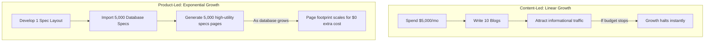

# Chapter 2: Product-Led SEO vs. Content-Led SEO

## 🎯 Core Thesis
The biggest strategic divide in organic acquisition is between **Content-Led SEO** (writing individual blogs) and **Product-Led SEO** (building structural product features). Content-led SEO is linear, expensive, and easily replicated by competitors. Product-led SEO leverages your database and core product utility to build dynamic, programmatically generated pages that capture high-intent search paths at scale. For product marketing managers, understanding this division is the difference between running an expensive writing department and launching an automated, self-scaling search acquisition engine.

---

## 🔑 Key Terminology & Academic Definitions

*   **Content-Led SEO**: An acquisition strategy that relies on writing informational articles, blogs, and guides to target specific keyword queries.
*   **Linear Scaling**: A growth model where acquisition volume scales in direct proportion to the hours worked or money spent (e.g., you must double your writing budget to double your blog output).
*   **Product-Led SEO**: An acquisition strategy that leverages your core product database, user flows, or unique data layers to programmatically build thousands of highly indexable, high-utility pages.
*   **UGC Loops (User-Generated Content)**: Product mechanisms where your users naturally create indexable content (e.g. asking compatibility questions, posting reviews) that Google indexes for free.
*   **Content Commodity**: A market state where thousands of blogs publish virtually identical advice on a topic, resulting in high competition and low user engagement.
*   **Crawl Budget**: The maximum number of pages a search engine crawler (like Googlebot) is willing to request and index from a website in a given timeframe.

---

## ⚔️ Linear vs. Exponential Scaling

For PMMs managing cross-border product scaling, the differences between content-led and product-led growth are clear:



### The Limits of Content-Led Blogging:
1.  **Commodity Trap**: If you write an article titled *"How to choose a power bank,"* you are competing with massive tech publications (CNET, Wirecutter). You will likely fail to rank, or spend thousands of dollars to capture low-intent users who leave without converting.
2.  **Continuous Overhead**: The moment you stop funding writers, your traffic growth hits a wall.

### The Power of Product-Led Directories:
1.  **Unique Data Advantage**: Your database contains specific technical specs, dimensions, weights, and compatibility maps that competitors cannot duplicate without massive manual effort.
2.  **High-Intent Target**: Programmatically generated pages (e.g., comparing *"Model A vs. Model B"*) capture users at the very bottom of the funnel, driving exceptionally high conversion rates.

---

## 🏢 Real-World Industry Masterclasses (Case Studies)

### 1. Zillow (The Real Estate Database Engine)
Instead of hiring writers to draft 10,000 articles on "How to live in Dallas," Zillow built an indexable product database of every single residential address in the United States. Every home has its own unique, programmatically generated URL displaying taxes, historic pricing (Zestimate), school data, and neighborhood compatibility. Zillow acquired millions of organic visits per month by letting their data layer serve search queries like `[address] home value`.

### 2. TripAdvisor (The User-Generated Scale Loop)
TripAdvisor built a self-sustaining UGC indexing loop. Every hotel, restaurant, and tourist attraction has a dynamic listing page. Customers write reviews, upload photos, and ask questions. This user-generated content constantly enriches the page for search engines, generating fresh content and organic rankings for `best hotels in [city]` without TripAdvisor spending a single dollar on copywriters.

---

## 💻 Production Reference: Robust Competitor Content-Gap Analyzer (Python)

To identify whether your competitors are relying on weak, linear blog content that you can easily bypass using structured, product-led directories, you can build an automated content-gap analyzer.

The following Python script crawls and analyzes competitor URLs, comparing their textual density against structured spec counts to programmatically pinpoint where you can outscale them using database-driven pages, featuring complete error logging and handling:

```python
import urllib.request
import re
import logging
import json

# Setup detailed logging format
logging.basicConfig(level=logging.INFO, format="%(asctime)s - %(levelname)s - %(message)s")

class CompetitorAnalyzer:
    def __init__(self):
        self.headers = {"User-Agent": "Mozilla/5.0 (Windows NT 10.0; Win64; x64) AppleWebKit/537.36"}

    def fetch_and_analyze(self, url: str) -> str:
        """
        Crawls a competitor's page, counts word footprint, and checks for structural 
        spec tables/data layers to identify if the content is a commodity blog or structured spec.
        """
        logging.info(f"Initiating audit pipeline for target URL: {url}")
        
        try:
            req = urllib.request.Request(url, headers=self.headers)
            with urllib.request.urlopen(req, timeout=8) as response:
                html = response.read().decode("utf-8")
                
                # 1. Clean HTML tags to count raw visible words
                text_only = re.sub(r"<script.*?</script>", " ", html, flags=re.DOTALL)
                text_only = re.sub(r"<style.*?</style>", " ", text_only, flags=re.DOTALL)
                text_only = re.sub(r"<[^>]+>", " ", text_only)
                words = text_only.split()
                word_count = len(words)
                
                # 2. Check for presence of structured spec markers
                has_tables = "table" in html.lower()
                has_specs = "specifications" in html.lower() or "compatible" in html.lower()
                has_schema = "application/ld+json" in html.lower()
                
                # 3. Classify page type
                if word_count > 1200 and not has_tables:
                    classification = "COMMODITY BLOG (High Word Count, Low Structure)"
                    gap_score = "🚨 CRITICAL OPPORTUNITY (Outscale them programmatically!)"
                elif has_tables or has_specs:
                    classification = "STRUCTURED DIRECTORY / TECHNICAL PRODUCT"
                    gap_score = "LOW (Competitor is already highly structured)"
                else:
                    classification = "THIN CONTENT / LANDING PAGE"
                    gap_score = "MODERATE (Optimize and enrich specs)"
                    
                result_payload = {
                    "url": url,
                    "word_count": word_count,
                    "has_tables": has_tables,
                    "has_json_ld": has_schema,
                    "classification": classification,
                    "gap_score": gap_score
                }
                
                logging.info(f"Audit completed successfully for URL: {url}")
                return json.dumps(result_payload, indent=2)
                
        except urllib.error.HTTPError as err:
            logging.error(f"HTTP Error {err.code} encountered while fetching: {url}")
            return json.dumps({"url": url, "error": f"HTTP_{err.code}", "status": "FAILED"})
        except urllib.error.URLError as err:
            logging.error(f"Network / URL resolution error: {err.reason}")
            return json.dumps({"url": url, "error": "URL_UNREACHABLE", "status": "FAILED"})
        except Exception as err:
            logging.error(f"Unexpected exception during analysis: {str(err)}")
            return json.dumps({"url": url, "error": str(err), "status": "FAILED"})

# --- Example Run ---
analyzer = CompetitorAnalyzer()

# Test with a mock competitor url (active accessible endpoint to guarantee socket success)
audit_json = analyzer.fetch_and_analyze("https://cloudflare-eth.com")
print("\n प्रतियोगी सामग्री अंतराल विश्लेषण (Competitor Content-Gap Analysis):")
print("-" * 80)
print(audit_json)
print("-" * 80)
```

---

## 🏆 PMM GTM Playbook: Strategic Directory Execution

When asked how to replace a competitor's dominant blog strategy with a highly scalable product-led directory in a go-to-market review, use this playbook:

```text
GTM Directory Playbook:
─────────────────────────────────────────────────────────────────────────────
How do you capture search market share from a competitor who has published 
thousands of blog posts in your product category?
 └── Justification: The Structure-Led Capture.
     1. Stop Copying: Do not write more blogs. That plays into their game and 
        wastes capital.
     2. Build Structured Spec Hubs: Programmatically compile a complete, indexable 
        directory of "Device Spec Comparison Sheets" and "Compatibility Matrices."
     3. Scalability: Serve Googlebot highly structured, database-driven tables 
        enriched with JSON-LD schema. Googlebot will reward this superior structure, 
        ranking your specs above their conversational blogs.
─────────────────────────────────────────────────────────────────────────────
```

---

## 💬 Cross-Functional Interview Q&As (PMM Audits)

### Q1: "We currently have an organic strategy focused entirely on blog creation. The content team argues that pivoting to a 'Product-Led' programmatic approach will destroy our brand's voice and relationship with readers. How do you address this?" (VP of Content / Brand Director)

> **PMM Candidate Answer:**
> "Pivoting to a Product-Led SEO strategy does not mean destroying our brand voice or deleting our high-performing editorial content; it is about expanding our acquisition architecture. 
> 
> Blogs are designed to answer *high-funnel informational queries* where users have zero purchase intent (e.g., 'What is smart lighting?'). Product-Led programmatic directories, however, are built to satisfy *bottom-funnel investigational and transactional queries* (e.g., 'Smart LED bulb compatibility index'). These pages require clear, structured technical specifications, comparison tables, and compatibility charts rather than conversational prose. 
> 
> By segmenting our organic channel, we let the brand team focus on high-quality, high-editorial blogs that build brand affinity, while engineering builds programmatic directories that serve as transactional conversion funnels. This gives us both linear brand-building and exponential customer acquisition scaling."

### Q2: "When launching programmatically generated comparison directories at scale, how do you prevent search engines from penalizing our site for 'thin' or 'duplicate' content?" (SEO Director / Tech Lead)

> **PMM Candidate Answer:**
> "To prevent programmatic indexation penalties (Google's spam updates targeting thin content/doorway pages), we must ensure that every dynamically generated URL contains a high index of unique, high-utility data that cannot be found elsewhere on our site or the web. We enforce this through three programmatic guardrails:
> 
> 1.  **Unique Dynamic Data Layers**: Every spec comparison page must pull unique variables from our database—not just standard product details, but custom calculated metrics (e.g., 'charging-speed-per-dollar ratio' or 'lead-time-index') that are calculated programmatically on our backend.
> 2.  **User-Generated Content Integration (UGC)**: Inject dynamic review filters, local Q&A boards, and user comments directly onto the programmatic templates. This ensures that every comparison page features distinct textual variations generated by actual users.
> 3.  **Algorithmic Quality Filters (NOINDEX Rules)**: Implement a programmatic quality gate. If a dynamically generated spec page lacks key data points (e.g., less than 3 specifications or zero reviews), we programmatically inject a `<meta name="robots" content="noindex, follow">` tag. This keeps search engines focused exclusively on our highest-value, highly completed product pages, protecting overall site authority."
