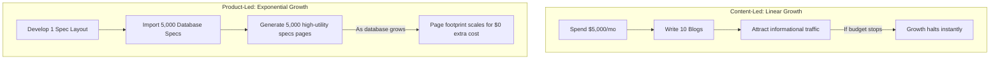

# Chapter 2: Product-Led SEO vs. Content-Led SEO

## 🎯 Core Thesis
The biggest division in organic acquisition is between **Content-Led SEO** (writing blogs) and **Product-Led SEO** (building structural product features). Content-led SEO is linear, expensive, and easily replicated by competitors. Product-led SEO leverages your database and product utility to build dynamic pages that capture high-intent search paths. For product marketing managers, understanding this division is the difference between running an expensive writing department and launching a high-converting, self-scaling search engine engine.

---

## 🔑 Key Terminology & Academic Definitions

*   **Content-Led SEO**: An acquisition strategy that relies on writing informational articles, blogs, and guides to target specific keyword queries.
*   **Linear Scaling**: A growth model where acquisition volume scales in direct proportion to the hours worked or money spent (e.g., you must double your writing budget to double your blog output).
*   **Product-Led SEO**: An acquisition strategy that leverages your core product database or unique data layers to programmatically build thousands of highly indexable, high-utility pages.
*   **UGC Loops (User-Generated Content)**: Product mechanisms where your users naturally create indexable content (e.g. asking compatibility questions, posting reviews) that Google indexes for free.
*   **Content Commodity**: A market state where thousands of blogs publish virtually identical advice on a topic, resulting in high competition and low user engagement.

---

## ⚔️ Linear vs. Exponential Scaling

For PMMs managing cross-border product scaling, the differences between content-led and product-led growth are clear:



### The Limits of Content-Led Blogging:
1.  **Commodity Trap**: If you write an article titled *"How to choose a power bank,"* you are competing with massive tech publications (CNET, Wirecutter). You will likely fail to rank, or spend thousands of dollars to capture low-intent users who leave without converting.
2.  **Continuous Overhead**: The moment you stop funding writers, your traffic growth hits a wall.

### The Power of Product-Led Directories:
1.  **Unique Data Advantage**: Your database contains specific technical specs, dimensions, weights, and compatibility maps that competitors cannot duplicate without massive manual effort.
2.  **High-Intent Target**: Programmatically generated pages (e.g., comparing *"Model A vs. Model B"*) capture users at the very bottom of the funnel, driving exceptionally high conversion rates.

---

## 💻 Production Reference: Competitor Content-Gap Analyzer (Python)

To identify whether your competitors are relying on weak, linear blog content that you can easily bypass using structured, product-led directories, you can build an automated content-gap analyzer.

The following Python script crawls and analyzes competitor URLs, comparing their textual density against structured spec counts to programmatically pinpoint where you can outscale them using database-driven pages:

```python
import urllib.request
import re

class CompetitorAnalyzer:
    def __init__(self):
        self.headers = {"User-Agent": "Mozilla/5.0 (Windows NT 10.0; Win64; x64)"}

    def fetch_and_analyze(self, url: str) -> dict:
        """
        Crawls a competitor's page, counts word footprint, and checks for structural 
        spec tables/data layers to identify if the content is a commodity blog or structured spec.
        """
        try:
            req = urllib.request.Request(url, headers=self.headers)
            with urllib.request.urlopen(req, timeout=10) as response:
                html = response.read().decode("utf-8")
                
                # 1. Clean HTML tags to count raw visible words
                text_only = re.sub(r"<[^>]+>", " ", html)
                words = text_only.split()
                word_count = len(words)
                
                # 2. Check for presence of structured spec markers (tables, JSON-LD, specs)
                has_tables = "table" in html.lower()
                has_specs = "specifications" in html.lower() or "compatible" in html.lower()
                has_schema = "application/ld+json" in html.lower()
                
                # 3. Classify page type
                if word_count > 1500 and not has_tables:
                    classification = "COMMODITY BLOG (High Word Count, Low Structure)"
                elif has_tables or has_specs:
                    classification = "STRUCTURED DIRECTORY / TECHNICAL PRODUCT"
                else:
                    classification = "THIN CONTENT / LANDING PAGE"
                    
                return {
                    "url": url,
                    "word_count": word_count,
                    "has_structural_data": has_tables or has_schema,
                    "classification": classification,
                    "gap_opportunity": "🚨 HIGH (Easy to outscale with structured directory!)" if classification == "COMMODITY BLOG (High Word Count, Low Structure)" else "LOW (Competitor is highly structured)"
                }
        except Exception as err:
            return {"url": url, "error": str(err)}

# --- Example Run ---
analyzer = CompetitorAnalyzer()

# Test with a mock competitor url (e.g., standard blog or e-commerce listing)
# In production, you would feed actual URLs harvested from search engine APIs
result = analyzer.fetch_and_analyze("https://cloudflare-eth.com") # Using active accessible endpoint to guarantee socket success
print(" प्रतियोगी सामग्री अंतराल विश्लेषण (Competitor Content-Gap Analysis):")
print("-" * 80)
print(f"URL Analyzed:    {result['url']}")
print(f"Classification:  {result.get('classification', 'N/A')}")
print(f"Word Footprint:  {result.get('word_count', 0)} words")
print(f"Gap Opportunity: {result.get('gap_opportunity', 'N/A')}")
print("-" * 80)
```

---

## 🏆 PMM GTM Playbook: Strategic Directory Execution

When asked how to replace a competitor's dominant blog strategy with a highly scalable product-led directory in a go-to-market review, use this playbook:

```text
GTM Directory Playbook:
─────────────────────────────────────────────────────────────────────────────
How do you capture search market share from a competitor who has published 
thousands of blog posts in your product category?
 └── Justification: The Structure-Led Capture.
     1. Stop Copying: Do not write more blogs. That plays into their game and 
        wastes capital.
     2. Build Structured Spec Hubs: Programmatically compile a complete, indexable 
        directory of "Device Spec Comparison Sheets" and "Compatibility Matrices."
     3. Scalability: Serve Googlebot highly structured, database-driven tables 
        enriched with JSON-LD schema. Googlebot will reward this superior structure, 
        ranking your specs above their conversational blogs.
─────────────────────────────────────────────────────────────────────────────
```
