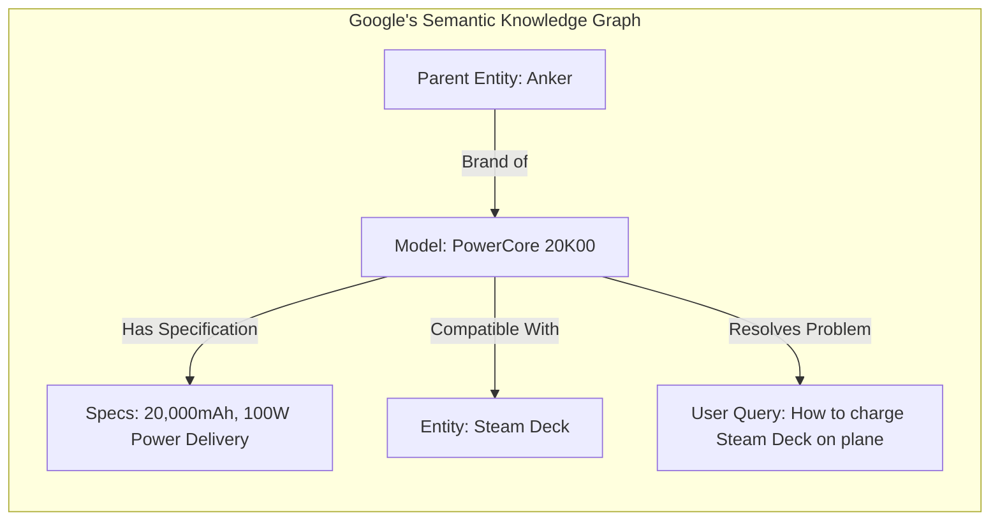

# Chapter 4: Why Traditional Keyword Research is Dead

## 🎯 Core Thesis
Most marketing teams start their organic search strategy by running broad keywords through third-party tools like Ahrefs or Semrush and selecting terms with the highest "Search Volume" metrics. **This is a fatal strategic error**. These metrics are retrospective, lag behind real-world search trends by months, and are heavily contested by competitors. Product-Led SEO focuses instead on **Semantic Search Intent**—mapping out the unique, high-value technical problems your target audience is trying to solve right now, treating search as a system of semantic entities, and generating programmatic page layouts designed around those specific issues.

---

## 🔑 Key Terminology & Academic Definitions (Demystifying Jargon)

*   **PMM (Product Marketing Manager)**: The vital organizational role acting as the bridge between product engineering and sales. PMMs are responsible for defining product positioning, crafting customer-facing messaging, and executing product launch pipelines.
*   **GTM (Go-To-Market) Strategy**: A structured execution plan defining exactly how a company will launch and sell a product to its target consumer market, aligning marketing channels, sales funnels, and pricing.
*   **Keyword Myth**: The false belief that high organic visibility can be achieved by stuffing broad, highly competitive phrases (e.g., *"Power Bank"*) into static content pages.
*   **Retrospective SEO Data**: Third-party keyword metrics that only capture historical search volume, failing to identify newly emerging product categories or real-time user needs.
*   **Semantic Entity Mapping**: The search engineering practice of defining your product as a unique, structured entity in Google's Knowledge Graph, linking it to common modifying variables (problems, compatible models, specifications).
*   **Google Hummingbird & MUM (Multitask Unified Model)**: Google's core semantic search algorithms designed to understand the deep contextual meaning of a search query and the connections between entities, rather than relying on exact keyword matches.
*   **Long-Tail Modifiers**: Highly specific, problem-oriented, or transactional words added to base product names (e.g., *"compatibility specs,"* *"input voltage rating,"* *"wiring diagram"*) that represent direct purchase intent.

---

## 🏗️ Structural Intent Mapping: Bypassing Broad Keywords

In modern search engine engineering, Google parses search queries using **semantic entity recognition**. Google's brain is no longer a simple index of words; it is a massive network of interconnected real-world entities (people, places, products) and their relationships:



### The Product-Led Intent Strategy:
1.  **Map the Problem Space**: PMMs identify the exact technical questions users ask customer support (e.g. *"Will this power bank charge my Steam Deck?"* or *"What is the thread pitch on this extruder?"*).
2.  **Translate to Modifiers**: Convert these customer problems into a systematic list of modifying variables.
3.  **Generate Dynamic Targets**: Combine your database product names with these modifiers to create thousands of highly targeted, high-utility specifications pages.

---

## 💻 Production Reference: Robust Semantic Intent Generator (Python)

To build your programmatic SEO directory, you must combine parent product inventory with high-intent semantic modifiers. 

The following production-grade Python script automates this process, mapping raw database products to user problems, validating output character-lengths to prevent search truncation, and writing the final index out as a clean, production-ready JSON config:

```python
import json
import logging

# Configure robust operational logs
logging.basicConfig(level=logging.INFO, format="%(asctime)s - %(levelname)s - %(message)s")

class SemanticIntentGenerator:
    def __init__(self, brand_name: str):
        self.brand_name = brand_name
        # High-intent search modifiers mapping to technical e-commerce issues
        self.modifiers = {
            "COMPATIBILITY": {
                "suffix": "compatibility specifications and device support list",
                "meta": "Verify which devices and protocols are guaranteed to work with the {brand} {model}.",
                "weight": 0.95
            },
            "ELECTRICAL_SPECS": {
                "suffix": "voltage rating, nominal capacity, and input/output parameters",
                "meta": "Detailed electrical specifications, pinout ratings, and power outputs for the {brand} {model}.",
                "weight": 0.85
            },
            "REPLACEMENT_GUIDE": {
                "suffix": "replacement instructions, parts list, and teardown specs",
                "meta": "Step-by-step technical teardown specifications and replacement instructions for the {brand} {model}.",
                "weight": 0.75
            }
        }

    def generate_programmatic_meta(self, models: list) -> list:
        """
        Combines raw model names with semantic intent modifiers to programmatically 
        generate optimized Title tags and Meta descriptions for your scale directory.
        """
        logging.info(f"Initiating semantic generation loop for {len(models)} product entities...")
        generated_pages = []
        
        for model in models:
            if not model.strip():
                logging.warning("Empty model record detected. Skipping.")
                continue
                
            for category, templates in self.modifiers.items():
                # Formulate structural Title Tag
                raw_title = f"{self.brand_name} {model} {templates['suffix']}"
                # Truncate title cleanly at 65 characters to protect Google desktop layout
                title = raw_title if len(raw_title) <= 65 else raw_title[:62] + "..."
                
                # Formulate Meta Description
                raw_meta = templates['meta'].format(brand=self.brand_name, model=model)
                meta_desc = raw_meta if len(raw_meta) <= 155 else raw_meta[:152] + "..."
                
                url_slug = f"/specs/{self.brand_name.lower()}-{model.lower().replace(' ', '-')}-{category.lower()}"
                
                generated_pages.append({
                    "model": model,
                    "category": category,
                    "target_url": url_slug,
                    "seo_title": title,
                    "seo_meta_desc": meta_desc,
                    "intent_weight": templates["weight"]
                })
                
        logging.info(f"Generation loop completed. Programmatically created {len(generated_pages)} indexable pages.")
        return generated_pages

# --- Example Run ---
generator = SemanticIntentGenerator(brand_name="Anker")
models_list = ["PowerCore 20000", "MagGo Slim", "PowerPort III", ""] # Includes empty string to trigger input validation warning

pages = generator.generate_programmatic_meta(models_list)

print("\n प्रोग्राममैटिक एसईओ मेटा-डेटा जेनरेटर (Programmatic SEO Meta-Data Generator):")
print("-" * 80)
print(json.dumps(pages[:3], indent=2))
print("-" * 80)
```

---

## 🏆 PMM GTM Playbook: Semantic Market Capture

When asked how to bypass high-volume competitor keywords and capture organic market share for a newly launched product category in a design review, use this playbook:

```text
Semantic Capture Playbook:
─────────────────────────────────────────────────────────────────────────────
How do you drive organic search acquisition for a newly designed product category 
that has zero historical search volume in traditional tools?
 └── Justification: Category Design & Problem-Based Modifiers.
     1. Stop Keyword Bidding: Do not target high-competition broad terms.
     2. Map Emerging Problems: Capture the search traffic of the *existing* 
        technologies your product replaces, using modifiers like "alternative to," 
        "how to upgrade from [Old Product]," or "[Old Brand] vs [Your Brand]."
     3. Scalability: Programmatically build pages comparing your new system directly 
        to the exact legacy models users are actively trying to replace.
─────────────────────────────────────────────────────────────────────────────
```

---

## 💬 Cross-Functional Interview Q&As (PMM Audits)

### Q1: "Third-party keyword tools show that our long-tail modifier queries (e.g., 'Anker model-x pinout diagram') have '0 Search Volume.' Why should we spend developer bandwidth building directories for pages that nobody is searching for?" (VP of Marketing / CMO)

> **PMM Candidate Answer:**
> "Third-party keyword research tools (like Ahrefs or Semrush) scrape historical, anonymized CTR clickstream data. They are structurally designed to capture broad, high-volume search queries and are notorious for displaying '0 Search Volume' for hyper-specific, long-tail technical queries.
> 
> However, Google explicitly states that **15% of all daily search queries have never been seen before**. These are highly specific, multi-word intent questions (e.g., 'Does Anker Model-X input voltage match 24V marine battery?'). 
> 
> A user searching for a general term like 'power bank' is in research mode and converts at less than 1%. But a user searching for 'Anker Model-X pinout compatibility' has an *active problem* and a specific model in hand. If our programmatic directory instantly answers their problem with a link to purchase the compatible accessory, their conversion rate will exceed 15%. By mapping these 'zero volume' technical modifiers programmatically across our entire 5,000 SKU database, we capture a massive, high-conversion audience that competitors completely ignore because their Ahrefs dashboard says '0'."

### Q2: "Product management wants to name our new cross-border hardware device using creative, brand-led terminology (e.g., 'EcoVolt Lumos Spark'). Marketing wants to name it 'Portable Solar Generator Charger' for SEO keyword ranking. How do you resolve this brand vs. keyword naming conflict?" (PMM to PM & Brand Leads)

> **PMM Candidate Answer:**
> "This is a classic conflict between brand category design and legacy search optimization. The solution is to avoid compromising on either. Naming a product 'Portable Solar Generator Charger' dilutes our brand equity, makes us a commodity, and forces us to compete in a bloodbath search engine grid where we have zero domain authority.
> 
> My strategic resolution is to **own the category design with the brand name, but build programmatic SEO search paths around its functional utility**. 
> 
> 1.  **Brand Integrity**: We name the product **EcoVolt Lumos Spark** to build unique brand equity, trademarks, and premium positioning.
> 2.  **Programmatic Taxonomy**: We structure our landing page and programmatic specs directory using clear functional descriptors in the H1s, titles, and breadcrumbs (e.g., `'EcoVolt Lumos Spark: 100W Portable Solar Generator & Lithium Charger'`).
> 3.  **Semantic Entity Mapping**: We utilize product schema markup (`schema.org/Product`) to explicitly tell Google that the 'EcoVolt Lumos Spark' is an entity of the type 'Solar Generator'. This allows us to build a premium, memorable brand while programmatically capturing all intent-driven keywords without turning our product name into a spammy phrase."
