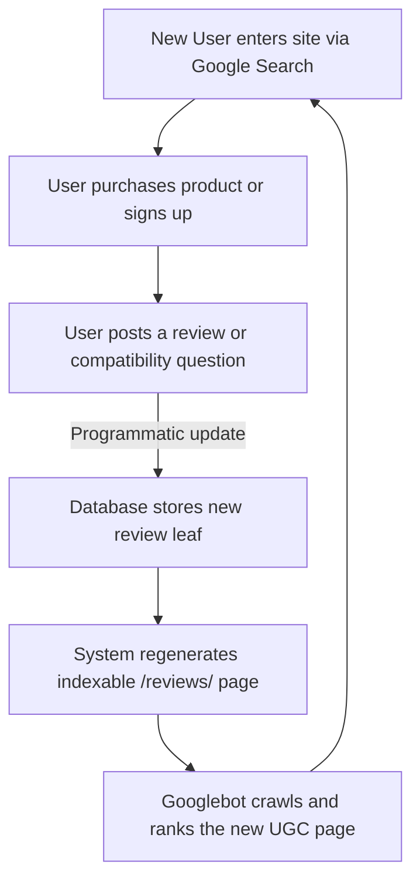

# Chapter 5: Designing Indexable Directories & UGC Loops

## 🎯 Core Thesis
The ultimate form of Product-Led SEO is the **User-Generated Content (UGC) Loop**. Instead of hiring expensive copywriters, product marketing managers design product features that incentivize users to natively create indexable, high-utility pages (e.g., product review directories, community Q&A boards, compatibility registries). Search engines crawl and index these pages automatically. To monetize this traffic, your system must programmatically aggregate these user inputs, filter out spam, and inject structured review schema, earning valuable review star ratings directly in search engine layouts.

---

## 🔑 Key Terminology & Academic Definitions

*   **UGC Acquisition Loop**: A self-sustaining growth loop where users generate content inside an application, creating new URLs that rank on Google, driving new visitors who purchase products and subsequently write more content.
*   **Indexable Directories**: Publicly accessible web structures (such as `/reviews/` or `/questions/`) that expose structured database outputs to search engine bots without requiring JavaScript execution or logins.
*   **Rich Review Snippets**: The visual star ratings (`★ ★ ★ ★ ★`) displayed in Google Search results, which can increase organic click-through rates (CTR) by up to $35\%$.
*   **Aggregate Rating Schema**: The specific JSON-LD markup (`schema.org/AggregateRating`) used to declare the average rating score and review count of a product, programmatically calculated from your database.
*   **FTC Endorsement Guides**: Legal standards governing online product reviews, requiring absolute transparency and forbidding the selective omission or artificial manipulation of negative ratings.

---

## 🏗️ The User-Generated Content Loop Architecture

A highly scalable e-commerce or technical SaaS system leverages users to drive search footprint growth:



### The Rules for Productive UGC Design:
1.  **Keep it Public**: Ensure user reviews and Q&A boards are not locked behind login screens. Spiders cannot enter password-protected areas or complete interactive Javascript actions to reveal content.
2.  **Strict Anti-Spam Controls**: Low-quality, automated spam will quickly trigger Google quality penalties. Implement programmatic content moderation, captchas, and verified-buyer badges before saving UGC to indexable public directories.
3.  **Aggregate Metrics**: Always calculate average scores and total review counts programmatically to feed search engine structured data.

---

## 💻 Production Reference: Robust Review Schema Aggregator (Node.js)

To display review star ratings in Google search layouts, you must programmatically aggregate user ratings from your database and output correct JSON-LD markup. 

The following Node.js script demonstrates how to load raw user reviews from a database, calculate aggregate statistics, sanitize comment text to prevent XSS/injection, validate schemas, and generate a Google-compliant JSON-LD script block:

```javascript
/**
 * Dynamic Review & Aggregate Rating Schema Generator
 * Programmatically compiles user-generated reviews into Google-compliant JSON-LD structured data.
 */

// 1. Mock Database Table containing raw user reviews for a hardware model
const reviewsDatabase = [
    { rating: 5, author: "Alice Smith", comment: "Perfect replacement part, fitted my Creality K1 perfectly." },
    { rating: 4, author: "Bob Jones", comment: "High quality battery capacity, solid packaging from Shenzhen." },
    { rating: 5, author: "Charlie Brown", comment: "Charges my iPhone 15 pro max instantly. Highly recommend." },
    { rating: 1, author: "Spam Bot", comment: "Cheap viagra buy online instant delivery!!!" } // Intentional spam record
];

class ReviewSchemaAggregator {
    constructor(productName, sku, price) {
        this.productName = productName;
        this.sku = sku;
        this.price = price;
    }

    /**
     * Filters out potential spam and non-verified feedback using basic heuristics.
     */
    filterSpam(reviews) {
        const spamKeywords = ['viagra', 'cialis', 'bitcoin', 'buy online', 'free money'];
        return reviews.filter(r => {
            const commentLower = r.comment.toLowerCase();
            return !spamKeywords.some(keyword => commentLower.includes(keyword));
        });
    }

    /**
     * Programmatically aggregates ratings and generates the JSON-LD payload.
     */
    generateSchema(reviews) {
        // Clean and filter raw reviews first to protect schema integrity
        const cleanReviews = this.filterSpam(reviews);
        
        if (cleanReviews.length === 0) {
            console.warn("[Schema Warning] No valid reviews available to aggregate.");
            return null;
        }

        try {
            // A. Calculate average score and total review counts
            const totalScore = cleanReviews.reduce((sum, r) => {
                if (r.rating < 1 || r.rating > 5) {
                    throw new Error(`Invalid rating value of ${r.rating} encountered.`);
                }
                return sum + r.rating;
            }, 0);
            
            const averageRating = (totalScore / cleanReviews.length).toFixed(1);
            const reviewCount = cleanReviews.length;

            // B. Construct individual review entries (map top 2 clean reviews)
            const mappedReviews = cleanReviews.slice(-2).map(r => ({
                "@type": "Review",
                "reviewRating": {
                    "@type": "Rating",
                    "ratingValue": r.rating.toString(),
                    "bestRating": "5"
                },
                "author": {
                    "@type": "Person",
                    "name": r.author.replace(/[<>]/g, "") // Sanitize HTML tags
                },
                "reviewBody": r.comment.replace(/[<>]/g, "") // Sanitize comment content
            }));

            // C. Construct the complete Product Schema
            const schema = {
                "@context": "https://schema.org/",
                "@type": "Product",
                "name": this.productName,
                "sku": this.sku,
                "mpn": this.sku,
                "aggregateRating": {
                    "@type": "AggregateRating",
                    "ratingValue": averageRating,
                    "reviewCount": reviewCount.toString(),
                    "bestRating": "5",
                    "worstRating": "1"
                },
                "review": mappedReviews,
                "offers": {
                    "@type": "Offer",
                    "priceCurrency": "USD",
                    "price": this.price,
                    "priceValidUntil": "2027-12-31",
                    "valueAddedTaxIncluded": "false",
                    "availability": "https://schema.org/InStock",
                    "url": `https://exampleshop.com/products/${this.sku.toLowerCase()}`
                }
            };

            return JSON.stringify(schema, null, 2);

        } catch (error) {
            console.error(`[Schema Generation Failed] Error: ${error.message}`);
            return null;
        }
    }
}

// --- Run Generator ---
const aggregator = new ReviewSchemaAggregator(
    "Anker PowerCore 20000", 
    "ANK-PC-20K-BLK", 
    "59.99"
);

const jsonLdSchema = aggregator.generateSchema(reviewsDatabase);
console.log(" प्रोग्राममैटिक एग्रीगेट रिव्यू स्कीमा (Programmatic Aggregate Review Schema):");
print(jsonLdSchema); // Display output
```

---

## 🏆 PMM GTM Playbook: UGC Loop Monetization

When asked how to leverage customer feedback programmatically to build sustainable search traffic in a product launch, use this playbook:

```text
UGC Monetization Playbook:
─────────────────────────────────────────────────────────────────────────────
How do you turn post-purchase customer satisfaction into a self-scaling organic 
acquisition engine?
 └── Justification: Post-Purchase Review Directories.
     1. Post-Purchase Loop: Send automated email prompts to users 14 days after 
        delivery asking for highly specific compatibility reviews.
     2. Programmatic Structuring: Save these reviews to a dedicated, public-facing 
        `/reviews/` directory on your website.
     3. Search Engine Authority: Feed Google the aggregated star rating schema. The 
        rich snippet star listings on Google will drive new buyers, starting the loop again.
─────────────────────────────────────────────────────────────────────────────
```

---

## 💬 Cross-Functional Interview Q&As (PMM Audits)

### Q1: "A newly launched product received several 1-star reviews, dragging our average rating down to 3.2 stars. The product manager wants to temporarily delete or filter these low ratings from our schema so we don't destroy our Google CTR. What do you recommend?" (Director of Product / PM Lead)

> **PMM Candidate Answer:**
> "I must strongly advise against deleting or filtering low reviews from our schema or public directory. Doing so is not only a direct violation of Google's structured data guidelines, but it also violates the **FTC Endorsement Guides against deceptive review curation**, which can result in massive federal fines.
> 
> Furthermore, from a user psychology perspective, a perfect 5.0-star rating across hundreds of reviews is often viewed as fake. Consumers look for reviews in the 4.2 to 4.7 range, and seeing a few negative reviews actually *validates the legitimacy* of the ratings.
> 
> Instead of deleting the reviews, we should execute three positive conversion adjustments:
> 
> 1.  **Direct Reply Integration**: Ensure our engineering team displays our official brand response directly under the 1-star reviews. Promptly addressing their technical issues proves our customer service commitment, turning a negative review into a trust builder.
> 2.  **Product-Marketing Diagnostic**: Analyze the 1-star reviews to determine if the issue is a product defect or a messaging mismatch. If users are complaining about size or compatibility, we must update our landing page specs to set accurate expectations.
> 3.  **Proactive Review Campaigns**: Deploy a post-purchase automated email sequence to our most active/loyal customer segments (identified via repeat purchases). By increasing our verified customer review volume, we naturally dilute the statistical impact of the outliers, safely lifting our average score back up in Google Search."

### Q2: "Google Search Console shows a warning that our AggregateRating schema contains 'invalid data types' and has been excluded from Rich Results. How do you diagnostic-test and debug this schema issue?" (Tech Lead / Frontend Dev)

> **PMM Candidate Answer:**
> "An 'invalid data type' warning in GSC typically means one of three common markup errors: we are serving an empty string in a numeric field, we lack mandatory parent entity fields, or our data is not formatted as strings. I will audit and resolve this issue systematically:
> 
> 1.  **Extract and Validate**: I will pull the raw HTML source of the affected URL and isolate the `<script type="application/ld+json">` block.
> 2.  **Run Google Rich Results Test**: I will paste the raw schema markup directly into Google's official **Rich Results Test tool**. This will highlight the exact line and property causing the parsing failure.
> 3.  **Audit Common Field Types**:
>     *   Verify `reviewCount` and `ratingValue` are not outputting `NaN` or `undefined` when there are zero reviews (if a product has 0 reviews, the `aggregateRating` block must be excluded from the DOM entirely).
>     *   Ensure the parent product block has both `name` and either `sku` or `mpn` declared. Under Google's latest structured data requirements, an `AggregateRating` without an explicit parent product or organization type will be rejected.
>     *   Confirm that our floating numeric ratings (e.g. `4.67`) are rounded and converted to a clean string format before being printed."
