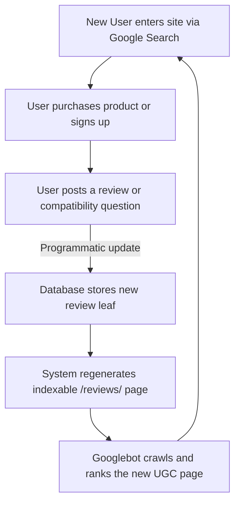

# Chapter 5: Designing Indexable Directories & UGC Loops

## 🎯 Core Thesis
The ultimate form of Product-Led SEO is the **User-Generated Content (UGC) Loop**. Instead of hiring copywriters, product marketing managers design product features that incentivize users to natively create indexable, high-utility pages (e.g., product review directories, compatibility boards, Q&A boards). Google crawls and indexes these pages automatically. To monetize this traffic, your system must programmatically aggregate these user inputs and inject structured review schema, earning valuable review star ratings directly in search engine layouts.

---

## 🔑 Key Terminology & Academic Definitions

*   **UGC Acquisition Loop**: A viral loop where users generate content inside the application, creating new URLs that rank on Google, driving new users who sign up and generate more content.
*   **Indexable Directories**: Publicly accessible web structures (such as `/reviews/` or `/questions/`) that expose structured database outputs to search engine bots.
*   **Rich Review Snippets**: The visual star ratings (`★ ★ ★ ★ ★`) displayed in Google Search results, which can increase Click-Through Rates (CTR) by up to $35\%$.
*   **Aggregate Rating Schema**: The specific JSON-LD markup used to declare the average rating score and review count of a product, programmatically calculated from your database.

---

## 🏗️ The User-Generated Content Loop Architecture

A highly scalable e-commerce or technical SaaS system leverages users to drive search footprint growth:



### The Rules for Productive UGC Design:
1.  **Keep it Public**: Ensure user reviews and question-and-answer boards are not locked behind login screens. Spiders cannot enter password-protected areas.
2.  **Strict Anti-Spam Controls**: Low-quality, automated spam will quickly trigger Google quality penalties. Implement programmatic content moderation and captchas before saving UGC to indexable public directories.
3.  **Aggregate Metrics**: Always calculate average scores and total review counts programmatically to feed search engine structured data.

---

## 💻 Production Reference: Dynamic Review Schema Aggregator (Node.js)

To display review star ratings in Google search layouts, you must programmatically aggregate user ratings from your database and output correct JSON-LD markup. 

The following Node.js script demonstrates how to load raw user reviews from a database, calculate the aggregate metrics, and generate the structured JSON-LD payload to satisfy Google's strict Rich Snippet requirements:

```javascript
/**
 * Dynamic Review & Aggregate Rating Schema Generator
 * Programmatically compiles user-generated reviews into Google-compliant JSON-LD structured data.
 */

// 1. Mock Database Table containing raw user reviews for a hardware model
const reviewsDatabase = [
    { rating: 5, author: "Alice Smith", comment: "Perfect replacement part, fitted my Creality K1 perfectly." },
    { rating: 4, author: "Bob Jones", comment: "High quality battery capacity, solid packaging from Shenzhen." },
    { rating: 5, author: "Charlie Brown", comment: "Charges my iPhone 15 pro max instantly. Highly recommend." }
];

class ReviewSchemaAggregator {
    constructor(productName, sku, price) {
        this.productName = productName;
        this.sku = sku;
        this.price = price;
    }

    /**
     * Programmatically aggregates ratings and generates the JSON-LD payload
     */
    generateSchema(reviews) {
        if (reviews.length === 0) {
            return null;
        }

        // A. Calculate average score and total review counts
        const totalScore = reviews.reduce((sum, r) => sum + r.rating, 0);
        const averageRating = (totalScore / reviews.length).toFixed(1);
        const reviewCount = reviews.length;

        // B. Formulate the latest individual review object to satisfy Google's guidelines
        const latestReview = reviews[reviews.length - 1];

        // C. Construct the complete Product Schema
        const schema = {
            "@context": "https://schema.org/",
            "@type": "Product",
            "name": this.productName,
            "sku": this.sku,
            "aggregateRating": {
                "@type": "AggregateRating",
                "ratingValue": averageRating,
                "reviewCount": reviewCount.toString(),
                "bestRating": "5",
                "worstRating": "1"
            },
            "review": {
                "@type": "Review",
                "reviewRating": {
                    "@type": "Rating",
                    "ratingValue": latestReview.rating.toString(),
                    "bestRating": "5"
                },
                "author": {
                    "@type": "Person",
                    "name": latestReview.author
                },
                "reviewBody": latestReview.comment
            },
            "offers": {
                "@type": "Offer",
                "priceCurrency": "USD",
                "price": this.price,
                "availability": "https://schema.org/InStock"
            }
        };

        return JSON.stringify(schema, null, 2);
    }
}

// --- Run Generator ---
const aggregator = new ReviewSchemaAggregator(
    "Anker PowerCore 20000", 
    "ANK-PC-20K-BLK", 
    "59.99"
);

const jsonLdSchema = aggregator.generateSchema(reviewsDatabase);
console.log(" प्रोग्राममैटिक एग्रीगेट रिव्यू स्कीमा (Programmatic Aggregate Review Schema):");
print(jsonLdSchema); // Custom display helper
```

---

## 🏆 PMM GTM Playbook: UGC Loop Monetization

When asked how to leverage customer feedback programmatically to build sustainable search traffic in a product launch, use this playbook:

```text
UGC Monetization Playbook:
─────────────────────────────────────────────────────────────────────────────
How do you turn post-purchase customer satisfaction into a self-scaling organic 
acquisition engine?
 └── Justification: Post-Purchase Review Directories.
     1. Post-Purchase Loop: Send automated email prompts to users 14 days after 
        delivery asking for highly specific compatibility reviews.
     2. Programmatic Structuring: Save these reviews to a dedicated, public-facing 
        `/reviews/` directory on your website.
     3. Search Engine Authority: Feed Google the aggregated star rating schema. The 
        rich snippet star listings on Google will drive new buyers, starting the loop again.
─────────────────────────────────────────────────────────────────────────────
```
