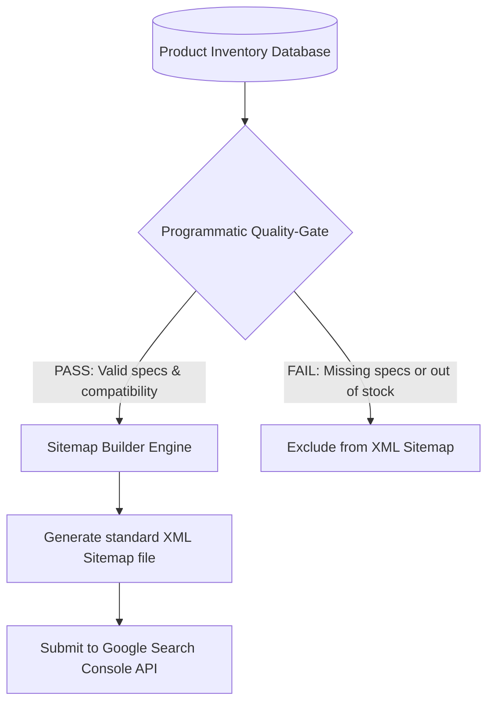

# Chapter 6: Programmatic SEO at Scale (pSEO)

## 🎯 Core Thesis
When executing Programmatic SEO (pSEO) at scale (generating 10,000 to 1,000,000+ unique specs and compatibility URLs), you must treat the search footprint as a database-driven engineering system. Crawlers will fail to index your pages if your sitemap structure is broken or contains thousands of low-quality, empty template links. To ensure successful indexing, developers must build **Automated XML Sitemap Generators** equipped with strict quality-control gates that only expose high-utility, fully populated URLs to search engine crawlers, protecting the domain from thin-content doorway penalties.

---

## 🔑 Key Terminology & Academic Definitions

*   **XML Sitemap**: A structured XML file telling search engines which pages on your site are available for crawling and indexing.
*   **Sitemap Index File**: A master sitemap file that links to multiple individual sitemap files, used when a website exceeds Google's limit of **50,000 URLs or 50MB** per single sitemap file.
*   **Sitemap Quality-Gate**: A programmatic validation check in your build script that filters out low-quality, incomplete, or empty database rows, preventing search engine indexing of thin pages.
*   **Doorway Page**: An SEO anti-pattern where thousands of low-quality pages are generated dynamically solely for ranking, offering zero unique utility to the user.
*   **Indexation Ratio**: The percentage of programmatically generated URLs that Google actually indexes:
    $$\text{Indexation Ratio} = \left( \frac{\text{Indexed URLs}}{\text{Total Submitted URLs}} \right) \times 100$$
    *   *A healthy programmatic directory should target an Indexation Ratio of $85\%+$ after 90 days.*

---

## 🏗️ The Programmatic XML Sitemap Pipeline

A robust programmatic page engine must be designed to avoid thin-content penalties while scaling to millions of URLs:



### Critical Rules to Avoid Search Engine Penalties:
1.  **Keep it fresh**: Regenerate your XML sitemaps dynamically (or daily via cron jobs) as new inventory is added or modified in your database.
2.  **Filter Empty Templates**: If a product has no specs, do not include it in the sitemap. Serving a search engine thousands of empty, templated pages leads directly to manual spam penalties.
3.  **Strict 50k Limit**: If your site scales beyond 50,000 dynamic pages, programmatically partition your sitemaps into multiple files and link them via a master **Sitemap Index**.

---

## 💻 Production Reference: Robust Paginated Sitemap Generator (Node.js)

The following production-ready Node.js script demonstrates how to parse a database of product specifications, execute a validation check (Quality-Gate) to exclude incomplete records, escape special characters to prevent XML parsing failures, partition URLs into paginated sitemaps of 50,000 URLs, and write them to disk with detailed log tracking:

```javascript
/**
 * Programmatic XML Sitemap Generator with Quality-Gate & Chunking Filters
 * Automatically builds search-engine ready sitemaps from database inventory tables.
 */

const fs = require('fs');
const path = require('path');

// 1. Mock Database Table containing technical spec profiles
const productDatabase = [
    { modelId: "ank-pc-20k", modelName: "Anker PowerCore 20000", totalSpecsCount: 15, isInStock: true },
    { modelId: "cre-k1-ext", modelName: "Creality K1 Extruder Node", totalSpecsCount: 12, isInStock: true },
    { modelId: "broken-spec-99", modelName: "Empty Device Specs", totalSpecsCount: 0, isInStock: false }, // Should fail gate
    { modelId: "mag-maggo-10k", modelName: "Anker & MagGo 10000 <special chars>", totalSpecsCount: 18, isInStock: true }
];

class SitemapGenerator {
    constructor(domain, outputDir) {
        this.domain = domain;
        this.outputDir = outputDir;
        this.minSpecsThreshold = 5; // Quality gate threshold
        this.maxChunkSize = 50000; // Google's official sitemap limit
    }

    /**
     * Sanitizes strings to prevent XML parsing errors caused by special characters.
     */
    sanitizeXmlString(str) {
        return str
            .replace(/&/g, '&amp;')
            .replace(/</g, '&lt;')
            .replace(/>/g, '&gt;')
            .replace(/"/g, '&quot;')
            .replace(/'/g, '&apos;');
    }

    /**
     * Programmatically validates and builds chunks of XML sitemaps
     */
    generateSitemaps(products) {
        console.log(`[Sitemap Pipeline] Initiating generation. Target Output Directory: ${this.outputDir}`);
        
        // Ensure output directory exists
        if (!fs.existsSync(this.outputDir)) {
            fs.mkdirSync(this.outputDir, { recursive: true });
        }

        const validUrls = [];
        let failedCount = 0;

        // 1. Execute the Quality-Gate
        products.forEach(prod => {
            if (prod.totalSpecsCount < this.minSpecsThreshold) {
                console.warn(`[Quality-Gate: REJECTED] Model ID: ${prod.modelId} has insufficient specifications (${prod.totalSpecsCount}).`);
                failedCount++;
                return;
            }

            const loc = `${this.domain}/specs/${this.sanitizeXmlString(prod.modelId)}`;
            const lastMod = new Date().toISOString().split('T')[0];
            validUrls.push({ loc, lastMod });
        });

        // 2. Chunk URLs into multiple sitemaps if they exceed max limit
        const totalChunks = Math.ceil(validUrls.length / this.maxChunkSize);
        const sitemapFiles = [];

        for (let i = 0; i < totalChunks; i++) {
            const chunk = validUrls.slice(i * this.maxChunkSize, (i + 1) * this.maxChunkSize);
            const sitemapName = `sitemap-specs-${i + 1}.xml`;
            const sitemapPath = path.join(this.outputDir, sitemapName);
            
            let xmlContent = `<?xml version="1.0" encoding="UTF-8"?>\n`;
            xmlContent += `<urlset xmlns="http://www.sitemaps.org/schemas/sitemap/0.9">\n`;
            
            chunk.forEach(entry => {
                xmlContent += `  <url>\n`;
                xmlContent += `    <loc>${entry.loc}</loc>\n`;
                xmlContent += `    <lastmod>${entry.lastMod}</lastmod>\n`;
                xmlContent += `    <changefreq>weekly</changefreq>\n`;
                xmlContent += `    <priority>0.7</priority>\n`;
                xmlContent += `  </url>\n`;
            });
            
            xmlContent += `</urlset>`;
            
            fs.writeFileSync(sitemapPath, xmlContent, 'utf-8');
            console.log(`[Sitemap Success] Generated chunk: ${sitemapName} with ${chunk.length} URLs.`);
            sitemapFiles.push(sitemapName);
        }

        // 3. Generate Master Sitemap Index File linking the chunks
        if (sitemapFiles.length > 0) {
            const masterPath = path.join(this.outputDir, 'sitemap-index.xml');
            let indexContent = `<?xml version="1.0" encoding="UTF-8"?>\n`;
            indexContent += `<sitemapindex xmlns="http://www.sitemaps.org/schemas/sitemap/0.9">\n`;
            
            sitemapFiles.forEach(file => {
                const loc = `${this.domain}/${file}`;
                const lastMod = new Date().toISOString().split('T')[0];
                indexContent += `  <sitemap>\n`;
                indexContent += `    <loc>${loc}</loc>\n`;
                indexContent += `    <lastmod>${lastMod}</lastmod>\n`;
                indexContent += `  </sitemap>\n`;
            });
            
            indexContent += `</sitemapindex>`;
            fs.writeFileSync(masterPath, indexContent, 'utf-8');
            console.log(`[Master Sitemap Index] Successfully written to: ${masterPath}`);
        }

        console.log(`\nSitemap Pipeline Results:`);
        console.log(`- Passed & Logged:   ${validUrls.length} URLs`);
        console.log(`- Rejected & Out:    ${failedCount} URLs`);
    }
}

// --- Run Sitemap Generation Pipeline ---
const outputDir = path.join(__dirname, 'sitemaps');
const generator = new SitemapGenerator("https://exampleshop.com", outputDir);

generator.generateSitemaps(productDatabase);
