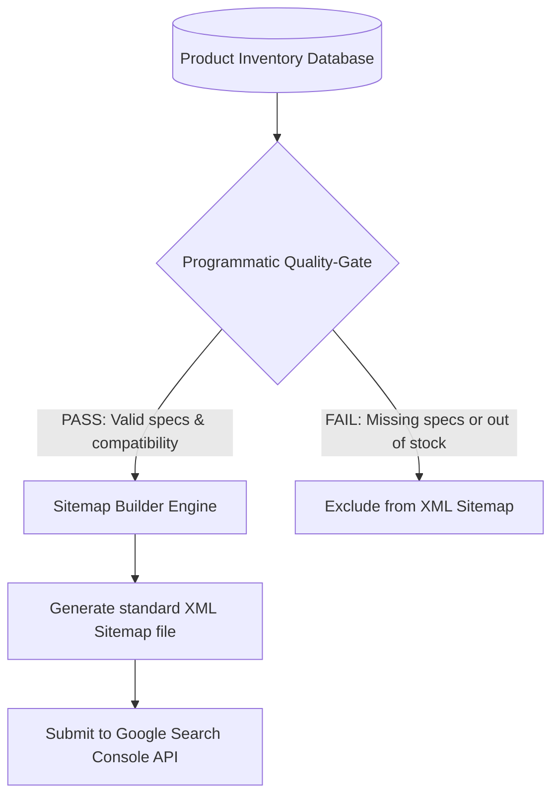

# Chapter 6: Programmatic SEO at Scale

## 🎯 Core Thesis
When executing Programmatic SEO (pSEO) at scale (generating 10,000 to 1,000,000+ unique specs and compatibility URLs), you must treat the search footprint as a database-driven engineering system. Crawlers will fail to index your pages if your sitemap structure is broken or contains thousands of low-quality, empty template links. To ensure successful indexing, developers must build **Automated XML Sitemap Generators** equipped with strict quality-control gates that only expose high-utility, fully populated URLs to search engine crawlers.

---

## 🔑 Key Terminology & Academic Definitions

*   **XML Sitemap**: A structured XML file telling search engines which pages on your site are available for crawling and indexing.
*   **Sitemap Index File**: A master sitemap file that links to multiple individual sitemap files, used when a website exceeds Google's limit of **50,000 URLs or 50MB** per single sitemap file.
*   **Sitemap Quality-Gate**: A programmatic validation check in your build script that filters out low-quality, incomplete, or empty database rows, preventing search engine indexing of thin pages.
*   **Doorway Page Penalty**: A severe Google quality penalty triggered by generating thousands of duplicate, automated pages designed solely for ranking rather than user utility.

---

## 🏗️ The Programmatic XML Sitemap Pipeline

A robust programmatic page engine must be designed to avoid thin-content penalties while scaling to millions of URLs:



### Critical Rules to Avoid Search Engine Penalties:
1.  **Keep it fresh**: Regenerate your XML sitemaps dynamically (or daily via cron jobs) as new inventory is added or modified in your database.
2.  **Filter Empty Templates**: If a product has no specs, do not include it in the sitemap. Serving a search engine thousands of empty, templated pages leads directly to manual spam penalties.
3.  **Strict 50k Limit**: If your site scales beyond 50,000 dynamic pages, programmatically partition your sitemaps into multiple files and link them via a master **Sitemap Index**.

---

## 💻 Production Reference: Dynamic Sitemap Generator (Node.js)

The following production-ready Node.js script demonstrates how to parse a database of product specifications, execute a validation check (Quality-Gate) to exclude incomplete records, build a standard XML sitemap, and write it to disk:

```javascript
/**
 * Programmatic XML Sitemap Generator with Quality-Gate Filters
 * Automatically builds search-engine ready sitemaps from database inventory tables.
 */

const fs = require('fs');
const path = require('path');

// 1. Mock Database Table containing technical spec profiles
const productDatabase = [
    { modelId: "ank-pc-20k", modelName: "Anker PowerCore 20000", totalSpecsCount: 15, isInStock: true },
    { modelId: "cre-k1-ext", modelName: "Creality K1 Extruder Node", totalSpecsCount: 12, isInStock: true },
    { modelId: "broken-spec-99", modelName: "Empty Device Specs", totalSpecsCount: 0, isInStock: false }, // Should fail gate
    { modelId: "mag-maggo-10k", modelName: "Anker MagGo 10000", totalSpecsCount: 18, isInStock: true }
];

class SitemapGenerator {
    constructor(domain, targetFile) {
        this.domain = domain;
        this.targetFile = targetFile;
        this.minSpecsThreshold = 5; // Minimum spec metrics required to pass the Quality-Gate
    }

    /**
     * Programmatically validates and builds the XML sitemap
     */
    generateSitemap(products) {
        console.log("Initializing Programmatic Sitemap Generator...");
        
        let urlBlocks = "";
        let passedCount = 0;
        let failedCount = 0;

        products.forEach(prod => {
            // 2. The Quality-Gate: Exclude broken/empty pages to prevent doorway page penalties
            if (prod.totalSpecsCount < this.minSpecsThreshold) {
                console.warn(`[Quality-Gate: REJECTED] Model ID: ${prod.modelId} has insufficient specifications.`);
                failedCount++;
                return;
            }

            // 3. Format URL entry block
            const loc = `${this.domain}/specs/${prod.modelId}`;
            const lastMod = new Date().toISOString().split('T')[0]; // Format as YYYY-MM-DD
            
            urlBlocks += `  <url>
    <loc>${loc}</loc>
    <lastmod>${lastMod}</lastmod>
    <changefreq>daily</changefreq>
    <priority>0.8</priority>
  </url>\n`;
            
            passedCount++;
        });

        // 4. Wrap in standard XML Sitemap structure
        const xmlContent = `<?xml version="1.0" encoding="UTF-8"?>
<urlset xmlns="http://www.sitemaps.org/schemas/sitemap/0.9">
${urlBlocks}</urlset>`;

        // 5. Write to disk
        fs.writeFileSync(this.targetFile, xmlContent, 'utf-8');
        
        console.log(`\nSitemap Pipeline Results:`);
        console.log(`- Passed & Indexed: ${passedCount} URLs`);
        console.log(`- Rejected & Excluded: ${failedCount} URLs`);
        console.log(`- Sitemap successfully written to: ${this.targetFile}`);
    }
}

// --- Run Sitemap Generation Pipeline ---
const sitemapPath = path.join(__dirname, 'sitemap.xml');
const generator = new SitemapGenerator("https://exampleshop.com", sitemapPath);

generator.generateSitemap(productDatabase);
```

---

## 🏆 PMM GTM Playbook: Programmatic Scale Control

When asked how to manage and index a database of 200,000 dynamic URLs without crashing your server or triggering search engine index blocks, use this playbook:

```text
Programmatic Scale Playbook:
─────────────────────────────────────────────────────────────────────────────
How do you guarantee indexability across hundreds of thousands of dynamic product URLs?
 └── Justification: Automatic Sitemap Partitioning & Quality-Gate pipelines.
     1. Daily Dynamic Sitemaps: Build automated build-scripts that rebuild your 
        XML sitemaps every night, pulling directly from database tables.
     2. Programmatic Quality Filter: Always enforce a minimum data threshold filter. 
        If a product record has zero specifications or no reviews, exclude it from the sitemap.
     3. Search Console Monitoring: Submit separate sitemaps for different categories 
        (e.g., sitemap-specs.xml, sitemap-reviews.xml) to programmatically isolate and 
        fix indexing errors.
─────────────────────────────────────────────────────────────────────────────
```
