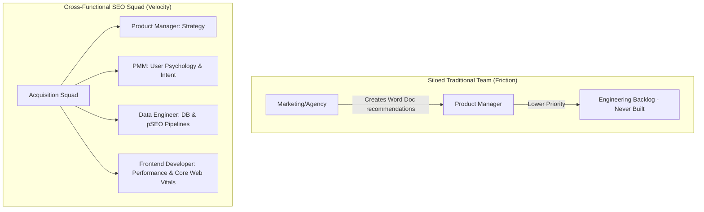

# Chapter 8: Structuring Teams & GTM Loops

## 🎯 Core Thesis
The ultimate bottleneck to executing a successful **Product-Led SEO** strategy is not technical; it is **organizational**. Traditional marketing-led SEO fails because external agencies draft text documents recommending changes that engineering backlogs inevitably ignore. Winning at organic search requires treating SEO as a core **Product Feature**. This means structuring cross-functional squads (Product, Engineering, Design, PMM) and integrating organic search acquisition loops directly into the Go-To-Market (GTM) lifecycle and product roadmap.

---

## 🔑 Key Terminology & Academic Definitions (Demystifying Jargon)

*   **PMM (Product Marketing Manager)**: The cross-functional role bridging engineering, sales, and product management. PMMs own product positioning, launch messaging, and target consumer persona mapping.
*   **GTM (Go-To-Market) Loop / Lifecycle**: The chronological steps a company takes to launch a product to its target consumers, aligning pricing, sales channels, and promotional loops.
*   **Cross-Functional SEO Squad**: An internal agile product development team composed of engineering, design, product management, and PMM stakeholders, executing search traffic acquisition directly inside the codebase rather than via external marketing agencies.
*   **The Agency Bottleneck**: An organizational block where external marketing agencies write list-based suggestions that developers ignore because they do not align with core codebase structures or sprint priorities.
*   **Organic GTM Loop**: An automated database mechanism where adding a new device SKU to the inventory table instantly generates and registers search-optimized, schema-rich landing pages.
*   **RICE Framework**: A prioritization scoring model used by product teams to evaluate tasks:
    $$\text{RICE Score} = \frac{\text{Reach} \times \text{Impact} \times \text{Confidence}}{\text{Effort}}$$
    It calculates whether an SEO task (like building a sitemap generator) has higher growth leverage than other feature requests.

---

## 🏗️ Structuring the Product-Led SEO Team

To build programmatically at scale, you must bypass the traditional siloed marketing structure in favor of a cohesive **Acquisition Product Team**:



### Why Siloed Teams Fail:
*   **Lack of Context**: Marketing teams write blogs without understanding database constraints, while developers write highly complex single-page apps without understanding crawl rendering limits.
*   **Friction**: Recommendations are written as "checklists" rather than integrated software requirements, leading to poor implementation and low developer morale.

### The Acquisition Squad Model:
*   The **Data Engineer** manages inventory databases, indexing pipelines, and programmatic sitemaps.
*   The **Frontend Developer** optimizes site rendering, Time to First Byte (TTFB), dynamic pre-rendering, and structured JSON-LD integration.
*   The **PMM** handles search intent classification, localized positioning, and competitor content gap strategies.
*   The **Product Manager** drives the roadmap, tracks down-funnel acquisition KPIs, and coordinates sprint releases.

---

## 📋 The Organic GTM Launch Search-Loop Template

To ensure organic search is never treated as a post-launch afterthought, PMMs must establish a standardized **Launch Search-Loop Framework** integrated into every phase of the product development lifecycle:

| Launch Phase | Product Dev Activity | Search-Loop Operational Action | Responsible Owner |
| :--- | :--- | :--- | :--- |
| **1. Ideation & PRD** | Writing Product Requirement Document (PRD). | Map semantic user search intent and identify competitor content/directory gaps. | PMM + Product Manager |
| **2. Technical Design**| Designing Database Schema & API structures. | Incorporate SEO variables (e.g. unique SKU, clean URL slugs, specifications index fields). | Data Engineer + UX Designer |
| **3. Alpha / Beta** | Building core app; staging frontend templates. | Verify SSR / dynamic rendering pipelines; audit Core Web Vitals and insert JSON-LD schema blocks. | Frontend Developer |
| **4. Pre-Launch** | Factory production; inventory staging. | Programmatically add new product records to the database; verify XML sitemap indexing gates. | Data Engineer |
| **5. Public Launch** | Paid ads kick off; press release goes live. | Dispatch search sitemaps; monitor real-time GSC crawl rates and server response latency. | Data Engineer + PMM |
| **6. Post-Launch (UGC)**| Customer deliveries completed. | Trigger post-purchase reviews and Q&A collection; aggregate and publish rating schema on product pages. | PMM + Frontend Developer |

---

## 🏆 PMM GTM Playbook: Winning Executive Buy-in

When presenting a product-led SEO strategy to executive leadership and seeking resources to fund a dedicated acquisition engineering squad, use this playbook:

```text
Executive Buy-In Playbook:
─────────────────────────────────────────────────────────────────────────────
How do you convince executive leadership to prioritize engineering resources 
for SEO over building new customer-facing features?
 └── Justification: The Self-Funding CAC Loop.
     1. Beyond Linear Ads: Explain that paid advertising is a tax on growth. 
        The moment ad budgets are cut, customer acquisition drops to zero.
     2. Asset-Led Growth: Treat the programmatic specs/reviews directory as a 
        durable product asset. It is built once and delivers recurring traffic 
        for near-zero marginal cost.
     3. High-Margin Pipeline: Demonstrate that by establishing a permanent organic 
        funnel, the company dramatically reduces its average customer acquisition 
        cost (CAC), directly boosting gross margins and company valuation.
─────────────────────────────────────────────────────────────────────────────
```

---

## 💬 Cross-Functional Interview Q&As (PMM Audits)

### Q1: "How do you resolve conflict between product development speed and organic programmatic SEO indexation? The core product squad wants to ship updates daily, but search teams are worried about URL stability and crawl budgets." (Head of Product / VP of Growth)

> **PMM Candidate Answer:**
> "This conflict represents a classic clash of development speed vs. search engine index stability. The resolution is not to slow down product development; it is to **decouple our search directory architecture from our dynamic frontend code deployments**.
> 
> We achieve this through three systematic guardrails:
> 
> 1.  **Strict URL Versioning & Canonicalization Rules**: We establish an immutable URL structure for all indexable directory pages. If the product engineering team changes frontend routing patterns, our backend routing layer must enforce permanent `301 redirects` to the canonical URL or keep the core search slugs untouched.
> 2.  **API-Driven SEO Directory Layer**: We build the programmatic directory as a read-only, headless consumer of our primary database. Developers can modify the core application checkout flows, user accounts, and product features daily, while the search directory remains isolated, querying static or cached database views.
> 3.  **Automated Regression Testing**: We integrate basic SEO assertions into our CI/CD deployment pipeline. If a code push accidentally removes key H1 tags, breaks `schema.org` blocks, or blocks indexation via a rogue `noindex` tag, the build automatically fails and halts deployment, protecting our search equity without slowing down developer velocity."

### Q2: "How do you set OKRs and track performance for a cross-functional SEO squad when organic search indexation has a natural lag of 3 to 6 months?" (VP of Growth / CMO)

> **PMM Candidate Answer:**
> "Setting traditional quarterly OKRs based solely on organic revenue is a recipe for team demoralization because Google's rendering, indexing, and ranking pipeline has a natural lag. To track progress accurately, **we must structure our OKRs using a mix of Leading Technical Inputs (squad velocity) and Lagging Business Outcomes (conversions).**
> 
> Here is a high-performance OKR framework for the squad:
> 
> *   **Objective: Build a capital-efficient customer acquisition asset through programmatic search directories.**
>     *   *Key Result 1 (Technical Input - Dev)*: Reduce server response time (TTFB) for all indexable pages under 150ms and secure a 'Good' Core Web Vitals rating (LCP < 2.0s, INP < 150ms).
>     *   *Key Result 2 (Product Input - PMM)*: Programmatically generate and submit 50,000 highly structured specification and compatibility pages with zero 'thin content' index blocks.
>     *   *Key Result 3 (Operational Input - QA)*: Achieve a 90%+ Googlebot Indexation Ratio for submitted programmatic pages within 90 days of release.
>     *   *Key Result 4 (Lagging Business Outcome - PM)*: Acquire 10,000 new organic customers, reducing our blended GTM Customer Acquisition Cost (CAC) by 30% over 6 months.
> 
> By holding the developers responsible for the *speed and structure of the code* (leading indicators) and the product marketing team responsible for *intent mapping and conversion tracking* (lagging indicators), we maintain high operational velocity and align our engineering sprints directly with enterprise value."
