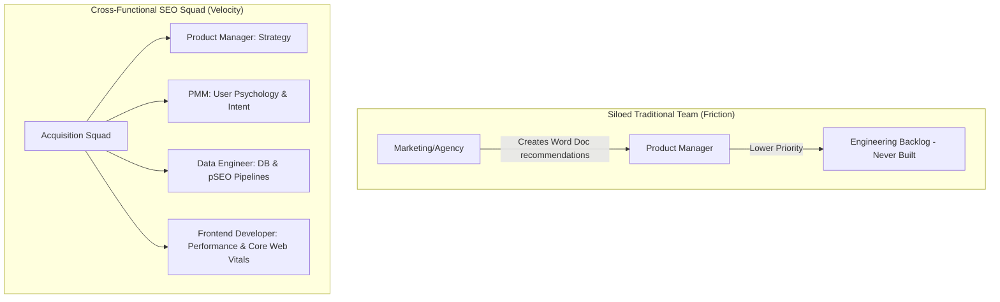

# Chapter 8: Structuring Teams & GTM Loops

## 🎯 Core Thesis
The ultimate bottleneck to executing a successful **Product-Led SEO** strategy is not technical; it is **organizational**. Traditional marketing-led SEO fails because external agencies draft text documents recommending changes that engineering backlogs inevitably ignore. Winning at organic search requires treating SEO as a core **Product Feature**. This means structuring cross-functional squads (Product, Engineering, Design, PMM) and integrating organic search acquisition loops directly into the Go-To-Market (GTM) lifecycle and product roadmap.

---

## 🔑 Key Terminology & Academic Definitions (Demystifying Jargon)

*   **PMM (Product Marketing Manager)**: The cross-functional role bridging engineering, sales, and product management. PMMs own product positioning, launch messaging, and target consumer persona mapping.
*   **GTM (Go-To-Market) Loop / Lifecycle**: The chronological steps a company takes to launch a product to its target consumers, aligning pricing, sales channels, and promotional loops.
*   **Cross-Functional SEO Squad**: An internal agile product development team composed of engineering, design, product management, and PMM stakeholders, executing search traffic acquisition directly inside the codebase rather than via external marketing agencies.
*   **The Agency Bottleneck**: An organizational block where external marketing agencies write list-based suggestions that developers ignore because they do not align with core codebase structures or sprint priorities.
*   **Organic GTM Loop**: An automated database mechanism where adding a new device SKU to the inventory table instantly generates and registers search-optimized, schema-rich landing pages.
*   **RICE Framework**: A prioritization scoring model used by product teams to evaluate tasks:
    $$\text{RICE Score} = \frac{\text{Reach} \times \text{Impact} \times \text{Confidence}}{\text{Effort}}$$
    It calculates whether an SEO task (like building a sitemap generator) has higher growth leverage than other feature requests.

---

## 🏗️ Structuring the Product-Led SEO Team

To build programmatically at scale, you must bypass the traditional siloed marketing structure in favor of a cohesive **Acquisition Product Team**:



### Why Siloed Teams Fail:
*   **Lack of Context**: Marketing teams write blogs without understanding database constraints, while developers write highly complex single-page apps without understanding crawl rendering limits.
*   **Friction**: Recommendations are written as "checklists" rather than integrated software requirements, leading to poor implementation and low developer morale.

### The Acquisition Squad Model:
*   The **Data Engineer** manages inventory databases, indexing pipelines, and programmatic sitemaps.
*   The **Frontend Developer** optimizes site rendering, Time to First Byte (TTFB), dynamic pre-rendering, and structured JSON-LD integration.
*   The **PMM** handles search intent classification, localized positioning, and competitor content gap strategies.
*   The **Product Manager** drives the roadmap, tracks down-funnel acquisition KPIs, and coordinates sprint releases.

---

## 🏆 PMM GTM Playbook: Winning Executive Buy-in

When presenting a product-led SEO strategy to executive leadership and seeking resources to fund a dedicated acquisition engineering squad, use this playbook:

```text
Executive Buy-In Playbook:
─────────────────────────────────────────────────────────────────────────────
How do you convince executive leadership to prioritize engineering resources 
for SEO over building new customer-facing features?
 └── Justification: The Self-Funding CAC Loop.
     1. Beyond Linear Ads: Explain that paid advertising is a tax on growth. 
        The moment ad budgets are cut, customer acquisition drops to zero.
     2. Asset-Led Growth: Treat the programmatic specs/reviews directory as a 
        durable product asset. It is built once and delivers recurring traffic 
        for near-zero marginal cost.
     3. High-Margin Pipeline: Demonstrate that by establishing a permanent organic 
        funnel, the company dramatically reduces its average customer acquisition 
        cost (CAC), directly boosting gross margins and company valuation.
─────────────────────────────────────────────────────────────────────────────
```
