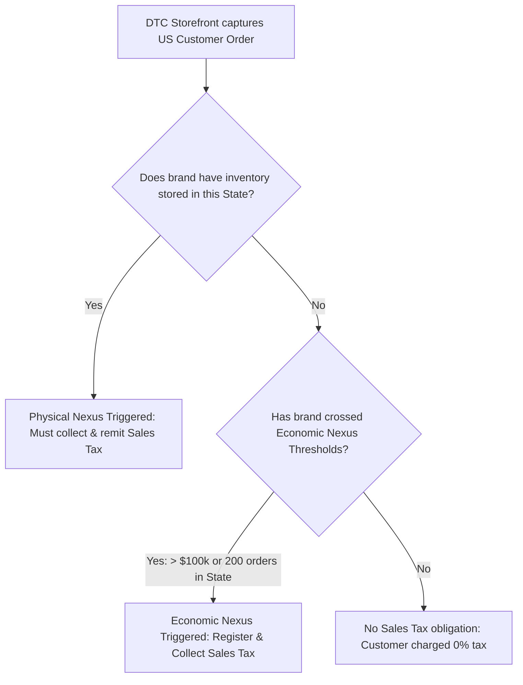

# Section 3: US Sales Tax Nexus & FX Risk Hedging

## 🎯 Core Thesis
Cross-border e-commerce brands live and die by their financial compliance and currency stability. Tanner Larsson details that scaling an e-commerce business requires transition from amateur merchant accounting to robust corporate finance. For Shenzhen-to-US/EU exporters, this means navigating the complex landscape of **US State Sales Tax Nexus thresholds, European Import VAT rules (IOSS), and Foreign Exchange (FX) currency fluctuations**. Failing to manage tax compliance leads directly to frozen bank accounts and severe audits, while failing to hedge FX risks between USD sales and RMB manufacturing costs can instantly wipe out a brand's net profit margins.

---

## 🔑 Key Terminology & Academic Definitions (Demystifying Jargon)

*   **Sales Tax Nexus**: The legal connection established between an e-commerce seller and a US state, obligating the seller to register, collect, and remit sales tax on transactions within that state.
*   **Economic Nexus**: A tax threshold established by the US Supreme Court (Wayfair decision) where a state obligates out-of-state remote sellers to collect sales tax once they exceed specific revenue benchmarks (typically **\$100,000 in annual gross sales or 200 unique transactions**).
*   **Physical Nexus**: Establishing a sales tax obligation in a state due to physical business operations, employees, or—critically for e-commerce—storing inventory in a local 3PL or Amazon FBA warehouse.
*   **EU Import VAT & IOSS (Import One-Stop Shop)**: The European Union tax portal that allows cross-border sellers to collect, declare, and remit VAT on sales of imported goods under **€150** directly at the checkout, bypassing customs delays.
*   **FX Risk Hedging**: The practice of utilizing financial instruments (such as forward contracts or structured spot transactions) to lock in exchange rates, protecting export profit margins from volatility between your sales currency (USD/EUR) and your manufacturing currency (RMB).
*   **Incoterms DDP (Delivered Duty Paid)**: An international shipping agreement where the seller assumes all responsibility, risk, and costs of transport, customs clearance, and import duties, ensuring a frictionless checkout experience for the customer.

---

## 🏗️ The US Sales Tax Economic Nexus Pipeline

DTC brands scaling in the United States must monitor their state-by-state transactions to maintain compliance while managing conversion friction:



### The Compliance Risk:
Many overseas sellers assume they are immune to US state taxes. However, if you store inventory in an Amazon FBA or local US 3PL warehouse, you instantly trigger **Physical Nexus** in that state, requiring sales tax registration and collection on all sales to customers in that state.

---

## 📈 Financial Mathematics: FX Currency Margin Compression

For Shenzhen exporters, managing the exchange rate between the **US Dollar (USD)** and **Chinese Renminbi (RMB)** is vital because factory COGS are billed in RMB, while DTC revenues are captured in USD.

Let's model the margin compression of an exporter under currency volatility:

### 1. The Margin-Exchange Rate Formula:
$$\text{Net Profit Margin (\%)} = 100\% - \left( \frac{\text{Landed Cost in RMB}}{\text{USD Retail Price} \times \text{Exchange Rate (USD to RMB)}} \right) - \text{Variable Ad/Op Costs (\%)} - \text{Taxation (\%)} $$

### 2. Operational Scenario (No Hedging):
*   **USD Retail Price**: \$80.00
*   **Landed Cost per Unit (EXW + Shipping in RMB)**: 140 RMB
*   **Ad/Operating & Merchant Fees**: 40% of USD retail (\$32.00)
*   **Tax/Nexus Compliance Cost**: 5% of USD retail (\$4.00)

Let's calculate our Net Profit Margin under two exchange rate scenarios:

#### Scenario A: Favorable Exchange Rate (\$1 USD = 7.20 RMB)
1.  **Convert Landed Cost to USD**:
    $$\text{Landed Cost (USD)} = \frac{140 \text{ RMB}}{7.20} \approx \$19.44$$
2.  **Calculate Net Profit Margin**:
    $$\text{Net Profit (USD)} = \$80.00 (\text{Retail}) - \$19.44 (\text{Landed}) - \$32.00 (\text{Ads}) - \$4.00 (\text{Tax}) = \$24.56 \text{ per unit}$$
    $$\text{Net Profit Margin (\%)} = \frac{\$24.56}{\$80.00} \times 100 \approx 30.7\%$$

#### Scenario B: Unfavorable Exchange Rate (\$1 USD = 6.60 RMB - USD depreciates)
1.  **Convert Landed Cost to USD**:
    $$\text{Landed Cost (USD)} = \frac{140 \text{ RMB}}{6.60} \approx \$21.21$$
2.  **Calculate Net Profit Margin**:
    $$\text{Net Profit (USD)} = \$80.00 - \$21.21 - \$32.00 - \$4.00 = \$22.79 \text{ per unit}$$
    $$\text{Net Profit Margin (\%)} = \frac{\$22.79}{\$80.00} \times 100 \approx 28.5\%$$
*   **The Volatility Trap**: A minor $8.3\%$ depreciation of the USD relative to the RMB compressed our net profit margin by **2.2%**, representing a profit drop of **\$1,770** on every 1,000 units sold. Lock in FX forward contracts during Q4 budgeting to protect margins.

---

## 🏆 Operator Playbook: Global Tax & FX Compliance

When managing international e-commerce cash flows and tax compliance, use this playbook:

```text
Global Tax & FX Playbook:
─────────────────────────────────────────────────────────────────────────────
How do you protect international DTC cash flow from sudden tax and FX audits?
 └── Justification: Automating Compliance & FX Lock-in.
     1. Automate US Sales Tax Collection: Integrate specialized tax engines 
        (Avalara or TaxJar) directly into your Shopify DTC checkout. This programmatically 
        calculates and collects the exact local sales tax rate based on the customer's 
        zip code, preventing under-collection liability.
     2. Utilize IOSS for European Imports: Register for an IOSS VAT tax identifier. 
        Collect the customer's local VAT (typically 20%) directly at your storefront 
        checkout. This eliminates customs delay hold-ups at European ports.
     3. Implement FX Forward Contracts: Work with digital cross-border banks 
        (e.g., PingPong, LianLian, or Payoneer) to lock in future exchange rates 
        for your USD-to-RMB conversions, guaranteeing your Q4 COGS budget.
─────────────────────────────────────────────────────────────────────────────
```

---

## 💬 Cross-Functional Interview Q&As (PMM Audits)

### Q1: "Our DTC Shopify storefront has just crossed the economic sales threshold in California and New York, triggering Sales Tax Nexus. How do you implement a compliance strategy without destroying our checkout conversion rates?" (VP of Operations / Growth PM)

> **PMM Candidate Answer:**
> "Crossing economic nexus in CA and NY is a major milestone, but implementing compliance must be handled with care. If a user sees an unexpected \$8.00 'Sales Tax' charge added at the very last step of checkout without warning, **it will trigger cognitive friction and spike cart abandonment by up to 15-20%**.
> 
> I will deploy a three-step integration strategy to maintain conversion performance:
> 
> 1.  **Automated Tax Engine Integration (Shopify Tax / TaxJar)**: We integrate Shopify's automated tax engine. It programmatically calculates and displays tax dynamically as the user types their shipping address. This avoids rigid, flat-rate calculations that scare off buyers.
> 2.  **Reposition Pricing and Value Communication**: We update our product pages to build tax expectations. We place a clean micro-copy note directly under the price: *'Calculated at checkout based on local state rates.'*
> 3.  **Deploy 'Free Shipping' Counter-Value**: To offset the psychological friction of paying sales tax, we pair it with a value-add. If we must charge \$5.00 in local tax, we bundle free priority shipping for orders over \$50. The customer perceives that they are saving \$8.00 in shipping fees, which more than offsets the \$5.00 state tax charge, maintaining our checkout conversion rates.
> 4.  **Register for Marketplace Facilitator Audits**: For sales on Amazon, Amazon automatically collects and remits the sales tax in almost all states. We must ensure our internal accounting software isolates Amazon Facilitator sales from our DTC sales to avoid double-paying state taxes."

### Q2: "Our Chinese manufacturing team wants us to bill all our international retail pricing in Chinese Yuan (RMB) on our storefront to simplify their factory accounting and eliminate FX risk. How do you respond to this operational request?" (VP of Supply Chain / Shenzhen Factory Manager)

> **PMM Candidate Answer:**
> "I must strongly oppose billing our international storefront in Chinese Yuan (RMB). Forcing Western consumers (especially in America) to view prices in RMB (e.g. ¥540 instead of \$75) is a conversion disaster that will destroy our DTC brand and increase checkout abandonment by over 90%.
> 
> 1.  **Extreme Cognitive Friction**: US consumers are unfamiliar with the Renminbi symbol. They will assume the site is insecure, scammy, or international, triggering massive safety objections.
> 2.  **Bank Transaction Fees**: If a US consumer pays in RMB, their credit card issuer will charge them a **3% international transaction fee**, sparking furious customer support tickets, refund requests, and chargebacks.
> 3.  **Attribution Disconnect**: Paid ads on Google and Facebook must be priced in USD to ensure absolute alignment with customer bidding intent.
> 
> **My Strategic Resolution:**
> We must keep our storefront 100% priced and billed in **US Dollars (USD)** to protect customer trust. 
> To resolve the factory's valid accounting and FX risk concerns, we implement a **Corporate Treasury Hedging System**:
> We set up a cross-border corporate account (using PingPong or LianLian). We capture all USD DTC revenue in USD, and utilize **FX Forward Contracts** to schedule monthly USD-to-RMB conversions at a locked, guaranteed rate. This eliminates the factory's FX risk, simplifies their accounting, and keeps our Western storefront converted at peak conversion efficiency."
