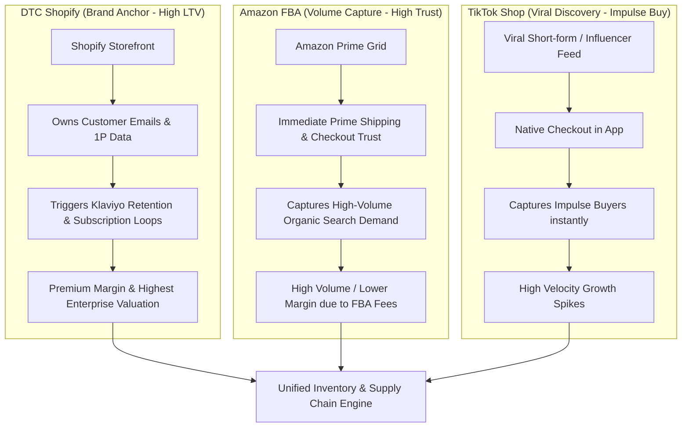

# Section 4: DTC Shopify Anchor vs. Amazon Volume

## 🎯 Core Thesis
True brand equity cannot survive on a single platform. Tanner Larsson argues that modern e-commerce requires multichannel presence. For cross-border exporters, this means constructing an integrated **Omnichannel Distribution Engine**. Relying solely on Amazon FBA is a high-risk strategy that leaves your business vulnerable to platform suspension and keeps your customer data completely hidden. To scale with a high competitive moat, operators must utilize a **Shopify DTC Storefront as their Brand Anchor** (owning customer data and lifecycle retention loops), leverage **Amazon FBA as a Transactional Capture Engine** (maximizing prime delivery speed and purchase trust), and deploy **TikTok Shop as a Viral Discovery Accelerator**.

---

## 🔑 Key Terminology & Academic Definitions (Demystifying Jargon)

*   **DTC Shopify Storefront**: The direct-to-consumer e-commerce portal owned by the brand, serving as the central positioning anchor where the company owns first-party data, customer relationships, and back-end email metrics.
*   **Amazon FBA (Fulfillment by Amazon)**: A dominant sales channel offering immediate access to over 150 million Prime buyers and high purchase trust, but siphoning gross margins through referral and warehousing fees.
*   **TikTok Shop / Social Commerce**: An emerging viral acquisition channel that allows users to purchase physical products directly inside a social media feed in a native checkout loop, minimizing purchase friction.
*   **Channel Cannibalization**: The operational risk that launching on a secondary channel (such as Amazon) will merely siphon existing high-margin customers away from your primary DTC channel.
*   **Omnichannel Pricing Integrity**: Maintaining consistent product pricing across all sales channels to prevent price wars, protect distributor relationships, and maintain premium brand positioning.
*   **First-Party Data (1P Data)**: Customer emails, phone numbers, and purchase histories owned directly by the brand, crucial for driving retention loops.

---

## 🏗️ The Omnichannel Distribution Engine

An evolved physical product brand structures its distribution channels to work in synergy, ensuring that different customer segments are captured and programmatically monetized across their preferred shopping environments:



---

## 🏆 Operator Playbook: Multichannel Synergy

When structuring your international sales channels to prevent platform risk and maximize customer margins, use this playbook:

```text
Omnichannel Scale Playbook:
─────────────────────────────────────────────────────────────────────────────
How do you balance Shopify DTC brand equity with Amazon sales volume?
 └── Justification: Channel Segmenting & Insert Marketing.
     1. Segment Your Products: Keep your primary, premium product bundles exclusive 
        to your Shopify DTC storefront. Sell individual, lower-margin baseline accessories 
        on Amazon FBA to capture search volume.
     2. Deploy Packaging Inserts: Include a high-utility packaging insert inside 
        every FBA box. Offer a free warranty upgrade or a step-by-step setup guide 
        that requires the user to register their email on your DTC Shopify site.
     3. Sync Inventory at the 3PL Level: Never store all your stock at Amazon. 
        Keep 70% of your container stock at a neutral US 3PL, and feed stock to FBA 
        and DTC dynamically to prevent capital lock-up.
─────────────────────────────────────────────────────────────────────────────
```

---

## 💬 Cross-Functional Interview Q&As (PMM Audits)

### Q1: "Amazon accounts for 85% of our international sales, but we have zero customer emails and low repeat purchase rates. As a PMM, how do you design a strategy to migrate Amazon buyers into our high-margin DTC Shopify ecosystem?" (CEO / VP of Sales)

> **PMM Candidate Answer:**
> "Relying on Amazon for 85% of our revenue is a major platform risk. Since Amazon explicitly forbids redirecting their shoppers to external websites through direct links or spammy promo slips in the box (violating their Terms of Service), we must deploy a **Value-Add Post-Purchase Migration Loop** focused on **Utility and Product Protection**:
> 
> **Step 1: The 'Extended Warranty & Setup' Packaging Insert**
> We place a premium, high-quality printed insert card inside our product packaging. We do not write spammy sales copy like *'Visit our site for 10% off.'* Instead, we position it as a mandatory product step:
> *'Activate Your Lifetime Warranty & Get the Setup Guide. Scan the QR code below to register your device.'*
> 
> **Step 2: Frictionless Registration Landing Page**
> When they scan the QR code, they land on a highly optimized, mobile-responsive Shopify landing page. To register their warranty, they enter their name, email, and Amazon Order ID. 
> 
> **Step 3: Trigger the Klaviyo Onboarding Loop**
> The moment they register, they are added to our DTC customer database. Klaviyo instantly triggers a welcome sequence:
> *   *Email 1*: Delivers the interactive setup guide and confirms their warranty activation.
> *   *Email 2*: Offers a custom video tutorial showing advanced tips to get the most out of their hardware.
> *   *Email 3*: Offers them a highly complementary accessory at an exclusive 'DTC member' price.
> 
> By transforming the transactional Amazon customer into a registered DTC warranty holder, we capture their first-party data legally, bypass Amazon's communications wall, and pull them into our high-margin retention loops, driving repeat purchases on our Shopify store."

### Q2: "If we launch our premium hardware product on TikTok Shop at a discount to capture viral short-form video traffic, how do we prevent channel conflict and protect our DTC Shopify pricing integrity?" (Brand Director / Finance Lead)

> **PMM Candidate Answer:**
> "TikTok Shop is an exceptional channel for capturing viral, impulse-driven growth, but launching our core DTC product at a discount there risks **destroying our brand's premium positioning and triggering channel conflict**. If our Shopify DTC store sells a keyboard for \$100, but users find it on TikTok Shop for \$70, they will feel cheated, and our DTC conversion rates will tank.
> 
> To capture TikTok's viral traffic while protecting our DTC pricing integrity, **we must execute a 'Differentiation and Bundle Isolation' strategy**:
> 
> 1.  **Isolate Product SKUs (Channel Bundling)**: We do not sell the exact same hardware SKU on TikTok Shop as a standalone product. Instead, we keep our core \$100 premium keyboard exclusive to Shopify. On TikTok Shop, we package a **'Starter Creator Bundle'** that combines the keyboard with a custom carrying case and a coiled cable priced at a premium \$129. We then run a temporary launch promotion for \$99. To the consumer, it feels like a massive discount, but because the bundle is unique, it is impossible to compare directly to our Shopify listing, preventing price cannibalization.
> 2.  **Utilize Platform-Subsidized Discounts**: TikTok frequently offers 'platform-subsidized discounts' where they display a discount to the user but reimburse the merchant for the difference. We must coordinate with our finance team to ensure these subsidized discounts are tracked correctly, ensuring we capture our full wholesale margin on every transaction.
> 3.  **Position Shopify as the Premium Hub**: We position our Shopify store as the ultimate customization hub (offering custom engraving, color choices, and firmware downloads) while keeping TikTok Shop focused strictly on fast, high-volume standard product bundles, protecting our brand equity long-term."
